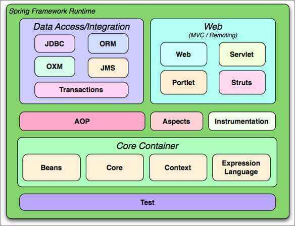
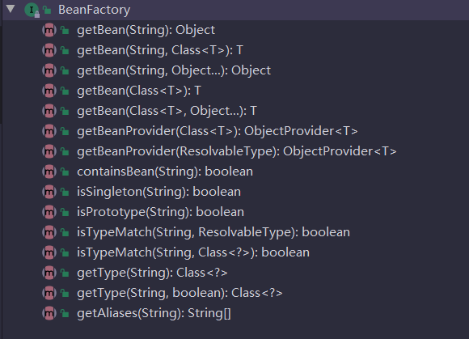
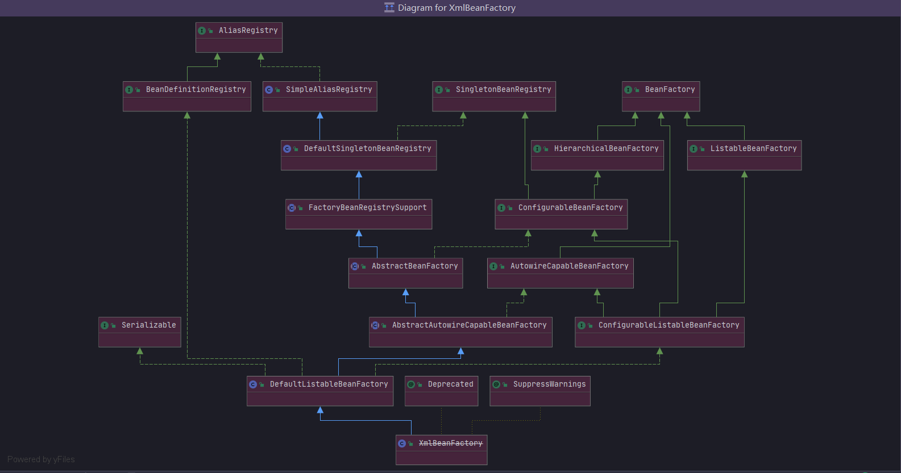
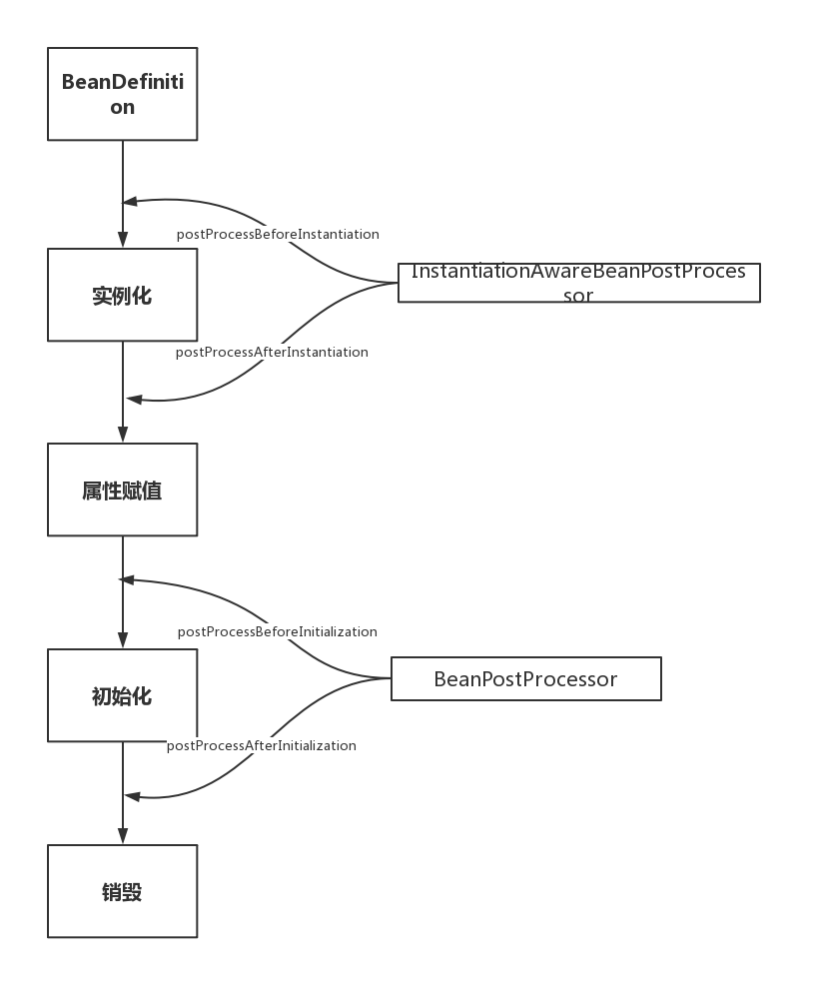
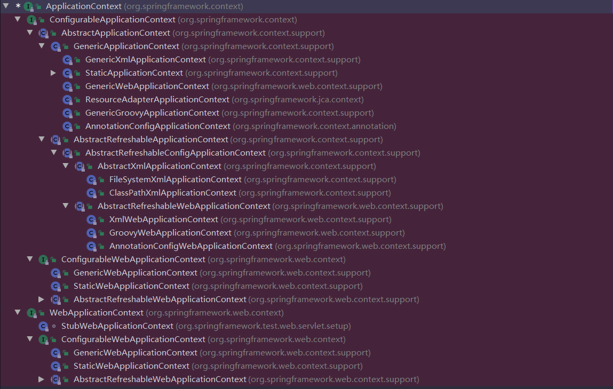
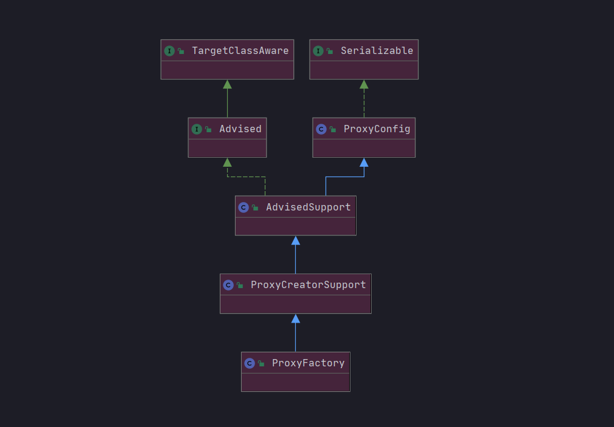
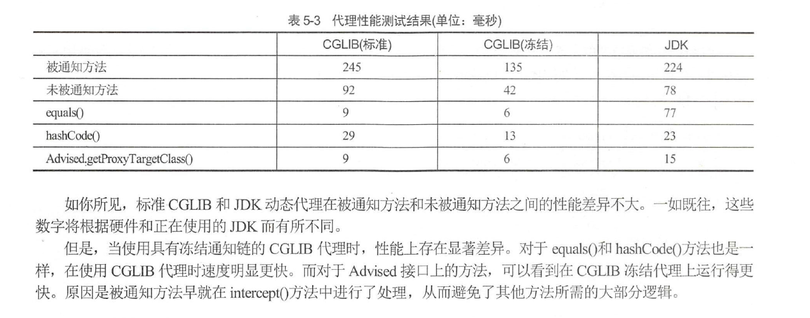
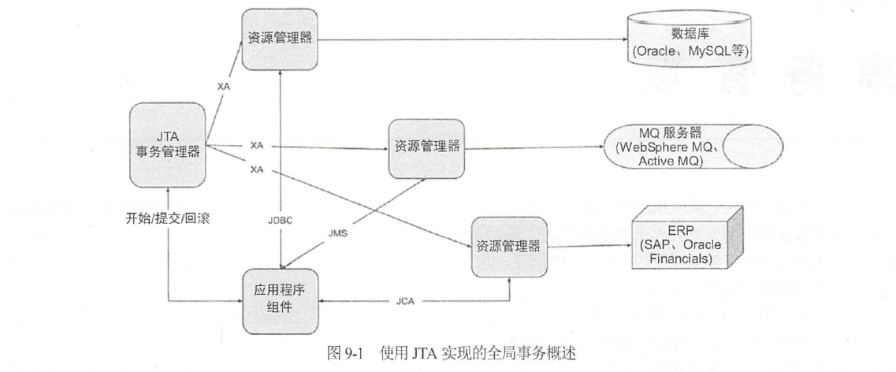

# Spring核心技术部分


## 1、什么是Spring？

Spring 是一个轻量级的Java企业级应用的开源开发框架，它是一个全面的、企业应用开发一站式的解决方案，贯穿表现层、业务层、持久层，可以这么说：使用Spring可以构建基于Java语言的任何类型应用程序。IoC容器是Spring的灵魂，其提供的与其他主流框架的无缝整合能力，使得Spring成为当今Java领域的主流霸主框架。 


## 2、使用Spring框架的好处是什么？

- **轻量**从代码大小与开销两方面来说，Spring都是轻量的。完整的Spring框架可以在一个只有2MB左右的jar包中发布出来，并且Spring所需的处理开销也是微不足道的。此外Spring是非侵入式的，典型的，Spring应用中的对象并不是必须依赖Spring中特定的类型。
- **控制反转**：Spring通过一种称作控制反转的IoC技术降低了耦合，通过IoC技术，一个对象及其依赖对象都会通过被动的方式被注入进来，而无需应用程序自己创建、组合或销毁对象，对象生命周期的维护全部交出去由IoC容器来做，应用程序仅仅负责实现业务逻辑即可。
- **面向切面编程(AOP):  **Spring支持面向切面的AOP编程，并且把应用业务逻辑和系统服务分开。Spring AOP整合了多种动态代理技术(如JDK动态代理、Cglib动态代理)，并应用到诸如声明式事物等场景，简化并降低了开发工作。
- **IoC容器**:  Spring 包含并管理应用中对象的生命周期和配置。在这个意义上讲它是一种容器，你可以配置你的每个bean是如何被创建，基于一个可配置的原型，你的bean可以只创建一个单独的实例，或者每次需要时都生成一个新的实例，以及级联创建bean所依赖的其他bean并自动完成组合装配。
- **事务管理：**Spring 提供一个持续的事务管理接口，可以扩展到上至本地事务下至全局事务（JTA）。
- **异常处理：**Spring 提供方便的API把具体技术相关的异常（比如由JDBC，Hibernate or JDO抛出的）转化为一致的unchecked异常。
- **一整套框架及整合：**Spring提供了基于传统分层设计的一整套框架及整合，例如：
  - 表现层SpringMVC模块是Web应用MVC模式的典型代表。
  - 持久层SpringJDBC模块是对JDBC开发的轻量级封装。同时还提供了对Mybatis、JPA等ORM框架的整合支持，大大简化了开发工作。
  - 得益于Spring IoC容器的能力，使得其他框架可以很容易被整合到Spring中来。


## 3、Spring由哪些模块组成？


- 核心模块：spring-core，依赖注入IOC和DI的基本实现

- Bean模块：spring-beans，Bean工厂与Bean的装配

- 上下文模块：spring-context，定义基础的Spring的Context上下文即IOC容器

  ​                       spring-context-support，对Spring IOC容器的扩展支持，以及IOC子容器

- 表达式语言模块：spring-expression，Spring表达式语言

- AOP模块：spring-aop，面向切面编程应用模块，整合Asm，CGLIb，JDKProxy

- AspectJ模块：spring-aspects，集成Aspect，Aop应用框架

- Instrumentation模块：spring-instrument，动态Class Loading模块

- JDBC模块：spring-jdbc，提供JDBC抽象框架的主要实现模块，用于简化Spring JDBC操作

- 数据集事务模块：spring-tx，Spring对数据库事物控制实现模块

- ORM模块：spring-orm，主要集成Hibernate，Java Persistence API(JPA)和Java Data Object(JDO)

- OXM模块：spring-oxm，将java对象映射成XML数据，或者将XML数据映射成java对象

- JMS模块：spring-jms，对JMS(Java Messaging Service)的支持，能够发送和接受消息

- Web模块：spring-web，提供了最基础Web支持，主要建立于核心容器之上

- WebMVC模块：spring-webmvc，实现了Spring MVC(model-view-Controller)的Web应用

- WebFlux模块：spring-webflux，一个新的非阻塞函数是Reactive Web 框架，可以用来建立异步的，非阻塞，事件驱动的服务
  Spring之通信报文

- Websocket模块：spring-websocket，主要是与Web前端的全双工通讯的协议

- Test模块：spring-test，主要为测试提供支持的




## 4、核心容器（应用上下文) 模块

它是基本的Spring模块，提供spring 框架的基础功能。BeanFactory是任何以spring为基础的应用的核心。Spring框架建立在此模块之上，它使Spring成为一个容器。


## 5、BeanFactory – BeanFactory 实现举例

BeanFactory是工厂模式的一个实现，提供了控制反转功能，用来把应用的配置和依赖从正真的应用代码中分离。最常用的BeanFactory 实现是XmlBeanFactory类。

org.springframework.beans.factory.BeanFactory类图：



org.springframework.beans.factory.XmlBeanFactory子类关系图：




## 6、BeanFactory主要子类


- **`HierarchicalBeanFactory`：**提供获取父级BeanFactory的getParentBeanFactory()方法，架设父子BeanFactory之间的桥梁。
- **`AutowireCapableBeanFactory`：**为BeanFactory提供自动装配的能力。
- **`ListableBeanFactory`：**为BeanFactory提供遍历容器中所有bean的能力。
- **`ConfigurableBeanFactory`：**为BeanFactory提供可配置的能力，例如提供了很多setXxx()，getXxx()方法等。
- **`ApplicationContext`：**应用程序上下文接口，基于BeanFactory之上的最重要接口。提供应用程序所需的各种资源或配置，例如Bean容器、环境变量、消息资源包、资源文件解析查找、应用程序事件发布等能力。

其他`BeanFactory`子类基本上都是`HierarchicalBeanFactory`、`AutowireCapableBeanFactory`、`ListableBeanFactory`、`ConfigurableBeanFactory`等组合起来的，例如`ConfigurableListableBeanFactory`


## 7、XmlBeanFactory

org.springframework.beans.factory.xml.XmlBeanFactory ，它根据XML文件中的定义加载beans。该容器从XML 文件读取配置元数据并用它去创建一个完全配置的系统或应用。这个类从Spring3.1的开始就已经废弃了，取而代之的是建议使用DefaultListableBeanFactory + XmlBeanDefinitionReader来构造一个DefaultListableBeanFactory实例。


## 8、PropertyEditor、ConversionService、Formatter的区别

`java.beans.PropertyEditor` 是 JDK 自带的类，是提供给 AWT。做啥用呢、就是讲用户在图形见面中输入的字符串转换位对应类型的值(对象)。类似于一个 convertor。Spring早期使用PropertyEditor进行Object与String的转换。

到Spring 3后，Spring提供了统一的ConversionService API和强类型的Converter SPI，以实现转换逻辑。Spring容器使用该系统来读写bean的属性值。具体见BeanWrapper，BeanWrapper的子类BeanWrapperImpl中就整合了PropertyEditor与ConversionService两种方式来操作bean的属性值。

除了格式转换，你还经常需要本地化String values。也就是以当地格式展示，如货币、日期等。通用的core.convert Converter SPI不能直接完成格式化需求。基于此，Spring 3 引入了 Formatter SPI，相比PropertyEditors简单直接。


## 9、说说Spring 3后的核心包中新增的类型转换体系

- **org.springframework.core.convert.ConversionService**

  

  直接提供给开发者使用的类型转换接口，该接口源码如下所示：

  ```java
  public interface ConversionService {
  
     //判断源对象类型是否可以转换成目标类型的对象
     boolean canConvert(@Nullable Class<?> sourceType, Class<?> targetType);
  
     //判断源对象类型是否可以转换成目标类型的对象
     boolean canConvert(@Nullable TypeDescriptor sourceType, TypeDescriptor targetType);
  
     //将源对象转换成目标类型的对象
     <T> T convert(@Nullable Object source, Class<T> targetType);
  
     //将源对象转换成目标类型的对象
     Object convert(@Nullable Object source, @Nullable TypeDescriptor sourceType, TypeDescriptor targetType);
  
  }
  ```
  其常用的一个实现是`org.springframework.core.convert.support.DefaultConversionService`，该类实现了`org.springframework.core.convert.ConversionService`接口和`org.springframework.core.convert.converter.ConverterRegistry`接口，后者提供了向ConversionService中注册自定义的`org.springframework.core.convert.converter.Converter`实例以增强整个ConversionService的类型转换能力。

  

- **org.springframework.core.convert.converter.Converter**

  是直接需要开发者实现的强类型转换SPI接口，该接口的源码如下所示：

  ```java
  public interface Converter<S, T> {
  
     //将源对象转换成目标对象
     T convert(S source);
  
  }
  ```
  很显然这是一种一对一的强类型转换接口。

- **org.springframework.core.convert.converter.ConverterFactory**

  Converter的工厂类，一般是一种特定类型或多态类型的对象转换成另一种多态类型的对象。例如：`StringToNumberConverterFactory`、`NumberToNumberConverterFactory`

- **org.springframework.core.convert.converter.GenericConverter**

  通用转换器接口，两种或多种类型之间的转换。这是最灵活的转换器SPI接口的，但也是最复杂的。 它是柔性的，一个GenericConverter可以支持多个源/目标类型对之间转换。由于这个接口相对比较复杂，一般情况下都不使用这个接口而使用更为简单的`Converter`或`ConverterFactory`。实际上调用`ConverterRegistry`的`addConverter()`或`addConverterFactory()`方法时，被添加进去的`Converter`或`ConverterFactory`会被适配为`GenericConverter`类型，也就是说真正添加进去的是一个适配器`ConverterAdapter`、`ConverterFactoryAdapter`(这两个适配是`GenericConversionService`的内部类)。

- **org.springframework.core.convert.support.DefaultConversionService**

  这是`ConversionService`的默认实现，在`DefaultConversionService`中默认加入了很多常用的类型转换器。

- **org.springframework.format.support.FormattingConversionService**

  这是将`org.springframework.format.Formatter`整合到`ConversionService`体系中来的一个实现，其默认实现是`org.springframework.format.support.DefaultFormattingConversionService`


## 10、说说调用BeanFactory#getBean()方法实例化一个bean的主要过程

此处我们就拿最简单的单例bean的场景，简要叙述一下初次调用其getBean()方法实例化一个bean的主要过程：

1. 首先调用BeanFactory#getBean()方法，如果调用的是getBean(Class requiredType)则需要先通过getBeanNamesByType()来获取指定类型的bean在容器中的所有bean定义(BeanDefinition)，如果出现多个则抛出NoUniqueBeanDefinitionException。也就是说如果调用的是getBean(Class requiredType)则需要将其转化为getBean(String beanName)来继续下一步。

2. 接着在AbstractFactoryBean#doGetBean()方法中先通过getSingleton(beanName)来尝试获取，如果获取到则直接返回，整个getBean()流程结束；如果获取不到，则开始接下来的单例bean首次实例化流程。

   *<u>getSingleton()实际是从DefaultSingletonBeanRegistry.singletonObjects中获取缓存的单例实例，也就是说Spring容器实际缓存单例实例的是：</u>*

   ```java
   public class DefaultSingletonBeanRegistry {
   	private final Map<String, Object> singletonObjects = new ConcurrentHashMap<>(256);
   }
   ```

3. 接着对该bean的BeanDefinition进行检查并进行相应的Merge合并，然后检查该bean是否依赖其他bean，如果有的话，则先在容器中注册并实例化所以依赖的bean；如果没有依赖任何bean，则走两条路线：一路是创建单例bean，一路是创建prototype类型的bean，流程大体相似，我们以本节开头所述那样只讲创建单例bean的情况。

4. 接着调用DefaultSingletonBeanRegistry#getSingleton(String, ObjectFactory<?>)模板方法，在匿名的ObjectFactory实例中最终调用的还是AbstractAutowireCapableBeanFactory#createBean()方法，接着调用实现了InstantiationAwareBeanPostProcessor接口的全局BeanPostProcessor实例（如果存在的话）的postProcessBeforeInstantiation()方法，该方法可以拦截后面new该bean的实例，即如果此方法返回该bean的一个实例，那么后续的new该bean的实例将会省去。

5. 接着调用AbstractAutowireCapableBeanFactory#doCreateBean()方法，在该方法中会根据以下几个方式创建bean的实例：

   - 如果该bean的BeanDefinition中存在Supplier类型的instanceSupplier对象，则调用Supplier#get()方法返回该bean的实例。
   - 如果该bean存在工厂方法，那么通过其工厂方法来创建该bean的实例。
   - 否则通过反射调用该bean的构造器来newInstance()并返回。

   一旦bean的实例被new出来以后，BeanFactory会立马调用DefaultSingletonBeanRegistry#addSingletonFactory(String beanName, ObjectFactory<?> singletonFactory)，将该bean的名字及实例工厂ObjectFactory分别放入到DefaultSingletonBeanRegistry的registeredSingletons和singletonFactories两个成员变量中保存起来，这个提前的缓存bean的机制即是解决Spring中bean循环依赖问题的关键。

   bean的实例被new出来之后，立马调用实现了InstantiationAwareBeanPostProcessor接口的全局BeanPostProcessor实例（如果存在的话）的postProcessAfterInstantiation()方法做一些后置操作。

6. 上一步仅仅是new出来一个最原始的bean实例，还没有调用其setter方法，接下来作如下调用：

   - 调用InstantiationAwareBeanPostProcessor#postProcessProperties()方法（如果实现了的话）。该方法可以修改准备设置到bean属性上的PropertyValues的原始值。
   - 就是通过BeanWrapperImpl来设置bean的各个属性值，期间会使用PropertyEditor及ConversionService两种类型转换手段相结合的方式来设置原始bean实例的属性值。

7. 上一步setter方法调用完了之后，就会依次作如下调用：

   - 调用AbstractAutowireCapableBeanFactory#invokeAwareMethods()方法调用bean所实现的一系列Aware接口(BeanNameAware、BeanClassLoaderAware、BeanFactoryAware)。

   - 调用BeanPostProcessor#postProcessBeforeInitialization()方法（如果实现了的话）。
   - 调用bean的init初始化方法了（如果该bean实现了InitializingBean接口或者指定了init-method方法或者具有@PostConstruct标注的方法的话）。
   - 调用BeanPostProcessor#postProcessAfterInitialization()方法（如果实现了的话）。

8. 接着调用DestructionAwareBeanPostProcessor#requiresDestruction()方法（如果实现了的话）,该方法返回布尔类型，如果返回true则注册销毁该bean的DisposableBeanAdapter示例并放入DefaultSingletonBeanRegistry的disposableBeans成员变量之中。


**站在开发的角度来说，主要的调用链概括如下：**

- BeanFactory#getBean()  =>
- AbstractFactoryBean#doGetBean()  =>
- DefaultSingletonBeanRegistry#getSingleton()  =>
- InstantiationAwareBeanPostProcessor#postProcessBeforeInstantiation()（如果实现了的话）  =>
- 实例化bean，即new该bean的实例  =>
- InstantiationAwareBeanPostProcessor#postProcessAfterInstantiation() （如果实现了的话） =>
- InstantiationAwareBeanPostProcessor#postProcessProperties()（如果实现了的话） =>
- BeanWrapperImpl来设置bean的各个属性值。
- AbstractAutowireCapableBeanFactory#invokeAwareMethods()（如果实现了的话） =>
- BeanPostProcessor#postProcessBeforeInitialization() （如果实现了的话） =>
- 调用bean的init初始化方法了（如果该bean实现了InitializingBean接口或者指定了init-method方法或者具有@PostConstruct注解的方法的话）=>
- BeanPostProcessor#postProcessAfterInitialization()方法（如果实现了的话）=>
- 调用DestructionAwareBeanPostProcessor#requiresDestruction()方法（如果实现了的话），返回true则会注册该bean的销毁方法。


**关于getBean()方法实例化一个bean的全过程，请见[示例代码](src/main/java/com/penglecode/xmodule/master4j/spring/beans/instantiation/xmlconfig/BeanInstantiationProcessExample1.java)**


## 11、@Configuration注解的属性proxyBeanMethods有什么作用？

布尔类型的proxyBeanMethods属性用来指示配置类中被@Bean注解标注的方法是否使用代理，默认是true使用代理，则直接从IOC容器之中取得bean的实例；如果设置为false，也就是不从IOC容器中获取bean的实例，这样每次调用@Bean标注的方法获取到的实例和IOC容器中的都不一样，是一个新的实例，所以我们可以将此属性设置为false来提高性能；


## 12、Spring bean依赖注入的几种方式

- **构造器注入**

  **构造器注入顾名思义就是在程序中显式的实现bean的有参构造器**，Spring容器在实例化bean的时候自动注入所依赖的bean。可以认为是隐式的@Autowired效果，而且首先尝试的是以构造器中方法参数名称作为beanName去容器中按照byName查找，找不到的话再使用byType去容器中查找；当某个类型的实例在容器中存在多个时，处理办法：

  - 加@Qualifier("your bean name")指定bean的名称
  - 直接使用@Resource(name="your bean name")取代默认的@Autowired
  - 给同类型的多个实例的某个加上@Primary注解

  <u>当存在多个有参构造器时，由于不知道使用哪个有参构造器来newInstance()，所以转而获取无参构造器来newInstance()，如果不存在无参构造器则报错。</u>

  ```java
  @Component
  public class AuthApiService implements InitializingBean, DisposableBean {
  
     private final RestTemplate restTemplate;
  
     private final List<ApiEndpoint> apiEndpoints;
  
     /**
      * 如果目标bean中存在唯一一个有参构造参数，那么该bean将会被自动装配
  	* 可以认为是隐式的@Autowired，先按byName(参数name)获取bean，获取不到再按byType，否则报错
  	* 当某个类型的实例在容器中存在多个时，处理办法：
  	* 1、加@Qualifier("your bean name")指定bean的名称
  	* 2、直接使用@Resource(name="your bean name")取代默认的@Autowired
  	* 3、给同类型的多个实例的某个加上@Primary注解
  	*/
     public AuthApiService(RestTemplate restTemplate, List<ApiEndpoint> apiEndpoints) {
  	   this.restTemplate = restTemplate;
  	   this.apiEndpoints = apiEndpoints;
     }
  }
  ```
  
- **工厂方法注入**

  工厂方法注入跟上面构造器注入基本差不多，例如：

  ```java
  @Configuration
  public static class ExampleConfiguration {
  
      /**
       * 工厂方法注入
       * @param restTemplate      - 等价于使用@Autowired自动注入
       * @param endpointsProvider - 等价于使用@Autowired按类型自动注入，只不过可以指定获取单个还是多个
       * @return
       */
      @Bean
      public UserApiService userApiService(RestTemplate restTemplate, 
                                           ObjectProvider<List<ApiEndpoint>> endpointsProvider) {
          return new UserApiService(restTemplate, endpointsProvider.getIfAvailable());
      }
  }
  ```

- **setter方法注入**

  ```java
  @Autowired
  public void setUserRepository(UserRepository userRepository) {
      this.userRepository = userRepository;
  }
  
  @Resource
  public void setRoleRepository(RoleRepository roleRepository) {
      this.roleRepository = roleRepository;
  }
  ```

- **直接在字段上注入**

  ```java
  @Autowired
  private UserRepository userRepository;
  
  @Resource(name="roleRepository")
  private RoleRepository roleRepository;
  ```

  


## 13、Spring bean自动装配的几种模式

Spring bean装配包括手动装配和自动装配，手动装配是有基于xml装配、构造方法、setter方法等。

自动装配有五种自动装配的方式，可以通过autowire属性设置（XmlConfig方式通过设置<bean autowire="xxx"/ >；JavaConfig方式通过设置@Bean(autowire="xxx")）来指导Spring容器用自动装配方式来进行依赖注入。 

1. AutowireCapableBeanFactory.AUTOWIRE_NO(0)：默认的方式是不进行自动装配，通过显式设置依赖属性来进行装配。
2. AutowireCapableBeanFactory.AUTOWIRE_BY_NAME(1)：通过参数名自动装配，Spring容器在配置文件中发现bean的autowire属性被设置成byname，之后容器试图匹配、装配和该bean的属性具有相同名字的bean。
3. AutowireCapableBeanFactory.AUTOWIRE_BY_TYPE(2)：通过参数类型自动装配，Spring 容器在配置文件中发现bean的autowire 属性被设置成byType，之后容器试图匹配、装配和该bean的属性具有相同类型的bean。如果有多 个bean符合条件，则抛出错误。
4. AutowireCapableBeanFactory.AUTOWIRE_CONSTRUCTOR(3)：这个方式类似于AUTOWIRE_BY_TYPE， 但是要提供给构造器参数，如果没有确定的带参数的构造器参数类型，将会抛出异常。
5. ~~AutowireCapableBeanFactory.AUTOWIRE_AUTODETECT(4)：首先尝试使用constructor来自动装配，如果无法工作，则使用byType方式。该方式已经被废弃了。~~

默认情况下，一个bean的自动装配模式为AUTOWIRE_NO，即不进行自动装配，从开发经验角度来说，手动组装一个bean能够很好的规避开发过程中，随着增加某个类型的不同实现而导致的问题。


## 14、Spring bean自动装配与bean依赖注入中的@Autowired的区别。

- Spring bean自动装配是指需要装配的目标bean中的各个依赖属性、setter方法上并没有设置任何注解(例如@Autowired)，例如：

  ```java
  public class UserBean{
      private String id;
      
      private String name;
      
      private AddressBean address;
      
      //setter省略
  }
  
  public class AddressBean {
      ...
  }
  ```

  当<bean name="user" class="xxx.UserBean" autowire="no"/ >时，user中的address始终是空；

  当<bean name="user" class="xxx.UserBean" autowire="byType"/ >时，user中的address就会被自动注入进来，而无需显示设置@Autowired注解；

- 但是两者也有共有的特性，例如在未设置自动装配模式时(即默认的autowire="no"时)，如果目标bean中存在唯一一个有参构造参数，那么该bean将会被自动装配。例如：

  ```java
  @Component
  public class AuthApiService implements InitializingBean, DisposableBean {
  
     private final RestTemplate restTemplate;
  
     private final List<ApiEndpoint> apiEndpoints;
  
     /**
      * 如果目标bean中存在唯一一个有参构造参数，那么该bean将会被自动装配
  	* 可以认为是隐式的@Autowired，先按byName(参数name)获取bean，获取不到再按byType，否则报错
  	* 当某个类型的实例在容器中存在多个时，处理办法：
  	* 1、加@Qualifier("your bean name")指定bean的名称
  	* 2、直接使用@Resource(name="your bean name")取代默认的@Autowired
  	* 3、给同类型的多个实例的某个加上@Primary注解
  	*/
     public AuthApiService(RestTemplate restTemplate, List<ApiEndpoint> apiEndpoints) {
  	   this.restTemplate = restTemplate;
  	   this.apiEndpoints = apiEndpoints;
     }
  }
  ```


## 15、Spring bean的生命周期有哪些?



1. 实例化 Instantiation
2. 属性赋值 Populate
3. 初始化 Initialization
4. 销毁 Destruction

实例化 -> 属性赋值 -> 初始化 -> 销毁

主要逻辑都在AbstractAutowireCapableBeanFactory#doCreateBean()方法中，逻辑很清晰，就是顺序调用以下三个方法，这三个方法与三个生命周期阶段一一对应，非常重要，在后续扩展接口分析中也会涉及。

1. createBeanInstance() -> 实例化，即通过反射Constructor#newInstance()方法实例化bean。
2. populateBean() -> 属性赋值，即通过bean的属性编辑器结合类型转换框架来设置bean的属性值。
3. initializeBean() -> 初始化，即调用bean的初始化方法，如果该bean实现了InitializingBean接口或者指定了init-method方法或者具有@PostConstruct标注的方法的话。
4. registerDisposableBeanIfNecessary() -> 销毁，即注册bean的销毁方法，实际是注册一个DisposableBeanAdapter来执行bean销毁时的业务逻辑，如果该bean实现了DisposableBean接口或者制定了-destroy-method方法或者具有@PreDestroy标注的方法。

```java
protected Object doCreateBean(final String beanName, final RootBeanDefinition mbd, final @Nullable Object[] args)
      throws BeanCreationException {

   // Instantiate the bean.
   BeanWrapper instanceWrapper = null;
   if (mbd.isSingleton()) {
      instanceWrapper = this.factoryBeanInstanceCache.remove(beanName);
   }
   if (instanceWrapper == null) {
      //1、实例化bean
      instanceWrapper = createBeanInstance(beanName, mbd, args);
   }
   final Object bean = instanceWrapper.getWrappedInstance();
   
   ...

   // Initialize the bean instance.
   Object exposedObject = bean;
   try {
      //2、设置bean的属性
      populateBean(beanName, mbd, instanceWrapper);
      //3、执行bean的初始化方法
      exposedObject = initializeBean(beanName, exposedObject, mbd);
   }
   catch (Throwable ex) {
      if (ex instanceof BeanCreationException 
          && beanName.equals(((BeanCreationException) ex).getBeanName())) {
         throw (BeanCreationException) ex;
      }
      else {
         throw new BeanCreationException(
               mbd.getResourceDescription(), beanName, "Initialization of bean failed", ex);
      }
   }

   ...

   try {
      // 4、注册bean的销毁方法(如果有的话)
      registerDisposableBeanIfNecessary(beanName, bean, mbd);
   }
   catch (BeanDefinitionValidationException ex) {
      throw new BeanCreationException(
            mbd.getResourceDescription(), beanName, "Invalid destruction signature", ex);
   }

   return exposedObject;
}
```

常用的扩展点：

1. Aware类型的接口（仅针对实现XxxAware接口的bean）

   例如BeanNameAware、BeanFactoryAware、BeanClassLoaderAware等。

   调用时机：在属性赋值(Populate)之后，且在初始化(Initialization)之前。

2. 生命周期接口（针对所有bean）

   - 在实例化bean的前后时机调用的InstantiationAwareBeanPostProcessor接口

     前置扩展点方法：postProcessBeforeInstantiation()

     后置扩展点方法：postProcessAfterInstantiation()

   - 在初始化bean的前后时机调用的BeanPostProcessor接口

     前置扩展点方法：postProcessBeforeInitialization()

     后置扩展点方法：postProcessAfterInitialization()


## 16、Spring是如何解决循环依赖问题的？

- 首先Spring只能解决单例bean的循环依赖问题。

- Spring的循环依赖分为两种：

  1. 构造器循环依赖；

     该种循环依赖从理论上就无法解决，这个很好理解：不管是new一个对象还是通过反射(Constructor#newInstantce())构造器所需的参数必须提前准备好，当存在循环依赖时，是无法解决的，这其实就是个死锁，ABean等BBean实例化好，BBean却也在等ABean实例化好，形成死锁。

  2. `setter` 循环依赖；

     该种循环依赖从理论上可以解决的，因为bean的实例提前new出来了，只是bean的属性在设置的时候产生依赖，这个完全可以解决。

- Spring是如何解决bean循环依赖的？

  首先给出答案：**Spring通过三级缓存来解决bean循环依赖的。**

  - 那么三级缓存到底是什么？

    Spring采用三个Map来做三级缓存，三级缓存的定义都在DefaultSingletonBeanRegistry中：

    1. singletonObjects：第一级缓存，这级缓存也是最终的、永久的缓存，这里面保存着准备就绪立即可用单例bean。也就是说这个里面的单例bean什么事情都做好了，例如属性值设置、初始化、销毁方法注册等等都做好了。

    2. earlySingletonObjects：第二级缓存，这级缓存保存的是早期的bean，与singletonObjects区别在于earlySingletonObjects中存放的bean不一定是完整的，当存在循环依赖时，刚从ObjectFactory#getObject()创建出来的bean会被放到这个二级缓存earlySingletonObjects中，这样其他依赖这个bean的bean在getBean()时就会从二级缓存中获取一个这个还没装配好的bean并设置到属性值中去。

       整个过程中由于setter属性值导致的递归调用getBean()方法，同时配合二级缓存earlySingletonObjects，这就是解决循环依赖的关键所在。

    3. singletonFactories：第三级缓存，这级缓存保存的是刚被ObjectFactory#getObject()创建出来的、且被ObjectFactory缓存的bean，也就是说多次调用ObjectFactory#getObject()会返回已缓存的bean（其实这个ObjectFactory是个lambda表达式）

    ```java
    /**
     * Cache of singleton objects: bean name to bean instance.
     * 存放的是单例 bean、对应关系是 bean Name --> bean instance
     */
    private final Map<String, Object> singletonObjects = new ConcurrentHashMap<>(256);
    /**
     * Cache of early singleton objects: bean name to bean instance.
     * 存放的早期的 bean、对应的关系 也是 beanName --> bean instance
     * 与 singletonObjects 区别在于 earlySingletonObjects 中存放的bean 不一定是完整的、
     * bean 在创建过程中就加入到 earlySingletonObjects 中了、所以在bean创建过程中就可以通过getBean 方法获取、
     * 这个Map 也是解决循环依赖的关键所在
     **/
    private final Map<String, Object> earlySingletonObjects = new HashMap<>(16);
    
    /**
     * Cache of singleton factories: bean name to ObjectFactory.
     * 存放的是 ObjectFactory 、可以理解为创建单例bean的factory、对应关系是 bean name --> objectFactory
     */
    private final Map<String, ObjectFactory<?>> singletonFactories = new HashMap<>(16);
    ```

  - 配合三级缓存解决循环依赖问题的关键代码也都在DefaultSingletonBeanRegistry中：

    在通过反射(Constructor#newInstance())实例化beanA之后立即调用`DefaultSingletonBeanRegistry#addSingletonFactory(beanName, objectFactory)`将beanName与objectFactory映射加入到三级缓存中去。其中objectFactory是个lambda表达式，也就是个内部类，它持有beanA的缓存。beanA在populateBean()时，发现依赖beanB，这时beanB经过了**前述流程**被放入到三级缓存中去了，beanB在populateBean()时发现依赖beanA，调用getBean(beanA)去容器中查找beanA，在`getSingleton(beanA, true)`逻辑中发现beanA已经在三级缓存中，于是将beanA升级为二级缓存并返回未装配好的beanA给beanB，此时beanB的populateBean()完成，接着调用`DefaultSingletonBeanRegistry#addSingleton(beanName, singletonObject)`将beanB加入到一级缓存中去，并从二级三级缓存中移除，至此beanB由于beanA的populateBean()被动的完成实例化；接着递归过程返回到beanA的populateBean()方法完成，接着调用`DefaultSingletonBeanRegistry#addSingleton(beanName, singletonObject)`将beanA加入到一级缓存中去，并从二级三级缓存中移除，至此beanA完成了实例化，同时被动的使beanB也顺带完成了实例化。

    ```java
    addSingletonFactory(beanName, () -> getEarlyBeanReference(beanName, mbd, bean));
    
    /**
     * 调用此方法意味着bean刚被newInstance()出来
     * 将bean的名称与bean的对象工厂ObjectFactory放入三级缓存中去
     */
    protected void addSingletonFactory(String beanName, ObjectFactory<?> singletonFactory) {
        Assert.notNull(singletonFactory, "Singleton factory must not be null");
        synchronized (this.singletonObjects) {
            if (!this.singletonObjects.containsKey(beanName)) {
                this.singletonFactories.put(beanName, singletonFactory); //放入缓存中
                this.earlySingletonObjects.remove(beanName);
                this.registeredSingletons.add(beanName);
            }
        }
    }
    
    /**
     * 为什么需要三级缓存才能解决bean循环依赖问题?
     * 其实使用二级缓存也是能够解决问题的，多加一级缓存是为了使
     * SmartInstantiationAwareBeanPostProcessor#getEarlyBeanReference()这个拦截器方法发挥作用
     * 所以才使用三级缓存
     */
    protected Object getEarlyBeanReference(String beanName, RootBeanDefinition mbd, Object bean) {
    		Object exposedObject = bean;
        if (!mbd.isSynthetic() && hasInstantiationAwareBeanPostProcessors()) {
            for (BeanPostProcessor bp : getBeanPostProcessors()) {
                if (bp instanceof SmartInstantiationAwareBeanPostProcessor) {
                    SmartInstantiationAwareBeanPostProcessor ibp =        
                        (SmartInstantiationAwareBeanPostProcessor) bp;
                    exposedObject = ibp.getEarlyBeanReference(exposedObject, beanName);
                }
            }
        }
        return exposedObject;
    }
    
    /**
     * 调用此方法意味着刚刚开始调用getBean()方法，先从缓存中查找目标bean
     * 依次从一级、二级、三级缓存中查找目标bean
     * 如果在三级缓存中发现了，则将其升级到二级缓存中来。
     */
    protected Object getSingleton(String beanName, boolean allowEarlyReference) {
    
       Object singletonObject = this.singletonObjects.get(beanName);
       // 这个bean 正处于 创建阶段
       if (singletonObject == null && isSingletonCurrentlyInCreation(beanName)) {
          // 并发控制
          synchronized (this.singletonObjects) {
             // 单例缓存是否存在
             singletonObject = this.earlySingletonObjects.get(beanName);
             // 是否运行获取 bean factory 创建出的 bean
             if (singletonObject == null && allowEarlyReference) {
                // 获取缓存中的 ObjectFactory
                ObjectFactory<?> singletonFactory = this.singletonFactories.get(beanName);
                if (singletonFactory != null) { //这个if分支里面发生了缓存升级：三级缓存升级为二级缓存
                   singletonObject = singletonFactory.getObject();
                   // 将对象缓存到 earlySingletonObject中
                   this.earlySingletonObjects.put(beanName, singletonObject);
                   // 从工厂缓冲中移除
                   this.singletonFactories.remove(beanName);
                }
             }
          }
       }
       return singletonObject;
    }
    
    /**
     * 调用此方法，意味着具有beanName的singletonObject是完全装配好的
     * 并将它放入一级缓存中
     */
    protected void addSingleton(String beanName, Object singletonObject) {
        synchronized (this.singletonObjects) {
            this.singletonObjects.put(beanName, singletonObject);
            this.singletonFactories.remove(beanName);
            this.earlySingletonObjects.remove(beanName);
            this.registeredSingletons.add(beanName);
        }
    }
    ```
    
  - 为什么采用三级缓存而不是二级缓存来做这个事？
  
    其实采用二级缓存也能解决循环依赖的问题，但是如果去掉了三级缓存，也即去掉了ObjectFactory（`() -> getEarlyBeanReference(beanName, mbd, bean)`），其中这个`getEarlyBeanReference()`方法的存在至关重要，它调用了`SmartInstantiationAwareBeanPostProcessor#getEarlyBeanReference()`方法，该方法是参与了bean自动代理机制，见`org.springframework.aop.framework.autoproxy.AbstractAutoProxyCreator#getEarlyBeanReference()`方法，该方法即是实现了`SmartInstantiationAwareBeanPostProcessor#getEarlyBeanReference()`方法，完成bean的自动代理。
  
    在这种情况下自动代理后的bean肯定还未执行初始化动作，所以还不是一个合格可用的bean，会被提升到二级缓存中去，因此第二级缓存`Map<String, Object> earlySingletonObjects`也是一个必不可少的存在。

参考文章[Spring循环依赖](https://juejin.im/post/6844904180683898888)


## 17、ApplicationContext主要子类



- **`ConfigurableApplicationContext`：**可配置的应用程序上下文，例如可以配置Environment、父级ApplicationContext、ApplicationListener，以及refresh()，close()功能。
- **`WebApplicationContext`：**web应用程序的上下文。
- **`ConfigurableWebApplicationContext`：**是`ConfigurableApplicationContext`和`WebApplicationContext`两个的组合。
- **`AbstractRefreshableApplicationContext`：**主要是和容器的刷新与创建有关，调用refreshBeanFactory方法完成容器刷新。
- **`AbstractRefreshableConfigApplicationContext`：**基于XML配置文件的且可指定配置文件位置的应用程序上下文。
- **`AbstractRefreshableWebApplicationContext`：**继承自`AbstractRefreshableConfigApplicationContext`。
- **`GenericApplicationContext`：**通用的应用程序上下文。
- **`GenericXmlApplicationContext`：**通用的以XML内容为构造条件的应用程序上下文。
- **`AnnotationConfigApplicationContext`：普通的以JavaConfig方式启动的应用程序上下文。其实就是普通Java Application程序。**
- **`FileSystemXmlApplicationContext`：以FileSystemResource(形如file:/d:/xxx.xml)来定位配置文件的应用程序上下文。其实就是普通Java Application程序。**
- **`ClassPathXmlApplicationContext`：以ClassPathResource(形如classpath:xxx.xml)来定位配置文件的应用程序上下文。其实就是普通Java Application程序。**
- **`XmlWebApplicationContext`：默认以/WEB-INF/applicationContext.xml配置文件启动的Servlet应用程序。**
- **`AnnotationConfigWebApplicationContext`：以JavaConfig方式启动的Servlet应用程序。**


## 18、说说启动一个ApplicationContext的主要过程。

启动一个应用程序上下文的主要逻辑基本都集中在AbstractApplicationContext#refresh()方法中：

1. 调用AbstractApplicationContext#prepareRefresh()准备上下文
2. 调用AbstractApplicationContext#obtainFreshBeanFactory()初始化上下文内部的beanFactory并加载XML配置中的BeanDefinition
3. 调用AbstractApplicationContext#prepareBeanFactory()准备上下文内部的beanFactory，准备工作主要有以下几点：
   - 对beanFactory进行一些设置，例如设置ClassLoader、bean定义中表达式解析器、基于java.beans.PropertyEditor的属性编辑器等
   - 注册ApplicationContextAwareProcessor，用于调用所有与应用上下文有关的Aware（不包括与BeanFactory相关的那几个Aware），例如EnvironmentAware、ResourceLoaderAware、MessageSourceAware、ApplicationContextAware等
   - 注册一些全局已解析的bean到容器中，例如：BeanFactory、ResourceLoader、ApplicationContext等
   - 处理容器中的ApplicationListener类型的bean
   - 注册全局Environment到容器中
4. 调用AbstractApplicationContext#invokeBeanFactoryPostProcessors根据优先级及顺序调用已注册到容器中的BeanDefinitionRegistryPostProcessor或者BeanFactoryPostProcessor的回调方法
5. 调用AbstractApplicationContext#registerBeanPostProcessors根据优先级及顺序注册在容器定义的BeanPostProcessor类型的bean，以备后面在getBean()时调用其相应时机的回调方法
6. 调用AbstractApplicationContext#initMessageSource初始化全局MessageSource并注册到容器中
7. 调用AbstractApplicationContext#initApplicationEventMulticaster初始化全局上下文事件广播器ApplicationEventMulticaster并注册到容器中
8. 调用留给子类扩展的模板方法AbstractApplicationContext#onRefresh()
9. 调用AbstractApplicationContext#registerListeners注册容器中的ApplicationListener实例到ApplicationEventMulticaster中并广播早期事件
10. 调用AbstractApplicationContext#finishBeanFactoryInitialization实例化、初始化所有非lazy-init类型的单例bean，具体包括：
    - 设置全局的ConversionService
    - 解析Environment中的属性占位符
    - 初始化LoadTimeWeaverAware
    - 调用beanFactory的preInstantiateSingletons()方法，实例化、初始化所有非lazy-init类型的单例bean
11. 调用AbstractApplicationContext#finishRefresh完成refresh()功能的收尾工作：
    - 初始化LifecycleProcessor
    - 调用LifercycleProcessor#onRefresh()方法来执行所有实现了Lifecycle接口的start()方法
    - 发布ContextRefreshedEvent事件
    - 将当前ApplicationContext实例注册到JMX的MBean中去
12. refresh()方法结束，应用程序上下文启动成功

**概括的说，主要的过程有：**

- 创建应用上下文内部的BeanFactory(实际是new了一个DefaultListableBeanFactory)，并对应用上下文进行初始化设置
- 调用容器中已注册的BeanDefinitionRegistryPostProcessor或者BeanFactoryPostProcessor的回调方法
- 注册容器中定义的BeanPostProcessor，以备后续首次getBean()初始化bean的时候调用其回调方法
- 初始化全局MessageSource并注册到容器中
- 初始化全局上下文事件广播器ApplicationEventMulticaster并注册到容器中
- 注册容器中的ApplicationListener实例到ApplicationEventMulticaster中并广播早期事件
- 实例化、初始化所有非lazy-init类型的单例bean
- 完成refresh()功能的收尾工作，例如：执行实现了Lifecycle接口的bean的start()方法；发布ContextRefreshedEvent事件等


## 19、BeanFactory和ApplicationContext的区别

- BeanFactory是Spring里面最低层的接口，提供了实例化初始化bean、自动装备bean、缓存单例bean等作为一个IoC容器的基础功能，且bean的实例化初始化都是被动进行的，即只有调用getBean()方法才会被动触发。
- ApplicationContext应用上下文，继承BeanFactory接口，它是Spring的一各更高级的容器，提供了更多的有用的功能：
  - 具有访问全局环境变量Environment、访问全局国际化资源文件MessageSource、访问任何资源文件Resource、管理并发布应用程序事件等能力。
  - 具有父子关系的层次结构的应用上下文支持
  - 自动的BeanFactoryPostProcessor注册及执行
  - 自动的BeanPostProcessor注册
  - 自动提前实例化初始化所有单例bean
  - ApplicationContext的一些子类可以实现更高级的特性，例如：自动扫描并配置bean、通过AOP自动代理bean等


## 20、BeanFactory和FactoryBean的区别

- **BeanFactory**

  BeanFactory定义了 IOC 容器的最基本形式，并提供了 IOC 容器应遵守的的最基本的接口，也就是 Spring IOC 所遵守的最底层和最基本的编程规范。BeanFactory的子类，是Spring IOC容器的具体实现，例如默认的DefaultListableBeanFactory。

- **FactoryBean**

  一般情况下，Spring 通过反射机制利用 <bean/ > 的 class 属性指定实现类实例化 Bean ，在某些情况下，实例化 Bean 过程比较复杂，如果按照传统的方式，则需要在 <bean/ > 中提供大量的配置信息。配置方式的灵活性是受限的，这时采用编码的方式可能会得到一个简单的方案。 Spring 为此提供了一个 org.springframework.bean.factory.FactoryBean 的工厂类接口，用户可以通过实现该接口定制实例化 Bean 的逻辑。

- 总的概括一下就是：BeanFactory是IOC容器的具体接口规范，是所有bean的工厂，而FactoryBean仅仅是某一类bean的工厂，FactoryBean为了简化传统<bean/ >的配置方式，更具有灵活性。


## 21、说说<context:annotation-config/ >和<context:component-scan/ >的区别

1. <context:annotation-config/ >和<context:component-scan/ >都是Spring应用上下文模块的基于XML配置的全局注解配置，对应的标签解析器分别为：

     - org.springframework.context.annotation.AnnotationConfigBeanDefinitionParser

       其直接借助AnnotationConfigUtils.registerAnnotationConfigProcessors()方法注册2中所述几个PostProcessor

     - org.springframework.context.annotation.ComponentScanBeanDefinitionParser

       其直接借助AnnotationConfigUtils.registerAnnotationConfigProcessors()方法注册2中所述几个PostProcessor

       同时借助org.springframework.context.annotation.ClassPathBeanDefinitionScanner来扫描@Component，@Repository，@Service， @Controller，@RestController，@ControllerAdvice等注解的bean

2. <context:annotation-config/ >主要作用是注册如下几个注解处理器：

   - org.springframework.context.annotation.ConfigurationClassPostProcessor

     激活并处理@Configuration注解标注的配置类

   - org.springframework.beans.factory.annotation.AutowiredAnnotationBeanPostProcessor

     激活并处理@Autowired、@Inject、@Value注解

   - org.springframework.context.annotation.CommonAnnotationBeanPostProcessor

     激活并处理常见的注解，特别是JSR-250提案下的javax.annotation包，其中包括@Resource、@PreDestroy、@PostConstruct等注解

   - org.springframework.orm.jpa.support.PersistenceAnnotationBeanPostProcessor

     JPA注解支持，例如@PersistenceContext和@PersistenceUnit

   - org.springframework.context.event.EventListenerMethodProcessor

     激活并处理基于注解@EventListener的事件方法

   - org.springframework.context.event.DefaultEventListenerFactory

     注册基于注解@EventListener的事件方法的ApplicationListener工厂类

3. **<context:component-scan/ >除了具有<context:annotation-config/ >的功能之外，<context:component-scan/ >还可以在指定的package下扫描以及注册具有@Component，@Repository，@Service， @Controller，@RestController，@ControllerAdvice等注解标注的bean的能力。**


## 22、ConfigurationClassPostProcessor到底做了什么?

org.springframework.context.annotation.ConfigurationClassPostProcessor实现了BeanDefinitionRegistryPostProcessor接口，在AbstractApplicationContext#refresh()方法中，是最早被调用的一组PostProcessor，说白了就是实现了BeanDefinitionRegistryPostProcessor接口的一组PostProcessor在应用上下文启动时最先被调用，并且是先调用其postProcessBeanDefinitionRegistry()方法，再调用其postProcessBeanFactory()方法。那么ConfigurationClassPostProcessor到底做了什么呢？ConfigurationClassPostProcessor的主要作用是注册被@Bean注释的工厂方法bean，完成这个目的它需要扫描一些候选的配置类，作为候选的配置类有以下两大种：

- @Configuration注释的标准配置类，该类的BeanDefinition#getAttribute("org.springframework.context.annotation.ConfigurationClassPostProcessor.configurationClass")为full，意味着该类将会根据@Configuration#proxyBeanMethods()进行CGLIB增强，也就是代理@Bean注释的工厂方法，使其走BeanFactory#getBean()获取。
- 非@Configuration注释的标准配置类，这种配置类有很多，大概有以下几种：@Component及其作为元注解的注解(例如@Service)、@ComponentScan、@Import、@ImportResource注解的类。**说白了就是具有@Component注解或者其作为元注解的注解(例如@Configuration、@Service等)都是候选的配置类。**

**ConfigurationClassPostProcessor不仅处理配置类中的@Bean配置，还会注册由@ComponentScan、@Import、@ImportResource等方式导入进来的Spring bean定义。**

示例：

```java
@Configuration //使用@Component、@Service等都是可以的
public class Example1LiteConfiguration {

    public static class Foo {}

    public static class Bar {}

    @Bean
    public Foo foo() {
        return new Foo();
    }

    @Bean
    public Bar bar() {
        return new Bar();
    }

}
```


## 23、@Import、ImportSelector、DeferredImportSelector、ImportBeanDefinitionRegistrar、ImportAware等区别与使用方法

- ImportSelector、DeferredImportSelector、ImportBeanDefinitionRegistrar、ImportAware等都需要配合@Import才能使用。

- 比如我们熟悉的：`@EnableAsync`、`@EnableAspectJAutoProxy`、`@EnableMBeanExport`、`@EnableTransactionManagement`…等等统一采用的都是借助`@Import`注解来实现的

- ImportSelector和DeferredImportSelector的区别：

  - `ImportSelector`实例的`selectImports`方法的执行时机，是在`@Configuration`注解中的其他逻辑被处理**之前**，所谓的其他逻辑，包括对`@ImportResource、@Bean`这些注解的处理（**注意，这里只是对@Bean修饰的方法的处理，并不是立即调用@Bean修饰的方法，这个区别很重要！**）；
  - `DeferredImportSelector`实例的`selectImports`方法的执行时机，是在`@Configuration`注解中的其他逻辑被处理**完毕之后**；
  - `DeferredImportSelector`的实现类可以用`@Order`注解，或者实现`Ordered`接口来对`selectImports`的执行顺序排序（`ImportSelector`不支持）

- ImportSelector和@Import的区别：

  - `ImportSelector`和`@Import`的示例：

    ```java
    public class Foo {}
    
    public class Bar {}
    
    @Configuration
    @Import({Foo.class, Bar.class}) //直接注册两个bean
    public class ExampleConfiguration1 {
        
    }
    
    public class ExampleImportSelector implements ImportSelector {
        
        /**
         * 动态注册两个bean
         */
        @Override
        public String[] selectImports(AnnotationMetadata importingClassMetadata) {
            List<String> candidates = new ArrayList<>();
            if(...) {
                candidates.add(Foo.class.getName());
            }
            if(...) {
                candidates.add(Bar.class.getName());
            }
            return candidates.toArray(new String[0]);
        }
        
    }
    
    @Configuration
    @Import(ExampleImportSelector.class)
    public class ExampleConfiguration1 {
        
    }
    ```

  - `ImportSelector`被设计成其实和`@Import`注解的类同样的导入效果，但是实现`ImportSelector`的类可以条件性地决定导入哪些配置。

- ImportSelector接口应用场景

  `AdviceModeImportSelector`：它是个抽象类。（实现类有出名的`AsyncConfigurationSelector`、`CachingConfigurationSelector`等，因为都是基于代理来做的，所以都继承了此抽象）。 它拿到泛型类型（比如`@EnableAsync`或者`@EnableCaching`），然后解析注解为`AnnotationAttributes`，最后由子类去实现select逻辑（具体要向容器注入的Class全类名）,比如注入`ProxyAsyncConfiguration`，或者其它的。。。

  **总之，像这种还不能决定去注入哪个处理器（如果你能决定，那就直接@Import那个类好了，没必要实现接口了），然后可以实现此接口，写出一些判断逻辑，不同的配置情况注入不同的处理类。**

- DeferredImportSelector接口应用场景

  它和上面只是执行的时机不同。在Spring内部没有应用，但是在Spring Boot中却有大量的应用，比如： `AutoConfigurationImportSelector`、`EnableCircuitBreakerImportSelector`等等

  **实现这个接口的基本思想是：做默认处理（以用户配置的为准，若用户没有配置，那就执行我的默认配置）。执行生效的一个先后顺序的简单控制**

- ImportBeanDefinitionRegistrar接口应用场景

  它的应用场景特别的有用，因此也是最常使用的。因为它直接可以向工厂里注册Bean的定义信息（**当然也可以拿出来Bean定义信息，做出对应的修改**）；ImportBeanDefinitionRegistrar#registerBeanDefinitions()方法的调用时机在ConfigurationClassPostProcessor#postProcessBeanDefinitionRegistry()方法被调用时触发的，ConfigurationClassPostProcessor是BeanDefinitionRegistryPostProcessor的一个实现，在应用上下文refresh()的前期就会被激活并调用其回调方法，而且ConfigurationClassPostProcessor是实现了PriorityOrdered接口的，也就是说其初始化时机比一般的BeanDefinitionRegistryPostProcessor实现都要早。**所以ImportBeanDefinitionRegistrar的调用时机特别的早，可以在其registerBeanDefinitions()中动态的注册一些bean。**


模拟Mybatis的@MapperScan和@Mapper注解功能的示例：

```java
@Inherited
@Documented
@Target(ElementType.TYPE)
@Retention(RetentionPolicy.RUNTIME)
public @interface Mapper {
    
}

@Mapper
public class UserMapper {
}

@Mapper
public class RoleMapper {
}

@Inherited
@Documented
@Target(ElementType.TYPE)
@Retention(RetentionPolicy.RUNTIME)
@Import(MapperAutoRegistryConfiguration.class)
public @interface MapperScan {

    String[] basePackages();

}

public class MapperAutoRegistryConfiguration implements ImportBeanDefinitionRegistrar, ResourceLoaderAware, EnvironmentAware {

    private ResourceLoader resourceLoader;

    private Environment environment;

    private String[] basePackages;

    @Override
    public void registerBeanDefinitions(AnnotationMetadata importingClassMetadata, BeanDefinitionRegistry registry) {
        AnnotationAttributes attributes = AnnotationAttributes.fromMap(importingClassMetadata.getAnnotationAttributes(MapperScan.class.getName()));
        this.basePackages = attributes.getStringArray("basePackages");
        ClassPathBeanDefinitionScanner scanner = new ClassPathBeanDefinitionScanner(registry, false, environment, resourceLoader);
        scanner.addIncludeFilter(new AnnotationTypeFilter(Mapper.class));
        scanner.scan(basePackages);
    }

    @Override
    public void setResourceLoader(ResourceLoader resourceLoader) {
        this.resourceLoader = resourceLoader;
    }

    @Override
    public void setEnvironment(Environment environment) {
        this.environment = environment;
    }
}

//配置类
@Configuration
@MapperScan(basePackages = "com.penglecode.xmodule.master4j.spring.context")
public class ExampleConfiguration {
}

//测试类
public class MapperAutoRegistryExample {

    public static void main(String[] args) {
        AnnotationConfigApplicationContext applicationContext = new AnnotationConfigApplicationContext(ExampleConfiguration.class);

        System.out.println(">>> applicationContext = " + applicationContext);

        String[] beanNames = applicationContext.getBeanDefinitionNames();
        System.out.println("=============================================All BeanDefinitions(" + beanNames.length + ")=================================================");
        for (String beanName : beanNames) {
            BeanDefinition beanDefinition = applicationContext.getBeanFactory().getBeanDefinition(beanName);
            System.out.println(beanDefinition);
        }

        UserMapper userMapper = applicationContext.getBean(UserMapper.class);
        System.out.println("userMapper = " + userMapper);
        RoleMapper roleMapper = applicationContext.getBean(RoleMapper.class);
        System.out.println("roleMapper = " + roleMapper);
    }

}
```


## 24、Resource、ResourceLoader、ResourcePatternResolver的区别

- Resource：是Spring对资源的统一抽象，该接口描述了资源的一系列信息，最重要的是它提供了读取资源内容的能力，其实现子类封装了读取各种资源的实现细节，其主要实现有：FileSystemResource、ClassPathResource、ByteArrayResource、InputStreamResource等待
- ResourceLoader：是Spring加载单个资源的统一接口`Resource getResource(String location)`，该接口只能有单个资源定位`location`来定位单个资源；
- ResourcePatternResolver：是ResourceLoader的增强子接口，提供了根据模式匹配获取多个资源的能力，其典型的实现有：`PathMatchingResourcePatternResolver`和Servlet环境的`ServletContextResourcePatternResolver`


## 25、classpath:和classpath*:区别

classpath：只会到你的class路径中查找找文件。

classpath*：不仅包含class路径，还包括jar文件中（class路径）进行查找。

*注意： 用classpath:需要遍历所有的classpath，所以加载速度是很慢的；因此，在规划的时候，应该尽可能规划好资源文件所在的路径，尽量避免使用classpath*。


## 26、Spring环境(Environment)&属性(PropertySource)体系

Spring 环境 & 属性由四个部分组成：PropertySource、PropertyResolver、Profile 和 Environment。

- PropertySource：属性源，key-value 属性对抽象，用于配置数据。
- PropertyResolver：属性解析器，用于解析属性配置，例如解析${}占位符等。
- Profile：剖面，只有激活的剖面的组件/配置才会注册到 Spring 容器，类似于 Spring Boot 中的 profile
- Environment：环境，PropertySource、Profile 、PropertyResolver 的组合。

示例：

```java
public class DataSourceProperties {

    @Value("${spring.datasource.jdbcUrl}")
    private String jdbcUrl;

    @Value("${spring.datasource.username}")
    private String username;

    @Value("${spring.datasource.password}")
    private String password;
    
    ...
        
}

@Configuration
public class ExampleConfiguration {

    @Configuration
    @Profile("dev")
    @PropertySource(name="applicationProperties", value={"classpath:application-dev.properties"})
    public static class DevConfiguration {

    }

    @Configuration
    @Profile("prd")
    @PropertySource(name="applicationProperties", value={"classpath:application-prd.properties"})
    public static class PrdConfiguration {

    }

    @Bean
    public DataSourceProperties dataSourceProperties() {
        return new DataSourceProperties();
    }

}

public class ProfileExample {

    public static void main(String[] args) {
        AnnotationConfigApplicationContext applicationContext = new AnnotationConfigApplicationContext();
        applicationContext.getEnvironment().setActiveProfiles("dev");
        applicationContext.register(ExampleConfiguration.class);
        applicationContext.refresh();

        ConfigurableEnvironment environment = applicationContext.getEnvironment();
        MutablePropertySources propertySources1 = environment.getPropertySources();

        for(PropertySource<?> propertySource : propertySources1) {
            System.out.println(String.format("【%s】>>> name = %s, source(%s) = %s", propertySource.getClass(), propertySource.getName(), propertySource.getSource().getClass(), propertySource.getSource()));
        }

        System.out.println("-----------------------------------");
        System.out.println(">>> spring.datasource.jdbcUrl = " + environment.getProperty("spring.datasource.jdbcUrl"));
        System.out.println(">>> spring.datasource.username = " + environment.getProperty("spring.datasource.username"));
        System.out.println(">>> spring.datasource.password = " + environment.getProperty("spring.datasource.password"));
        System.out.println("-----------------------------------");

        System.out.println(applicationContext.getBean(DataSourceProperties.class));
    }
}
```


## 30、Spring AOP概念

AOP全名Aspect-oriented programming面向切面编程，与大多数技术一样， AOP 带有自己特定的一组概念和术语，了解它们的含义非常重要。以下是AOP 的核心概念：

- **连接点(JoinPoint)**

  连接点是应用程序执行期间明确定义的一个点。连接点的典型示例包括方法调用、方法调用本身、类初始化和对象实例化。连接点是AOP 的核心概念，并且定义了在应用程序中可以使用AOP插入其他逻辑的点。

  **简单来说，连接点就是被拦截到的程序执行点，因为Spring只支持方法类型的连接点，所以在Spring中连接点就是被拦截到的方法。**

- **通知(Advice)**

  拦截特定连接点并执行相关的代码就是通知，它是由类中的方法定义的。有许多类型的通知，比如前置通知（在连接点之前执行）和后置通知（在连接点之后执行）。

- **切入点(PointCut)**

  切入点是用于定义何时执行通知的连接点**集合**。通过创建切入点，可以更细致地控制如何将通知应用于应用程序的组件中。一般认为，所有的方法都可以认为是连接点，但是我们并不希望在所有的方法上都添加通知，而切入点的作用就是提供一组规则(使用 AspectJ pointcut expression language 来描述) 来匹配连接点，给满足规则的连接点添加通知。

  ```java
  @Pointcut("execution(* com.remcarpediem.test.aop.service..*(..))")
  public void pointcut() {
  }
  ```
  上边切入点的匹配规则是`com.remcarpediem.test.aop.service`包下的所有类的所有函数。

- **切面(Aspect)**

  切面是封装在类中的通知和切入点的组合。这种组合定义了应该在应用程序中的哪些位置(**切入点**)执行什么样的代码(**通知**)。也就是说切面由**切入点(PointCut)**和**通知(Advice)**组成。

- **目标对象(Target)**

  目标对象指将要被增强(代理或织入)的对象，即包含主业务逻辑的类对象。或者说是被一个或者多个切面所通知的对象。

- **增强器(Advisor)**

  Advisor是切面的另外一种实现，能够将通知以更为复杂的方式织入到目标对象中，是将通知包装为更复杂切面的装配器。Advisor由切入点和Advice组成。Advisor这个概念来自于Spring AOP架构，在AspectJ中是没有等价的概念的。

简单来讲，整个Aspect可以描述为：**满足指定`PointCut`规则的一系列`JoinPoint`会被添加相应的`Advice`的操作**。

AOP代理主要分为**静态代理**和**动态代理**。即：

- 以AspectJ为代表的静态代理。

  所谓静态代理就是AOP框架会在编译阶段生成AOP代理类，因此也称为编译时增强。ApsectJ是静态代理的实现之一，也是最为流行的。静态代理由于在编译时就生成了代理类，效率相比动态代理要高一些。AspectJ可以单独使用，也可以和Spring结合使用。

- 以Spring AOP为代表的动态代理。

  静态代理不同，动态代理就是说AOP框架不会去修改编译时生成的字节码，而是在运行时在内存中生成一个AOP代理对象，这个AOP对象包含了目标对象的全部方法，并且在特定的切点做了增强处理，并回调原对象的方法。

  Spring AOP中的动态代理主要有两种方式：**JDK动态代理**和**CGLIB动态代理**。

  - JDK代理通过反射来处理被代理的类，并且要求被代理类必须实现一个接口。核心类是`InvocationHandler`接口和`Proxy`类。而当目标类没有实现接口时，Spring AOP框架会使用CGLIB来动态代理目标类。
  - CGLIB（Code Generation Library），是一个代码生成的类库，可以在运行时动态的生成某个类的子类。CGLIB是通过继承的方式做的动态代理，因此如果某个类被标记为final，那么它是无法使用CGLIB做动态代理的。核心类是`MethodInterceptor`接口和`Enhancer`类。


## 31、Spring AOP架构

SpringAOP 的核心架构基于代理。当想要创建一个类的被通知实例时，必须使用ProxyFactory 创建该类的代理实例，首先ProxyFactory 提供想要织入到代理的所有切面。使用ProxyFactory 是创建AOP 代理的纯程序化方法。

大多数情况下，不需要在应用程序中使用它；相反，可以依赖Spring 所提供的声明式AOP 配置机制(ProxyFactoryBean类、<aop:aspectj-autoproxy/ > 名称空间和@Aspect样式注解）来完成声明式代理的创建。但是，了解代理创建的工作过程是非常重要的，因此首先演示代理创建的编程方法，然后深入讨论Spling 的声明式AOP 配置。

- **Spring中的切面**

  在SpringAOP 中，切面由实现了Advisor 接口的类的实例表示。Spring 提供了可以在应用程序中重复使用的、便捷的Advisor 实现，从而无须创建自定义的Advisor 实现。Advisor 有两个子接口： PointcutAdvisor 和 IntroductionAdvisor 。

  所有的Advisor 实现都实现了PointcutAdvisor 接口，这些实现使用切入点来控制应用于连接点的通知。在Spring中，引言被视为特殊类型的通知，通过使用IntroductionAdvisor 接口，可以控制将引言引用于哪些类。

  *<u>注意Advisor是Spring AOP的natvie叫法，AspectJ中则没有这样的概念。</u>*

- **关于ProxyFactory类**

  ProxyFactory 类控制Spring AOP 中的织入和代理创建过程。在创建代理之前，必须指定被通知对象或目标对象(Target)。正如你之前所看到的那样，可以使用setTarget()方法执行此操作。`ProxyFactory`在创建代理对象时会委托给`DefaultAopProxyFactory#createAopProxy(AdvisedSupport config)`方法，`DefaultAopProxyFactory`内部会分情况返回基于JDK的`JdkDynamicAopProxy`或基于CGLIB的`ObjenesisCglibAopProxy`，它俩都实现了Spring的`AopProxy`接口。`AopProxy`接口中只定义了一个方法，`getProxy()`方法，Spring Aop创建的代理对象也就是该接口方法的返回结果。

  ProxyFactory 类提供了你在前面的代码示例中看到的addAdvice()方法， 主要用于将通知应用于类中所有的方法调用，而不是有选择地应用。在内部，addAdvice()将传入的通知封装到DefaultPointcutAdvisor(DefaultPointcutAdvisor是PointcutAdvisor的标准实现）的一个实例中，并使用默认包含所有方法的切入点对其进行配置。当想要更精确地控制所创建的Advisor或想要向代理添加引入时，可以自己创建Advisor并使用ProxyFactory的addAdvisor()方法。

  可以使用相同的ProxyFactory实例来创建多个代理， 每个代理都有不同的切面。为了帮助实现该过程，ProxyFactory提供了removeAdvice()和removeAdvisor()方法，这些方法允许从ProxyFactory中删除之前传入的任何通知或切面。如果想要检查ProxyFactory是否附有特定的通知，可以调用adviceIncluded(advice) ，传入要检查的通知对象。

  

- ProxyFactory的简单示例：

  ```java
  TimeService targetService = new TimeServiceImpl();
  MethodBeforeAdvice advice = new TimeServiceSimpleAdvice();
  ProxyFactory proxyFactory = new ProxyFactory();
  proxyFactory.setTarget(targetService);
  if(useJdkProxy) {
      proxyFactory.setInterfaces(TimeService.class);
  }
  
  //直接添加通知，使用默认的切面DefaultPointcutAdvisor
  proxyFactory.addAdvice(advice);
  
  TimeService proxyService = (TimeService) proxyFactory.getProxy();
  ```
  ```java
  TimeService targetService = new TimeServiceImpl();
  MethodBeforeAdvice advice = new TimeServiceSimpleAdvice();
  ProxyFactory proxyFactory = new ProxyFactory();
  proxyFactory.setTarget(targetService);
  if(useJdkProxy) {
      proxyFactory.setInterfaces(TimeService.class);
  }
  
  //使用自定义的切面
  proxyFactory.addAdvisor(new DefaultPointcutAdvisor(new ObjectMethodExcludedPointcut(), advice));
  
  TimeService proxyService = (TimeService) proxyFactory.getProxy();
  ```

- **在Spring中创建通知**

  Spring 支持六种通知，如下表所示：

  |   通知名称   |                      接口                       |                             描述                             |
  | :----------: | :---------------------------------------------: | :----------------------------------------------------------: |
  |   前置通知   |   org.springframework.aop.MethodBeforeAdvice    | 在连接点前面执行，前置通知不会影响连接点的执行，除非此处抛出异常。 |
  | 后置返回通知 |  org.springframework.aop.AfterReturningAdvice   | 又叫**正常返回通知(After returning advice)**在连接点正常执行完成后执行，如果连接点抛出异常，则不会执行。 |
  |   后置通知   |       org.springframework.aop.AfterAdvice       | 又叫**返回通知(After finlly advice)**在连接点执行完成后执行，不管是正常执行完成，还是抛出异常，都会执行返回通知中的内容。 |
  |   异常通知   |      org.springframework.aop.ThrowsAdvice       | 又叫**异常返回通知(After throwing advice)**仅在连接点抛出异常后执行。 |
  |   环绕通知   |   org.aopalliance.intercept.MethodInterceptor   | 环绕通知围绕在连接点前后，比如一个方法调用的前后。这是最强大的通知类型，能在方法调用前后自定义一些操作。环绕通知还需要负责决定是继续处理join point(调用ProceedingJoinPoint的proceed方法)还是压根就绕过原方法。 |
  |   引入通知   | org.springframework.aop.IntroductionInterceptor | Spring 将引入建模为特殊类型的拦截器。通过使用引入拦截器，可以指定由引入通知引入的方法的实现 |


- **在Spring中使用切点**

  从版本4.0 开始， Spring 提供了八个Pointcut 接口的实现：两个用作创建静态和动态切入点的便捷类的抽象类，以及六个具体类，其中每一个具体类完成以下操作。

  - 一起构成多个切入点
  - 处理控制流切入点
  - 执行简单的基于名称的匹配
  - 使用正则表达式定义切入点
  - 使用AspectJ 表达式定义切入点
  - 定义在类或方法级别查找特定注解的切入点

  下表总结了这八个Pointcut 接口的实现：

  |                            实现类                            |                             描述                             |
  | :----------------------------------------------------------: | :----------------------------------------------------------: |
  | org.springframework.aop.support.annotation.AnnotationMatchingPointcut | 此实现在类或方法上查找特定的Java 注解。可以拦截加在实现类、接口类或者类的方法的注释方法 |
  |  org.springframework.aop.aspectj.AspectJExpressionPointcut   |     此实现使用AspectJ织入器以AspectJ语法评估切入点表达式     |
  |      org.springframework.aop.support.ComposablePointcut      | ComposablePointcut 类使用诸如union()和intersection()等操作组合两个或更多个切入点 |
  |     org.spri11gframework.aop.support.ControlFlowPointcut     | ControlFlowPointcut 是一种特殊的切入点，它们匹配另一个方法的控制流中的所有方法， 即任何作为另一个方法的结果而直接或间接调用的方法 |
  | org.springframework.aop.support.DynamicMethodMatcherPointcut | 此实现旨在作为构建动态切入点的基类；该类除了能在方法声明上做拦截逻辑，还可以在方法参数值上做拦截逻辑；并且该类的matchs(Method method, Class<?> targetClass， Object[] args)方法在每次调用代理对象上的代理方法时均会被调用一次。 |
  |   org.springframework.aop.support.JdkRegexpMethαlPointcut    | 该实现允许使用JDK 1.4 正则表达式支持定义切入点。该类需要JDKl.4 或更高版本 |
  |   org.springframework.aop.support.NameMatchMethodPointcut    | 通过使用NameMatchMethodPointcut，可以创建一个切入点，对方法名称列表执行简单匹配 |
  | org.springframework.aop.support.StaticMethodMatcherPointcut  | StaticMethodMatcherPointcut 类用作构建静态切入点的基础；该类只能在被拦截的方法声明上做拦截逻辑，无法在方法参数值上做拦截逻辑；并且该类的matchs(Method method, Class<?> targetClass)方法初次调用结果会被缓存起来，后面不会再次调用 |

  

- CGLIB动态代理和JDK动态代理的性能对比

  

- **如何选择代理种类?**

  决定使用哪个代理通常很容易。CGLIB 代理可以代理类和接口，而JDK 代理只能代理接口。在性能方面，除非在冻结模式下使用CGLIB ， 否则JDK 和CGLIB 标准模式之间没有显著差异（至少在运行被通知和未被通知方法时没有显著差异）。在这种情况下，通知链不能更改且CGLIB 在冻结模式下会进行进一步优化。当需要代理类时， CGLIB代理是默认选择，因为它是唯一能够生成类代理的代理。**如果想要在代理接口时使用CGLIB 代理，必须使用setOptimize()方法将ProxyFactory中的optimize标志的值设置为true。**

  

- **以声明的方式配置Spring AOP**

  在这之前的有关ProxyFactory及Advice、Pointcut、Advisor的使用都是基于编程的方式在使用Spring AOP。在使用Spring AOP 的声明式自己置时，存在三个选项。

  1. 使用ProxyFactoryBean ： 在Spring AOP 中，当根据定义的Spring bean 创建AOP 代理时， ProxyFactoryBean提供了一种声明方式来配置Spring 的ApplicationContext（以及底层的BeanFactory）。
  2. 使用Spring <aop:/ > 名称空间 ：在Spring2.0 中引入的aop 名称空间提供了一种简化的方式（与ProxyFactoryBean相比）来定义Spring 应用程序中的切面及其DI 需求。但是，<aop:/ > 名称空间在底层也是使用了ProxyFactoryBean 。
  3. 使用＠Aspect注解：除基于XML的<aop:/ > 名称空间外，还可以在类中使用@Aspect注解来配置Spring AOP 。尽管使用的语法基于Aspect ， 并且在使用此选项时需要包含一些AspectJ库， 但在引导ApplicationContext 时， Spring 仍然使用代理机制（即为目标创建代理对象）。

- **使用ProxyFactoryBean**

  ProxyFactoryBean 类是FactoryBean 的一个实现， 它允许指定一个bean 作为目标， 并且为该bean 提供一组通知和顾问（这些通知和顾问最终被合并到一个AOP代理中）。ProxyFactoryBean 用于将拦截器逻辑应用于现有的目标bean ， 做法是当调用该bean上的方法时，在方法调用之前和之后执行拦截器。因为可以同时使用顾问和通知， 所以不仅可以以声明的方式配置通知，还可以配置切入点。

  ProxyFactoryBean 与ProxyFactory 共享一个公共接口（org.springfrarnework.aop. framework.Advised 接口）， 这两个类都间接实现了org.springframework.aop. framework.AdvisedSupport 类，而org.springframework.aop. framework.AdvisedSupport
  类又实现了Advised 接口，因此公开了许多相同的标志，比如frozen 、optimize 和 exposeProxy。这些标志的值直接被传递给底层的ProxyFactory，从而允许以声明的方式配置工厂。

  ProxyFactoryBean属性配置释义：

  - **target**：被代理的bean，例如引用容器的一个bean，它和下面targetName参数两者取其一即可
  - **targetName**：被代理的bean在容器中的beanName，它和上面target参数两者取其一即可
  - **proxyTargetClass**：true-倾向于CGLIB动态代理，false-倾向于JDK动态代理
  - **autodetectInterfaces**：表示是否在生成代理对象时需要启用自动检测被代理对象实现的接口，默认是`true`。<u>有了它可以不用通过设置`proxyInterfaces`或`interfaces`来建议走JDK动态代理，而仅需通过proxyTargetClass一个参数就能确定是否走JDK动态代理。</u>
  - **proxyInterfaces**：基于接口的代理时指定需要代理的接口。
  - **interfaces**：基于接口的代理时指定需要代理的接口，属于从`ProxyCreatorSupport`继承过来的。
  - **singleton**：用来指定`ProxyFactoryBean`生成的bean是否是单例的，默认是`true`。该值对应于`FactoryBean`的isSingleton()接口方法的返回值。
  - **exposeProxy**：属于从`ProxyCreatorSupport`继承过来的属性，用于定义是否需要在调用代理对象时把代理对象发布到`AopContext`，默认是`false`。
  - **frozen**：属于从`ProxyCreatorSupport`继承过来的属性，用于指定代理对象被创建后是否还允许更改代理配置，通过`Advised`接口更改。`true`表示不允许，默认是false。这个参数是用来开启CGLIB优化的。
  - **interceptorNames**：用于指定生成的代理对象需要绑定的Advice或Advisor在bean容器中的名称列表。这个列表如果出现通配符*则将应用所有Advice或Advisor。如果未设置target/targetName，那么将以interceptorNames最后一个名字作为目标bean的名字(如果该bean不是Advice或Advisor的话)。

  下面是ProxyFactoryBean的一个典型配置案例：

  ```xml
  <bean name="timeService" class="com.penglecode.xmodule.master4j.spring.aop.advice.TimeServiceImpl"/>
  
  <bean name="timeServiceBeforeAdvice" class="com.penglecode.xmodule.master4j.spring.aop.advice.TimeServiceSimpleAdvice"/>
  
  <bean name="timeServiceAfterAdvice" class="com.penglecode.xmodule.master4j.spring.aop.proxyfactorybean.TimeServiceAfterAdvice"/>
  
  <bean name="cglibProxyTimeService" class="org.springframework.aop.framework.ProxyFactoryBean">
      <property name="proxyTargetClass" value="true"/>
      <property name="interceptorNames">
          <list>
              <value>timeServiceBeforeAdvice</value>
              <value>timeServiceAfterAdvice</value>
              <!-- 最后一个作为targetName，并不建议这样做，这种约定会在将来版本被删除 -->
              <value>timeService</value>
          </list>
      </property>
  </bean>
  
  <bean name="jdkProxyTimeService" class="org.springframework.aop.framework.ProxyFactoryBean">
      <property name="targetName" value="timeService"/>
      <property name="proxyTargetClass" value="false"/>
      <property name="interceptorNames">
          <list>
              <value>timeServiceBeforeAdvice</value>
              <value>timeServiceAfterAdvice</value>
          </list>
      </property>
  </bean>
  ```

- **使用Spring <aop:/ > 名称空间**

  这种基于XML配置声明式Spring AOP的方式，实际中使用较少，建议还是用基于@Aspect注解的方式来做。

- **使用＠Aspect注解**

  使用＠Aspect样式注解来声明通知。注意这并不意味着使用AspectJ的织入机制，Spring仍然使用自己的代理机制来通知目标方法！

  激活＠Aspect注解，可以通过两种方式来进行：

  - 基于xmlconfig方式：`<aop:aspectj-autoproxy/ >`
  - 基于javaconfig方式：`@EnableAspectJAutoProxy`

  Spring AOP支持在切入点表达式中使用以下AspectJ切入点指示器(PCD)：

  - ***execution*** - 通过execution(..)表达式来确定匹配的切点，这是在使用Spring AOP时将使用的主要切入点指示器；
  - ***within*** - 简单地通过判断当前被执行方法是否是within(type)中指定类型type中声明的方法来匹配切点，**支持模式匹配**，例如within(com.xxx.FooServiceImpl)只会将通知应用到FooServiceImpl实现类中的方法上，换成接口FooService则没有效果。
  - *this* - 将匹配限制为连接点(使用Spring AOP时方法的执行)，其中bean引用(Spring AOP代理)是给定类型的实例
  - ***target*** - 通过判断被代理类型是否是target(type)中指定类型type的子类型来匹配的切点，例如target(org.springframework.data.repository.CrudRepository)那么继承或实现CrudRepository的类的方法将会被应用通知。
  - *args* - 将匹配限制为连接点(使用Spring AOP时方法的执行)，其中参数是给定类型的实例
  - ***@target*** - 通过判断被代理类型是否标注了@target(annotation)中指定类型annotation的注解来匹配的切点，且annotation注解只能加在targetClass上，即实现类上才有效果，annotation注解加在方法上或者接口上都是没有效果的。
  - *@args* - 将匹配限制为连接点(使用Spring AOP时方法的执行)，其中传递的实际参数的运行时类型具有给定类型的注释。
  - ***@within*** - 跟@target(..)效果一样，这并没有奇怪的，因为Spring AOP走的路线是基于CGLIB或JDK动态代理的而非AspectJ，而且只能代理方法，引入AspectJ切入点指示器(PCD)只是再尽量向标准靠拢，所以@target()、@within()语义上并没有完全实现标准AspjectJ的那套语义，所以形成了@target()与@within()行为基本一样的问题。
  - ***@annotation*** - 通过判断被代理对象上被调用的代理方法有没有标注@annotation(annotation)中指定的注解annotation来匹配切点，且annotation注解只能加在targetClass上，即实现类上才有效果，annotation注解加在方法上或者接口上都是没有效果的。

- **Spring内部管理的自动代理创建的bean的名称：**

  见AopConfigUtils.**AUTO_PROXY_CREATOR_BEAN_NAME** = org.springframework.aop.config.internalAutoProxyCreator

  对于这个beanName，它其实是注册一个APC(`org.springframework.aop.framework.autoproxy.AbstractAutoProxyCreator`)，到底注册哪种类型的`AutoProxyCreator`，需要根据情况来定：

  - 如果启用`@EnableAspectJAutoProxy`或`<aop:aspectj-autoproxy/ >`则注册的类型是：org.springframework.aop.aspectj.annotation.AnnotationAwareAspectJAutoProxyCreator（注册优先级最高）
  - 如果XML中仅启用了`<aop:config/ >`则注册的类型是：`org.springframework.aop.aspectj.autoproxy.AspectJAwareAdvisorAutoProxyCreator`（注册优先级次高）
  - 如果上面两个都不符合，并且@Import实现了**org.springframework.context.annotation.AdviceModeImportSelector<EnableXxxAnnotation>**的注册器的话（例如Spring声明式事物(@EnableTransactionManagement)，Spring声明式缓存(@EnableCaching)等），则注册的类型是：`org.springframework.aop.framework.autoproxy.InfrastructureAdvisorAutoProxyCreator`（注册优先级最低）
  - 如果某个优先级低的先占据了该AUTO_PROXY_CREATOR_BEAN_NAME，那么其BeanDefinition的beanClass将会被替换为优先级高的。

  

- **与AspectJ集成**

  AOP 为许多基于OOP 的应用程序中出现的常见问题提供了强大的解决方案。在使用SpringAOP 时， 可以利用AOP 功能的可选择子集，在大多数情况下， 可以解决在应用程序中遇到的问题。但是， 在某些情况下， 可能需要使用SpringAOP 范围之外的某些AOP 功能。
  从连接点的角度来看， SpringAOP 仅支持与执行公共非静态方法相匹配的切入点。但是，在某些情况下，可能需要向受保护／私有的方法应用通知，比如对象构建或字段访问期间等。
  在这些情况下， 需要使用更全面的功能集来查看AOP 实现。此时，我们偏爱使用Aspectf， 因为可以使用Spring配置AspectJ 切面， AspectJ 成为SpringAOP 的完美补充。


## 32、Spring AOP生成的代理对象对java.lang.Object中方法的处理方式

Spring AOP最终是由`ProxyFactory`类生成代理对象，`ProxyFactory`在创建代理对象时会委托给`DefaultAopProxyFactory#createAopProxy(AdvisedSupport config)`方法，`DefaultAopProxyFactory`内部会分情况返回基于JDK的`JdkDynamicAopProxy`或基于CGLIB的`ObjenesisCglibAopProxy`，两种方式在处理调用代理对象上的那些继承自java.lang.Object的方法（诸如hashcode、equals等）时，他们的处理方式都是保持一致的，具体如下所示：

- 都会特殊处理hashcode()和equals()方法，而不会调用目标对象上的hashcode()或equals()方法逻辑，取而代之的是代理类重写了hashcode()和equals()方法，其中调用了特殊的处理逻辑：

  - CGLIB动态代理见org.springframework.aop.framework.CglibAopProxy.EqualsInterceptor，org.springframework.aop.framework.CglibAopProxy.HashCodeInterceptor
- JDK动态代理见org.springframework.aop.framework.JdkDynamicAopProxy#equals()，org.springframework.aop.framework.JdkDynamicAopProxy#hashCode()
  
- 对于toString()、clone()、finalize()方法的调用默认将会应用切面，也就是说通知默认会拦截这三个方法，如果不希望切面去处理这三个方法，那么必须替换DefaultPointcutAdvisor的默认切点(Pointcut.TRUE - 即应用到一切上)，例如下面这样：

  ```java
  /**
   * 排除java.lang.Object中的所有方法
   */
  public class ObjectMethodExcludedPointcut extends DynamicMethodMatcherPointcut {
  
      private final Map<Method,Class<?>> objectMethods;
  
      public ObjectMethodExcludedPointcut() {
          Method[] objectMethods = Object.class.getDeclaredMethods();
          this.objectMethods = Arrays.stream(objectMethods)
              .collect(Collectors.toMap(Function.identity(), Method::getDeclaringClass));
      }
  
      @Override
      public boolean matches(Method method, Class<?> targetClass, Object... args) {
          return !objectMethods.containsKey(method);
      }
  }
  
  ProxyFactory proxyFactory = new ProxyFactory();
  proxyFactory.setTarget(targetService);
  //使用自定义的切面取代默认的切面
  proxyFactory.addAdvisor(new DefaultPointcutAdvisor(new ObjectMethodExcludedPointcut(), advice));
  ```

- Object中的剩余几个final的方法(getClass()、wait()、notify()等)，由于是final的，是无法做到被动态代理的，因为final的方法无法被重写，调用这些方法压根就不会进入到InvocationHandler#invoke()或者MethodInterceptor#intercept()方法中去，对这些方法的调用都会真实的落在实际对象上。


## 33、Spring AOP生成的代理类具体是什么样的？

- 基于CGLIB动态代理的类，我们通过反射大致可以得出其声明形式：

  ```java
  TimeService proxyService = (TimeService) proxyFactory.getProxy();
  Class<?> proxyClass = proxyService.getClass();
  Class<?> proxySuperClass = proxyClass.getSuperclass();
  Class<?>[] proxyInterfaces = proxyClass.getInterfaces();
  System.out.println(">>> proxyClass = " + proxyClass);
  System.out.println(">>> proxySuperClass = " + proxySuperClass);
  System.out.println(">>> proxyInterfaces = " + Arrays.toString(proxyInterfaces));
  ```
  输出结果：

  ```shell
  >>> proxyClass = class com.penglecode.xmodule.master4j.spring.aop.advice.TimeServiceImpl$$EnhancerBySpringCGLIB$$83c9d8cf
  >>> proxySuperClass = class com.penglecode.xmodule.master4j.spring.aop.advice.TimeServiceImpl
  >>> proxyInterfaces = [interface org.springframework.aop.SpringProxy, 
                         interface org.springframework.aop.framework.Advised, 
                         interface org.springframework.cglib.proxy.Factory]
  ```

  不难得出代理类的声明形式大致应该是这样的：

  ```java
  public class TimeServiceImpl$$EnhancerBySpringCGLIB$$83c9d8cf extends TimeServiceImpl 
      implements SpringProxy, Advised, Factory {
      ...
      public final boolean equals(Object var1) {
          ...
      }
      public final String toString() {
          ...
      }
      public final int hashCode() {
          ...
      }
      
  }
  ```

  - 其中`Factory`接口是CGLIB的Enhancer#create()时候自动添加上去的，并非Spring AOP强加进去的。

  - `SpringProxy`接口是Spring AOP强加进去的，`Advised`接口仅在`ProxyFactory`的`opaque=false`时会被加入进去。不管是CGLIB动态代理还是JDK动态代理，都是通过AopProxyUtils.completeProxiedInterfaces()方法加入相关接口的：

    ```java
    class CglibAopProxy implements AopProxy, Serializable {
        ...
        @Override
    	public Object getProxy(@Nullable ClassLoader classLoader) {
            ...
            enhancer.setInterfaces(AopProxyUtils.completeProxiedInterfaces(this.advised));
            ...
        }
        ...
    }
    ```

- 基于JDK动态代理的类，我们通过反射大致可以得出其声明形式：

  ```java
  TimeService proxyService = (TimeService) proxyFactory.getProxy();
  Class<?> proxyClass = proxyService.getClass();
  Class<?> proxySuperClass = proxyClass.getSuperclass();
  Class<?>[] proxyInterfaces = proxyClass.getInterfaces();
  System.out.println(">>> proxyClass = " + proxyClass);
  System.out.println(">>> proxySuperClass = " + proxySuperClass);
  System.out.println(">>> proxyInterfaces = " + Arrays.toString(proxyInterfaces));
  ```

  输出结果：

  ```shell
  >>> proxyClass = class com.sun.proxy.$Proxy0
  >>> proxySuperClass = class java.lang.reflect.Proxy
  >>> proxyInterfaces = [ interface com.penglecode.xmodule.master4j.spring.aop.advice.TimeService, 
                          interface org.springframework.aop.SpringProxy, 
                          interface org.springframework.aop.framework.Advised, 
                          interface org.springframework.core.DecoratingProxy ]
  ```

  不难得出代理类的声明形式大致应该是这样的：

  ```java
  public class $Proxy0 extends Proxy 
      implements TimeService, SpringProxy, Advised, DecoratingProxy {
      ...
      public $Proxy0(InvocationHandler var1) throws  {
          super(var1);
      }
      
      public final boolean equals(Object var1) throws  {
          try {
              return (Boolean)super.h.invoke(this, m1, new Object[]{var1});
          } catch (RuntimeException | Error var3) {
              throw var3;
          } catch (Throwable var4) {
              throw new UndeclaredThrowableException(var4);
          }
      }
      
      public final int hashCode() throws  {
          try {
              return (Integer)super.h.invoke(this, m0, (Object[])null);
          } catch (RuntimeException | Error var2) {
              throw var2;
          } catch (Throwable var3) {
              throw new UndeclaredThrowableException(var3);
          }
      }
      
      public final String toString() throws  {
          try {
              return (String)super.h.invoke(this, m2, (Object[])null);
          } catch (RuntimeException | Error var2) {
              throw var2;
          } catch (Throwable var3) {
              throw new UndeclaredThrowableException(var3);
          }
      }
      ...
  }
  ```

  - 其中`DecoratingProxy`接口是Spring AOP强加进去的。

  - `SpringProxy`接口是Spring AOP强加进去的，`Advised`接口仅在`ProxyFactory`的`opaque=false`时会被加入进去。不管是CGLIB动态代理还是JDK动态代理，都是通过AopProxyUtils.completeProxiedInterfaces()方法加入相关接口的：

    ```java
    final class JdkDynamicAopProxy implements AopProxy, InvocationHandler, Serializable {
    	@Override
    	public Object getProxy(@Nullable ClassLoader classLoader) {
    		if (logger.isTraceEnabled()) {
    			logger.trace("Creating JDK dynamic proxy: " + this.advised.getTargetSource());
    		}
    		Class<?>[] proxiedInterfaces = AopProxyUtils.completeProxiedInterfaces(this.advised, true);
    		findDefinedEqualsAndHashCodeMethods(proxiedInterfaces);
    		return Proxy.newProxyInstance(classLoader, proxiedInterfaces, this);
    	}
    }
    ```

- 输出动态代理类的class文件一探究竟：

  ```java
  private static void outputProxyClassFile() {
      //该设置用于输出cglib动态代理产生的类，我将其设为和JDK动态代理生成的$Proxy0的默认位置一样
      System.setProperty(DebuggingClassWriter.DEBUG_LOCATION_PROPERTY, "C:/workbench/Java/IdeaProjects/projects1");
      //该设置用于输出jdk动态代理产生的类，本机生成位置如上面所示
      System.getProperties().put("sun.misc.ProxyGenerator.saveGeneratedFiles", "true");
      //System.getProperties().put("jdk.proxy.ProxyGenerator.saveGeneratedFiles", "true"); //JDK8以上版本使用这个
  }
  ```


34、ProxyFactory的ProxyConfig配置项解释

首先ProxyFactory是间接继承于ProxyConfig的

- **ProxyConfig.proxyTargetClass**：用来指示Spring AOP尽量使用某一种代理解决方案，true-尽量使用CGLIB动态代理，false-也未必使用JDK动态代理。为什么这么说？请看DefaultAopProxyFactory中的一段代码：

  ```java
  public class DefaultAopProxyFactory implements AopProxyFactory, Serializable {
  
     @Override
     public AopProxy createAopProxy(AdvisedSupport config) throws AopConfigException {
        if (config.isOptimize() //如果开启优化
            || config.isProxyTargetClass() //如果倾向于CGLIB代理
            || hasNoUserSuppliedProxyInterfaces(config) //如果用户没有指定过代理接口
           ) {
           Class<?> targetClass = config.getTargetClass();
           if (targetClass == null) {
              throw new AopConfigException("TargetSource cannot determine target class: " +
                    "Either an interface or a target is required for proxy creation.");
           }
           /**
            * targetClass是接口类型?这种情况比较少见，例如生成Mybatis Mapper接口的实现类就是这种特殊情况
            */
           if (targetClass.isInterface() || Proxy.isProxyClass(targetClass)) {
              return new JdkDynamicAopProxy(config);
           }
           return new ObjenesisCglibAopProxy(config);
        }
        else {
           return new JdkDynamicAopProxy(config);
        }
     }
  }
  ```

- **ProxyConfig.optimize**：这个优化指的是尽量走CGLIB动态代理而非JDK动态代理，这个参数唯一被用到的地方就是上面的DefaultAopProxyFactory#createAopProxy()方法中。**这个配置项仅对CGLIB动态代理有作用。**

- **ProxyConfig.opaque**：设置代理类是否实现Advised接口，该接口可以查询到代理的状态，默认为false意味着会实现Advised接口。

- **ProxyConfig.exposeProxy**：用来指示代理对象proxyObject是否通过一个AopContext暴露出来，这个AopContext就是一个ThreadLocal实现的AOP上下文，持有当前代理对象。

- **ProxyConfig.frozen**：这个用来冻结对ProxyFactory对象的修改，即冻结了修改Advice/Advisor，如果(proxyFactory.isFrozen() && proxyFactory.isStatic())为true，那么CGLIB动态代理将会采取优化措施，将会使用CglibAopProxy.FixedChainStaticTargetInterceptor来取代CglibAopProxy.DynamicAdvisedInterceptor。**这个配置项仅对CGLIB动态代理有作用。**

- **TargetSource.isStatic()**：代表TargetSource所持有的的target实例是一个静态的对象，例如单例。


## 34、Spring AOP切点Pointcut之MethodMatcher接口的运行机制

MethodMatcher接口通过重载定义了两个matches()方法，两个参数的`matches(Method method, Class<?> targetClass)`被称为静态匹配，在匹配条件不是太严格时使用，可以满足大部分场景的使用，称之为静态的主要是区分为三个参数的`matches(Method method, Class<?> targetClass, Object... args)`方法需要在运行时动态的对参数的类型进行匹配；两个方法的分界线就是`boolean isRuntime()`方法，进行匹配时先用两个参数的`matches(Method method, Class<?> targetClass)`方法进行匹配，若匹配成功，则检查boolean isRuntime()的返回值，若为true，则调用三个参数的`matches(Method method, Class<?> targetClass, Object... args)`方法进行匹配（若两个参数的都匹配不中，三个参数的就被短路了），比如需要统计用户登录次数时，那么登录传入的参数就是可以忽略的，则调用两个参数的matches()方法就已经足够了，但是若要在登陆时对用户账号执行特殊的操作（如赋予特殊的操作权限），就需要对参数进行一个类似于检验的操作，就需要调用三个参数的matches()进行匹配。

- StaticMethodMatcher ：该类只能在被拦截的方法声明上做拦截逻辑，无法在方法参数值上做拦截逻辑；并且该类的matchs(Method method, Class<?> targetClass)方法初次调用结果会被缓存起来，后面不会再次调用。
- DynamicMethodMatcher  ：该类除了能在方法声明上做拦截逻辑，还可以在方法参数值上做拦截逻辑；并且该类的matchs(Method method, Class<?> targetClass， Object[] args)方法在每次调用代理对象上的代理方法时均会被调用一次。


## 35、Spring AOP某一个连接点方法上应用的各种通知Advice整合到同一个Advisor的机制

Spring AOP通过`org.springframework.aop.framework.adapter.AdvisorAdapterRegistry`接口，将某一个连接点方法上应用的各种不同类型的通知Advice整合到同一个Advisor中去！

首先我们看看这个接口的定义及默认实现：

```java
public interface AdvisorAdapterRegistry {

   /**
    * 将各种通知Advice包装成Advisor，
    * 该方法的默认实现就是将各种通知Advice包装成同一个DefaultPointcutAdvisor
    */
   Advisor wrap(Object advice) throws UnknownAdviceTypeException;

   /**
    * 将不同类型通知Advice的拦截方法适配成一个统一的MethodInterceptor
    */
   MethodInterceptor[] getInterceptors(Advisor advisor) throws UnknownAdviceTypeException;

   /**
    * 注册Advisor适配器org.springframework.aop.framework.adapter.AdvisorAdapter
    */
   void registerAdvisorAdapter(AdvisorAdapter adapter);

}
```

```java
/**
 * AdvisorAdapterRegistry的唯一默认实现，
 * ProxyFactory和ProxyFactoryBean都直接或间接的调用了AdvisorAdapterRegistry
 */
public class DefaultAdvisorAdapterRegistry implements AdvisorAdapterRegistry, Serializable {

   private final List<AdvisorAdapter> adapters = new ArrayList<>(3);


   /**
    * 将已知的几种通知适配成Advisor
    */
   public DefaultAdvisorAdapterRegistry() {
      registerAdvisorAdapter(new MethodBeforeAdviceAdapter());
      registerAdvisorAdapter(new AfterReturningAdviceAdapter());
      registerAdvisorAdapter(new ThrowsAdviceAdapter());
   }

   //将各种不同的通知Advice包装成统一的DefaultPointcutAdvisor
   @Override
   public Advisor wrap(Object adviceObject) throws UnknownAdviceTypeException {
      if (adviceObject instanceof Advisor) {
         return (Advisor) adviceObject;
      }
      if (!(adviceObject instanceof Advice)) {
         throw new UnknownAdviceTypeException(adviceObject);
      }
      Advice advice = (Advice) adviceObject;
      if (advice instanceof MethodInterceptor) {
         // So well-known it doesn't even need an adapter.
         return new DefaultPointcutAdvisor(advice);
      }
      for (AdvisorAdapter adapter : this.adapters) {
         // Check that it is supported.
         if (adapter.supportsAdvice(advice)) {
            return new DefaultPointcutAdvisor(advice);
         }
      }
      throw new UnknownAdviceTypeException(advice);
   }

   //将不同类型通知Advice的拦截方法适配成一个统一的MethodInterceptor
   @Override
   public MethodInterceptor[] getInterceptors(Advisor advisor) throws UnknownAdviceTypeException {
      List<MethodInterceptor> interceptors = new ArrayList<>(3);
      Advice advice = advisor.getAdvice();
      if (advice instanceof MethodInterceptor) {
         interceptors.add((MethodInterceptor) advice);
      }
      for (AdvisorAdapter adapter : this.adapters) {
         if (adapter.supportsAdvice(advice)) {
            interceptors.add(adapter.getInterceptor(advisor));
         }
      }
      if (interceptors.isEmpty()) {
         throw new UnknownAdviceTypeException(advisor.getAdvice());
      }
      return interceptors.toArray(new MethodInterceptor[0]);
   }

   @Override
   public void registerAdvisorAdapter(AdvisorAdapter adapter) {
      this.adapters.add(adapter);
   }

}
```


## 36、容器中注册的bean在满足被代理条件时，是如何被自动代理的？

- 基于ProxyFactoryBean声明式创建bean的代理对象时，其实不是自动代理，不满足本例所问。因为容器中同一类型的bean存在两个：一个是原始声明的原始bean，另一个是ProxyFactoryBean这个FactoryBean的getObject()方法得到的原始bean的代理实例。

- 基于＠Aspect注解风格的目标bean自动代理机制(@EnableAspectJAutoProxy或<aop:aspectj-autoproxy/ >)，才是本例所问的根本。因为它在原始bean的createBean()期间偷换了bean的实例，将一个基于原始bean的代理实例替换了原始bean作为getBean()的返回值返回给了调用者，此时容器中只有原始bean的代理实例而没有原始bean。

  具体创建代理bean实例的流程如下：

  1. 应用上下文启动时，`ConfigurationClassPostProcessor`首先工作，扫描到`@EnableAspectJAutoProxy`注解，执行`org.springframework.context.annotation.AspectJAutoProxyRegistrar`将`org.springframework.aop.aspectj.annotation.AnnotationAwareAspectJAutoProxyCreator`注册到容器中。
  2. 接着应用上下文注册实现了`BeanPostProcessor`接口的bean(见`AbstractApplicationContext#registerBeanPostProcessors()`)，而`AnnotationAwareAspectJAutoProxyCreator`实现了`SmartInstantiationAwareBeanPostProcessor`接口，也即实现了`BeanPostProcessor`接口，所以`AnnotationAwareAspectJAutoProxyCreator`的实例很快在容器中较早的被创建出来以备用来自动代理其他bean。
  3. 接着应用上下文调用`AbstractApplicationContext#finishBeanFactoryInitialization()`方法主动实例化所有单例bean，即调用`getBean()`方法。当一个单例bean（例如叫beanA）被创建时：
     - 如果存在一个`InstantiationAwareBeanPostProcessor`的自定义实现，且其`postProcessBeforeInstantiation()`方法提前返回了一个beanA的实例，那么后面就不会再走createBean()的剩余流程了而直接return。在return之前会经过最后一个实现了`InstantiationAwareBeanPostProcessor#postProcessBeforeInstantiation()`方法的`BeanPostProcessor`，这个`BeanPostProcessor`就是`AnnotationAwareAspectJAutoProxyCreator`，其顶级父类`org.springframework.aop.framework.autoproxy.AbstractAutoProxyCreator`实现了`InstantiationAwareBeanPostProcessor#postProcessBeforeInstantiation()`方法，在方法中创建了原始beanA的代理实例并代替原始beanA作为`getBean()`方法的返回值返回给了调用者，**这是第一种被自动代理的情况！**
     - 如果beanA正常的通过反射(Constructor#newInstance())被new出实例的话，那么接下来要调用beanA的初始化后置处理方法，即`BeanPostProcessor#postProcessAfterInitialization()`。`AnnotationAwareAspectJAutoProxyCreator`的顶级父类`org.springframework.aop.framework.autoproxy.AbstractAutoProxyCreator`实现了`BeanPostProcessor#postProcessAfterInitialization()`方法，在方法中创建了原始beanA的代理实例并代替原始beanA作为`getBean()`方法的返回值返回给了调用者，**这是第二种被自动代理的情况！**
     - 如果beanA存在循环依赖的话，那么三级缓存`Map<String, ObjectFactory<?>> singletonFactories`会被查找。当初创建beanA的时候加入三级缓存的代码是`addSingletonFactory(beanName, () -> getEarlyBeanReference(beanName, mbd, bean));`，其中这个lambda表达式就是`ObjectFactory`。在解决bean循环依赖时`ObjectFactory#getObject()`率先被调用，也就触发了调用`SmartInstantiationAwareBeanPostProcessor#getEarlyBeanReference()`方法，而`AnnotationAwareAspectJAutoProxyCreator`的顶级父类`org.springframework.aop.framework.autoproxy.AbstractAutoProxyCreator`实现了`SmartInstantiationAwareBeanPostProcessor#getEarlyBeanReference()`方法，在方法中创建了原始beanA的代理实例并代替原始beanA作为`getBean()`方法的返回值返回给了调用者，**这是第三种被自动代理的情况！**
  4. 至此bean自动代理的三种情况已经大致讲述完毕。
  
- **总结一下自动的原理：**

  <u>**要实现根据一定的条件自动代理注册到容器中的bean，那么必不可少的要遍历每个bean，你肯定想到的是自定义个BeanPostProcessor在诸如postProcessAfterInitialization()这样的生命周期回调方法中来做！事实的确是这个样子的，不过选择的是Spring内部使用的SmartInstantiationAwareBeanPostProcessor，之所以要选择他，主要是为了解决在自动代理情况下的Spring bean循环依赖的问题。**</u>

  <u>**例如在SmartInstantiationAwareBeanPostProcessor#postProcessAfterInitialization()方法中，就会通过wrapIfNecessary()方法来判断当前bean是否需要被代理，其逻辑是：询问容器中的所有Advisor类型的bean，即通过AopUtils.canApply(Advisor, beanClass)来判断当前bean是否有资格被代理，其实质也是通过PointcutAdvisor中持有的Pointcut的match逻辑来完成的。**</u>


## 37、@EnableAspectJAutoProxy或<aop:aspectj-autoproxy/ >到底干了什么？

向容器中注册基于＠Aspect注解风格的目标bean自动代理生成器：`org.springframework.aop.aspectj.annotation.AnnotationAwareAspectJAutoProxyCreator`

在AnnotationAwareAspectJAutoProxyCreator中，通过`org.springframework.aop.aspectj.annotation.AspectJAdvisorFactory`接口来判断给定beanClass中是否存在@Aspect注解，如果有的话尝试获取：

1. 尝试获取Advice，即被@Before、@After、@AfterReturning、@AfterThrowing、@Around注解的方法，将其适配成成Advice返回；
2. 尝试获取Pointcut，即被@Pointcut注解的方法，将其适配成Advisor并返回。

接着BeanFactoryAspectJAdvisorsBuilder借助AspectJAdvisorFactory 通过适配器模式聚合出所有候选的Advisor，这些Advisor接下来将会通过AopUtils.canApply(Advisor, beanClass)来判断当前bean是否有资格被代理，其实质也是通过PointcutAdvisor中持有的Pointcut的match逻辑来完成的。


## 40、Spring事务架构

- **Spring的声明式事务的好处**

  Spring 声明性事务提供极好的支持，这意味着不需要将事务管理千旧马和业务逻辑混淆起来。所要做的就是声明必须参与事务的相关方法（在类或层中）以及事务配置的细节， Spring 将负责处理事务管理，而不用开发人员具体关注事务的提交与回滚的时机与实现。

- **事务类型**

  1. **本地事务**

     本地事务易于管理，如果应用程序中的所有操作都需要与一个事务资源（如JDBC 连接）进行交互，那么使用本地事务就足够了。但是，如果没有使用像Spring 这样的应用程序框架，则需要编写大量的事务管理代码，并且如果将来事务的范围需要扩展到跨多个事务资源，就必须删除本地事务管理代码并重新编写代码，以便使用全局事务。

  2. **全局事务(分布式事务)**

     **<u>分布式事务是指事务的参与者、支持事务的服务器、资源服务器以及事务管理器分别位于不同的分布式系统的不同节点之上。简单来说就是一个大的操作由两个或者更多的小的操作共同完成。而这些小的操作又分布在不同的网络主机上。这些操作，要么全部成功执行，要么全部不执行。</u>**

     在Java 世界中，全局事务是通过JTA 实施的。在这种情况下，与JTA 兼容的事务管理器通过各自的资源管理器连接到多个事务资源，而且些资源管理器能够通过XA 协议（一种定义了分布式事务的开放标准）与事务管理器进行通信， 并使用2 Phase Commit(2PC)机制来确保所有后端数据源被更新或完全回滚。如果任意后端资惊失败，则整个事务将回滚，因此对其他资源的更新也会回滚。

     下图显示了使用JTA 实现的全局事务的高级视图。如图所示，主要有四部分参与了全局事务（通常也称为分布到事务）。

     

     - 第一部分是后端资源，比如RDBMS 、消息中间件、企业资源计划（ERP）系统等。
     - 第二部分是资源管理器，通常由后端资源供应商提供，并负责与后端资源进行交互。例如，当连接到MySQL数据库时， 需要与MySQL 的Java 连接器提供的MysqlXADataSource 类进行交互。其他后端资源（例如， MQ 、ERP等）也都提供了自己的资源管理器。
     - 第三部分是JTA 事务管理器，负责管理、协调和同步参与事务的所有资源管理器的事务状态。我们使用了XA协议， 这是一种被广泛用于分布式事务处理的开放标准。JTA 事务管理器还支持2PC ，以便所有更改一并提交， 并且当任何资源更新失败时，回滚整个事务，从而导致任何资源都没有被更新。整个机制由Java Transaction Service(JTS)规范指定。
     - 最后一部分是应用程序。可以是应用程序本身，也可以是运行应用程序的底层容器或Spring框架，用来管理事务（开始、提交、回滚事务等）。同时，应用程序通过由JEE 定义的各种标准与底层后端资源进行交互。如上图所示，应用程序通过JDBC 连接到RDBMS，通过JMS 连接到MQ，通过Java EE Connector Architecture(JCA）连接到ERP 系统。

     所有兼容JEE 的应用程序服务器（例如JBoss 、WebSphere、WebLogic 和GlassFish）都支持JTA ，通过JNDI查找提供事务。对于独立应用程序或Web 容器（例如Tomcat 和Jetty），还存在开源和商业解决方案， 这些环境（例如，Atomikos 、Java Open Transaction Manager[JOTM］和Bitronix）都提供对JTA/XA 的支持。

- **PlatformTransactionManager的实现**

  在Spring 中， PlatformTransactionManager 接口使用TransactionDefinition 和TransactionStatus 接口来创建和管理事务。想要实现这些接口，必须详细了解事务管理器。

  Spring 为PlatfonnTransactionManager 接口提供了一组丰富的实现。CciLocalTransactionManager类支持JEE、JCA和通用客户端接口（CCI) 。DataSourceTransactionManag类用于通用JDBC 连接。对于ORM 方面，有许多实现，包括JPA(JpaTransactionManager 类）和Hibernate 5(HibemateTransactionManager)。对于JMS ，该实现通过JmsTransactionManager 类支持JMS 2.0。而对于JTA，通用实现类是JtaTransactionManager。Spring 还提供了几个特定于应用程序服务器的JTA 事务管理器类。这些类为WebSphere(WebSphereUowTransactionManager 类）、WebLogic(WebLogicJtaTransactionManager 类）和Oracle OC4J(OC4JJtaTransactionManager 类）提供本地支持。

  PlatformTransactionManager接口：

  - PlatformTransactionManager ： 事务管理器
  - TransactionDefinition ： 事务的一些基础信息，如传播特性、隔离级别、超时时间等
  - TransactionStatus ： 事务的一些状态信息，如是否是一个新的事务、是否已被标记为回滚

  ```java
  //事物管理器
  public interface PlatformTransactionManager extends TransactionManager {
  
     /**
      * 根据事务定义TransactionDefinition，获取事务，相当于begin事务
      * @see TransactionDefinition#getPropagationBehavior
      * @see TransactionDefinition#getIsolationLevel
      * @see TransactionDefinition#getTimeout
      * @see TransactionDefinition#isReadOnly
      */
     TransactionStatus getTransaction(@Nullable TransactionDefinition definition)
           throws TransactionException;
  
     /**
      * 提交给定的事物
      */
     void commit(TransactionStatus status) throws TransactionException;
  
     /**
      * 回滚给定的事物
      */
     void rollback(TransactionStatus status) throws TransactionException;
  
  }
  ```

- **事物的定义TransactionDefinition接口**

  ```java
  public interface TransactionDefinition {
  
     /**
      * 支持当前事务，如果当前没有事务，就新建一个事务。这是默认的事务传播特性。
      */
     int PROPAGATION_REQUIRED = 0;
  
     /**
      * 支持当前事务，如果当前没有事务，就以非事务方式运行。
      */
     int PROPAGATION_SUPPORTS = 1;
  
     /**
      * 支持当前事务，如果当前没有事务，就抛出异常。
      */
     int PROPAGATION_MANDATORY = 2;
  
     /**
      * 新建一个事务，如果当前存在事务，就把当前事务挂起。
      */
     int PROPAGATION_REQUIRES_NEW = 3;
  
     /**
      * 以非事务方式运行操作，如果当前存在事务，就把当前事务挂起。
      */
     int PROPAGATION_NOT_SUPPORTED = 4;
  
     /**
      * 以非事务方式运行，如果当前存在事务，则抛出异常。
      */
     int PROPAGATION_NEVER = 5;
  
     /**
      * 如果当前存在事务，则在嵌套事务内执行。如果当前没有事务，则进行与PROPAGATION_REQUIRED类似的操作。
      */
     int PROPAGATION_NESTED = 6;
  
  
     /**
      * 数据库默认的隔离级别
      * @see java.sql.Connection
      */
     int ISOLATION_DEFAULT = -1;
  
     /**
      * 会出现脏读、不可重复读、幻读 ( 隔离级别最低，并发性能高 )
      * @see java.sql.Connection#TRANSACTION_READ_UNCOMMITTED
      */
     int ISOLATION_READ_UNCOMMITTED = 1;  // same as java.sql.Connection.TRANSACTION_READ_UNCOMMITTED;
  
     /**
      * 会出现不可重复读、幻读问题（锁定正在读取的行）
      * @see java.sql.Connection#TRANSACTION_READ_COMMITTED
      */
     int ISOLATION_READ_COMMITTED = 2;  // same as java.sql.Connection.TRANSACTION_READ_COMMITTED;
  
     /**
      * 会出现幻读（锁定所读取的所有行）
      * @see java.sql.Connection#TRANSACTION_REPEATABLE_READ
      */
     int ISOLATION_REPEATABLE_READ = 4;  // same as java.sql.Connection.TRANSACTION_REPEATABLE_READ;
  
     /**
      * 保证所有的情况不会发生（锁表）
      * @see java.sql.Connection#TRANSACTION_SERIALIZABLE
      */
     int ISOLATION_SERIALIZABLE = 8;  // same as java.sql.Connection.TRANSACTION_SERIALIZABLE;
  
  
     /**
      * 默认超时设置，-1即永不超时
      */
     int TIMEOUT_DEFAULT = -1;
  
  
     /**
      * 返回事务的传播特性，默认返回PROPAGATION_REQUIRED
      */
     default int getPropagationBehavior() {
        return PROPAGATION_REQUIRED;
     }
  
     /**
      * 返回事务的隔离级别，默认返回ISOLATION_DEFAULT，即由数据库默认值决定
      */
     default int getIsolationLevel() {
        return ISOLATION_DEFAULT;
     }
  
     /**
      * 获取事务超时时间，默认返回TIMEOUT_DEFAULT，即永不超时
      */
     default int getTimeout() {
        return TIMEOUT_DEFAULT;
     }
  
     /**
      * 返回当前事务是否是只读事务。
      * readOnly并不是所有数据库都支持的，不同的数据库下会有不同的结果。
      * 设置了readOnly后，connection都会被赋予readOnly，效果取决于数据库的实现。例如：
      * 	1、在oracle下测试，发现不支持readOnly，也就是不论Connection里的readOnly属性是true
      *      还是false均不影响SQL的增删改查；
      *   2、在mysql下测试，发现支持readOnly，设置为true时，只能查询，若增删改会异常：
      *      java.sql.SQLException: Connection is read-only。
      * 另外在ORM中，设置了事务readOnly会赋予一些额外的优化，例如在Hibernate中，会被禁止flush等。
      *
      * 总结：只读事务readOnly不是一个强选项，只是应用程序给数据库的一个"暗示"，提示数据库，本次事务都是读取操作没有写入操作
      * 提示数据库可以放心的优化而不用担心数据的一致性。这个能力由数据库厂商自由实现，没有必须实现的硬性标准。
      */
     default boolean isReadOnly() {
        return false;
     }
  
     /**
      * Return the name of this transaction. Can be {@code null}.
      */
     @Nullable
     default String getName() {
        return null;
     }
  
     /**
      * 默认的事务定义
      * @since 5.2
      */
     static TransactionDefinition withDefaults() {
        return StaticTransactionDefinition.INSTANCE;
     }
  
  }
  ```

  1. **事务的隔离级别**

     说到事务的隔离级别，我们先来说说数据库中几个引发数据一致性的名词定义：

     -  **脏读：**指当一个事务正在访问数据，并且对数据进行了修改，而这种修改还没有提交到数据库中，这时，另外一个事务也访问这个数据，然后使用了这个数据。因为这个数据是还没有提交的数据， 那么另外一 个事务读到的这个数据是脏数据，依据脏数据所做的操作可能是不正确的。简言之就是：**后一个事物读取并使用到前一个事务还未提交的数据。**
     - **不可重复读：**指在一个事务内，多次读取同一数据（**也可能是同一拨数据**）。在这个事务还没有结束时，另外一个事务也访问该同一数据。 那么，在第一个事务中的两次读数据之间，由于第二个事务的修改，那么第一个事务两次读到的数据可能是不一样的。这样就发生了在一个事务内两次读到的数据是不一样的，因此称为是不可重复读。**简言之就是：前一个事务中多次读取同一个数据，并且期间该同一数据被后一个事物修改过，而引发的前一事务读取到同一数据不同结果的问题，称之为不可重复读。**
     - **幻读：**指当事务不是独立执行时发生的一种现象，例如第一个事务对一个表中的数据进行了修改，这种修改涉及到表中的全部数据行。同时，第二个事务也修改这个表中的数据，这种修改是向表中插入一行新数据。那么，就会发生操作第一个事务的用户发现表中还有 没有修改的数据行。**简言之就是：幻读是指同一查询在同一事务中多次进行，由于其他事务所做的插入操作，导致每次返回不同的结果集，此时发生幻像读，就好象发生了幻觉一样。**

     针对解决上述数据库中存在的脏读、不可重复读、幻读等问题，就出现了使用数据库事务隔离级别来指示数据库上述问题的最低保障，隔离级别是RDBMS标准的一部分，每个数据库都会实现以下五个标准的事务隔离级别：

     - **ISOLATION_DEFAULT**：使用数据库设置的默认隔离级别，即由 DBA 默认的设置来决定隔离级别。
     - **ISOLATION_READ_UNCOMMITTED**：最低限度的隔离级别，并发性能最好，但是会出现脏读、不可重复读、幻读 。
     - **ISOLATION_READ_COMMITTED**：使用行锁锁定正在读取的行，来解决脏读问题，但是解决不了不可重复读和幻读。
     - **ISOLATION_REPEATABLE_READ **：使用行锁锁定所读取的所有行，来解决不可重复读问题，但是解决不了幻读。
     - **ISOLATION_SERIALIZABLE**：使用表锁来锁定整个表，来解决幻读问题，锁粒度最大，并发性能最差。

  2. **事务的传播特性**

     事务的隔离级别是数据库本身的事务功能，然而事务的传播属性则是Spring自己为我们提供的功能，数据库事务没有事务的传播属性这一说法。这一点需要明确！

     - **PROPAGATION_REQUIRED**：支持当前事务，如果当前没有事务，就新建一个事务。这是默认的事务传播特性。
     - **PROPAGATION_SUPPORTS**：支持当前事务，如果当前没有事务，就以非事务方式运行。
     - **PROPAGATION_MANDATORY**：支持当前事务，如果当前没有事务，则抛出异常。
     - **PROPAGATION_REQUIRES_NEW**：新建一个事务，如果当前存在事务，就把当前事务挂起。
     - **PROPAGATION_NOT_SUPPORTED**：以非事务方式运行操作，如果当前存在事务，就把当前事务挂起。
     - **PROPAGATION_NEVER**：以非事务方式运行，如果当前存在事务，则抛出异常。
     - **PROPAGATION_NESTED**：如果当前存在事务，则在嵌套事务内执行。如果当前没有事务，则进行与PROPAGATION_REQUIRED类似的操作。

     **PROPAGATION_REQUIRES_NEW**与**PROPAGATION_NESTED**的区别：

     - 两者都有类似于父子事务的概念，更确切地说前者是物理父子事务，后者是逻辑父子事务(或者说嵌套事务，分段事务等)；
     - **PROPAGATION_REQUIRES_NEW**中子事务独立于父事务，即两者的提交与回滚互不影响，乃至子事务中发生异常也不会导致父事务回滚；
     - **PROPAGATION_NESTED**与数据库的savepoint事务保存点有关系，父事务回滚将会导致子事务也会回滚，父事务提交将会连同子事务一起提交，子事务回滚只会回滚到savepoint保存点处，子事务的提交统一由父事务来代为一起提交，自己没有单独提交的权利。

     事务传播特性的实现都是在`org.springframework.transaction.support.AbstractPlatformTransactionManager`中实现的，你比如说`PROPAGATION_NEVER`特性的实现：

     ```java
     public abstract class AbstractPlatformTransactionManager implements PlatformTransactionManager, Serializable {
         
         @Override
     	public final TransactionStatus getTransaction(@Nullable TransactionDefinition definition)
     			throws TransactionException {
     
     		// Use defaults if no transaction definition given.
     		TransactionDefinition def = (definition != null ? definition : TransactionDefinition.withDefaults());
     
     		Object transaction = doGetTransaction();
     		boolean debugEnabled = logger.isDebugEnabled();
     
     		if (isExistingTransaction(transaction)) {
     			// Existing transaction found -> check propagation behavior to find out how to behave.
     			return handleExistingTransaction(def, transaction, debugEnabled);
     		}
     
     		// Check definition settings for new transaction.
     		if (def.getTimeout() < TransactionDefinition.TIMEOUT_DEFAULT) {
     			throw new InvalidTimeoutException("Invalid transaction timeout", def.getTimeout());
     		}
     
             //如果当前不存在事务，并且事务传播特性设置为PROPAGATION_MANDATORY那么就抛出异常
     		// No existing transaction found -> check propagation behavior to find out how to proceed.
     		if (def.getPropagationBehavior() == TransactionDefinition.PROPAGATION_MANDATORY) {
     			throw new IllegalTransactionStateException(
     					"No existing transaction found for transaction marked with propagation 'mandatory'");
     		}
             ...
         }
         
         /**
          * Create a TransactionStatus for an existing transaction.
          */
         private TransactionStatus handleExistingTransaction(
               TransactionDefinition definition, Object transaction, boolean debugEnabled)
               throws TransactionException {
     	   //当前存在事务，如果事务传播特性是PROPAGATION_NEVER，则抛出异常
            if (definition.getPropagationBehavior() == TransactionDefinition.PROPAGATION_NEVER) {
               throw new IllegalTransactionStateException(
                     "Existing transaction found for transaction marked with propagation 'never'");
            }
             ...
         }
         ...
     }
     ```

  3. **只读事务的理解**

     只读事务readOnly并不是所有数据库都支持的，不同的数据库下会有不同的结果。
     设置了readOnly后，connection都会被赋予readOnly属性，效果取决于数据库的实现。例如：

     > 1. 在oracle下测试，发现不支持readOnly，也就是不论Connection里的readOnly属性是true还是false均不影响SQL的增删改查；
     >
  > 2. 在mysql下测试，发现支持readOnly，设置为true时，只能查询，若增删改会异常：java.sql.SQLException: Connection is read-only。
  
  另外在ORM中，设置了事务readOnly会赋予一些额外的优化，例如在Hibernate中，会被禁止flush等。
  
     总结：只读事务readOnly不是一个强选项，只是应用程序给数据库的一个"暗示"，提示数据库，本次事务都是读取操作没有写入操作，提示数据库可以放心的优化而不用担心数据的一致性。这个能力由数据库厂商自由实现，没有必须实现的硬性标准。
  
     **connection.setReadOnly(true)**与**`SET TRANSACTION READ ONLY`**的区别：前者`connection.setReadOnly(true)`正如前面所述，仅仅在connection属性上给数据库一个"暗示"或"建议"，数据库理不理睬不确定；后者`SET TRANSACTION READ ONLY`是显式的强制的来告诉数据库开启一个只读事务。在显式只读事务中，只能看到开启事务的那一刻的数据库快照中的数据，期间其他事务提交的数据它是看不到的，同时你非要在本只读事务中做DML操作数据库不保证数据的一致性。这个特性在有些场景特别有用，例如分页查询时，对于一个高并发的表，查分页count与查分页数据时保持数据的一致性通过设置readOnly=true就很适合。

- **事务状态TransactionStatus**

  ```java
  public interface TransactionStatus extends TransactionExecution, SavepointManager, Flushable {
  
      /**
  	 * 返回当前事务是否是一个新事务
  	 * @Override TransactionExecution#isNewTransaction()
  	 */
      @Override
  	boolean isNewTransaction();
  
  	/**
  	 * 设置当前事务为rollback-only状态，指示事物管理器去回滚该事务。
  	 * 通常通过捕获一个异常来调用setRollbackOnly()
  	 * @Override TransactionExecution#setRollbackOnly()
  	 */
      @Override
  	void setRollbackOnly();
  
  	/**
  	 * 当前事务是否已经标记为rollback-only?
  	 * @Override TransactionExecution#isRollbackOnly()
  	 */
      @Override
  	boolean isRollbackOnly();
  
  	/**
  	 * 当前事务是否完成(包括事务提交与回滚)
  	 * @Override TransactionExecution#isCompleted()
  	 */
      @Override
  	boolean isCompleted();
      
      /**
  	 * 在事务中创建一个savepoint保存点
  	 * @see java.sql.Connection#setSavepoint
  	 * @Override SavepointManager#createSavepoint()
  	 */
      @Override
  	Object createSavepoint() throws TransactionException;
  
  	/**
  	 * 回滚到指定的savepoint保存点
  	 * @see java.sql.Connection#rollback(java.sql.Savepoint)
  	 * @Override SavepointManager#rollbackToSavepoint()
  	 */
      @Override
  	void rollbackToSavepoint(Object savepoint) throws TransactionException;
  
  	/**
  	 * 明确地释放给定的保存点。请注意，大多数事务管理器会自动在交易完成后释放保存点
  	 * @see java.sql.Connection#releaseSavepoint
  	 * @Override SavepointManager#releaseSavepoint()
  	 */
      @Override
  	void releaseSavepoint(Object savepoint) throws TransactionException;
      
     /**
      * 返回当前事务内部是否存在savepoint保存点
      */
     boolean hasSavepoint();
  
     /**
      * flush当前保持的Session中的更改到数据库，主要用于Hibernate/JPA Session
      * @Override Flushable#flush()
      */
     @Override
     void flush();
  
  }
  ```

- **编程式事务**

  **通过`org.springframework.transaction.support.TransactionTemplate`来实现编程式事务。**

  **编程式事务示例：**

  1. 模拟一个PROPAGATION_REQUIRED事务createProduct()的执行过程中嵌套了另一个PROPAGATION_REQUIRED事务recordAccessLog1()的场景：

     ```java
     
     public void createProduct(final Product product) {
         TransactionTemplate transactionTemplate = transactionTemplateFactory.createTransactionTemplate(TransactionDefinition.PROPAGATION_REQUIRED);
         transactionTemplate.executeWithoutResult(transactionStatus -> {
             productRepository.createProduct(product);
             accessLogService.recordAccessLog1(new AccessLog("新增商品", "createProduct()", DateTimeUtils.formatNow())); //嵌套recordAccessLog1()子事务
         });
     }
     
     
     public void recordAccessLog1(final AccessLog accessLog) {
         TransactionTemplate transactionTemplate = transactionTemplateFactory.createTransactionTemplate(TransactionDefinition.PROPAGATION_REQUIRED);
         transactionTemplate.executeWithoutResult(transactionStatus -> {
             accessLogRepository.recordAccessLog1(accessLog);
         });
     }
     ```
     整个事务执行过程：

     - 首先createProduct()事务在TransactionTemplate的execute()方法中调用DataSourceTransactionManager#getTransaction()方法，接着DataSourceTransactionManager#doGetTransaction()方法被调用，产生一个新的事务对象transaction(DataSourceTransactionObject)，由于是首次进入事务，所以isExistingTransaction(transaction)方法肯定返回false，于是创建一个代表新事务的TransactionStatus(transaction,newTransaction=true,newSynchronization=true)，并继续进入了doBegin(transaction)方法中，并在方法中首次开启了事务，开启新事务的过程主要就是从DataSource中获取一个新的connection连接传给new ConnectionHolder(connection)，然后设置connection的autoCommit=false、事务隔离级别、是否只读事务等，设置connectionHolder的connectionHandle、synchronizedWithTransaction=true、transactionActive=true、在TransactionSynchronizationManager中绑定DataSource与当前connectionHolder，初始化设置TransactionSynchronizationManager中一个新事务的应有的初始值。最后返回transactionStatus。
     - 接着调用productRepository.createProduct(product)，其中会调用jdbcTemplate.update()方法。在jdbcTemplate.update()方法中首先通过DataSourceUtils.getConnection()来获取Connection，获取的逻辑会优先考虑当前是否在事务当中，即调用TransactionSynchronizationManager.getResource()来获取与当前线程绑定的ConnectionHolder，如果存在那么说明当前处于事务当中，则从ConnectionHolder中拿最终的connection来进行数据库操作。当数据库操作完毕之后，在jdbcTemplate.update()方法的末尾会调用DataSourceUtils.releaseConnection()方法来释放connection，由于当前处于事务当中，所以其中的释放动作其也没有做什么事，并没有真的去释放connection。
     - 接着调用accessLogService.recordAccessLog1()方法，该方法跟上面createProduct()一样产生一个新的事务对象transaction(DataSourceTransactionObject)，但是这个事务的传播特性也是PROPAGATION_REQUIRED，那么根据其语义(如果当前存在事务就加入事务当中)，于是就重用了TransactionSynchronizationManager中与当前DataSource相绑定的connectionHolder，然后走的流程跟上面差不多，唯一不同的就是返回的transactionStatus中newTransaction,newSynchronization都为false，这个很重要，因为这个直接关系到transactionManager.commit(status)到底是真的commit还是什么也没做。接着recordAccessLog1()方法调用jdbcTemplate.update()方法，其中逻辑都一样，都是从当前事务中拿connection，释放connection也是假释放。
     - 接着走到了recordAccessLog1()事务方法的TransactionTemplate的execute()方法的末尾，即transactionManager.commit(status)这里，这里是去提交事务的，当时由于recordAccessLog1()事务**不是一个新的起点事务**(transactionStatus(newTransaction=false,newSynchronization=false))，所以commit()动作也是假提交，并没有真的提交事务。
     - 接着走到了createProduct()事务方法的TransactionTemplate的execute()方法的末尾，即transactionManager.commit(status)这里，这里是去提交事务的，当时由于createProduct()事务**是一个新的起点事务**(transactionStatus(newTransaction=true,newSynchronization=true))，所以commit()动作也是真的提交，即通过status.getTransaction().getConnectionHolder().getConnection()来获取connection，最后调用connection.commit()提交了事务。
     - 最后做一些清理善后工作，其中包括：
       1. 调用TransactionSynchronizationManager.clear()方法；
       2. 解除TransactionSynchronizationManager中当前DataSource与connectionHolder的绑定关系；
       3. 接着调用DataSourceUtils.releaseConnection()来释放当前connectionHolder中的connection；
       4. 最后如果有挂起的事务，那么继续执行挂起的事务。

  2. 模拟一个PROPAGATION_REQUIRED事务updateProduct()的执行过程中嵌套了另一个PROPAGATION_REQUIRES_NEW事务recordAccessLog2()的场景：

     ```java
     
     public void updateProduct(final Product product) {
         TransactionTemplate transactionTemplate = transactionTemplateFactory.createTransactionTemplate(TransactionDefinition.PROPAGATION_REQUIRED);
         transactionTemplate.executeWithoutResult(transactionStatus -> {
             productRepository.updateProduct(product);
             accessLogService.recordAccessLog2(new AccessLog("更新商品", "updateProduct()", DateTimeUtils.formatNow()));
         });
     }
     
     public void recordAccessLog2(final AccessLog accessLog) {
         TransactionTemplate transactionTemplate = transactionTemplateFactory.createTransactionTemplate(TransactionDefinition.PROPAGATION_REQUIRES_NEW);
         transactionTemplate.executeWithoutResult(transactionStatus -> {
             accessLogRepository.recordAccessLog1(accessLog);
         });
     }
     ```

     过程大体相同，唯一不同的是，两次transactionManager.getTransaction()获取的都是一个**新的起点事务**(transactionStatus(newTransaction=true,newSynchronization=true))，导致其commit()时都是真的提交，并且在recordAccessLog2()事务commit()之后，其清理善后工作引导挂起的updateProduct()事务继续执行并提交。

  3. 事务执行过程要领：

     - PlatformTransactionManager的主要逻辑就是实现Spring事务的传播特性。

     - transactionManager#getTransaction()方法在逻辑上是新起一个事务，到底是不是真的**新的起点事务**得看其返回值transactionStatus(newTransaction=true,newSynchronization=true)，如果这两个值为true则代表是新起的事务。
     - 如果是真的**新的起点事务**transactionStatus(newTransaction=true,newSynchronization=true)，那么肯定是执行了doBegin(transaction, definition)方法，其中会从DataSource中拿一个新的Connection，控制台日志会打印`doBegin(DataSourceTransactionManager.java:265)] - Acquired Connection ...`
     - **新的起点事务**的事务在transactionManager#commit()动作中都是会真的提交事务，并且会在commit过后引导挂起的事务继续执行。
     - 底层jdbc update()操作时通过统一的DataSourceUtils工具类来获取或释放connection，其执行逻辑会考虑当前是否存在事务，如果存在的话，则会从TransactionSynchronizationManager获取与当前DataSource绑定的Connection来进行数据库操作。
     - 由于TransactionSynchronizationManager是基于ThreadLocal来保持当前事务的，也就是说，两个先后进行的新事务，在挂起和恢复的时候都会涉及到：先保存待挂起的事务的TransactionSynchronizationManager中当前数据、再清除重置TransactionSynchronizationManager、再加载待恢复的事务的TransactionSynchronizationManager数据。

- @Transactional注解的声明式事务

  **通过激活注解@EnableTransactionManagement来启用基于@Transactional注解的声明式事务。**

  基于@Transactional注解的声明式事务又会因为代理实现方式(EnableTransactionManagement#mode())的不同而分为：

  - 基于Spring AOP的动态代理模式，即基于CGLIB动态代理或JDK动态代理；此种代理功能有限，例如只能加在public方法上，本类中方法之间相互调用会绕过代理逻辑等问题。
  - 基于AspectJ的字节码织入代理模式，它是基于AspectJ框架的，功能十分强大，没有上述问题。

  **声明式事务示例：**

  1. 模拟一个PROPAGATION_REQUIRED事务createProduct()的执行过程中嵌套了另一个PROPAGATION_REQUIRED事务recordAccessLog1()的场景：

     ```java
     @Transactional(propagation= Propagation.REQUIRED, rollbackFor=Exception.class)
     public void createProduct(Product product) {
         productRepository.createProduct(product);
         accessLogService.recordAccessLog1(new AccessLog("新增商品", "createProduct()", DateTimeUtils.formatNow()));
     }
     
     public void recordAccessLog1(AccessLog accessLog) {
             accessLogRepository.recordAccessLog1(accessLog);
             /**
              * 不通过抛出业务异常来回滚，而直接通过标记rollbackOnly=true来强制回滚当前事务；
              * PROPAGATION_REQUIRES_NEW时，子事务回滚不会影响父事务.
              * 与下面不同的是，这个会导致UnexpectedRollbackException: 
              * Transaction rolled back because it has been marked as rollback-only
              * 这是因为在当前事务传播语义下，一旦某个事务标记rollback-only为true那么将会
              * 导致global-rollback-only也为true，所以会抛出异常；
              * 但是此异常并不是导致事物回滚的原因，此时事务是主动回滚的，
              * 而不是依靠此UnexpectedRollbackException被动回滚的，这点需要明白。
              */
             //TransactionAspectSupport.currentTransactionStatus().setRollbackOnly();
         }
     ```

     

  2. 模拟一个PROPAGATION_REQUIRED事务updateProduct()的执行过程中嵌套了另一个PROPAGATION_REQUIRES_NEW事务recordAccessLog2()的场景：

     ```java
     @Transactional(propagation=Propagation.REQUIRED, rollbackFor=Exception.class)
     public void updateProduct(Product product) {
         productRepository.updateProduct(product);
         accessLogService.recordAccessLog2(new AccessLog("更新商品", "updateProduct()", DateTimeUtils.formatNow()));
     }
     
     @Transactional(propagation=Propagation.REQUIRES_NEW, rollbackFor=Exception.class)
         public void recordAccessLog2(AccessLog accessLog) {
             accessLogRepository.recordAccessLog2(accessLog);
             /**
              * 不通过抛出业务异常来回滚，而直接通过标记rollbackOnly=true来强制回滚当前事务；
              * PROPAGATION_REQUIRES_NEW时，子事务回滚不会影响父事务.
              * 与上面不同的是，这个不会导致UnexpectedRollbackException: 
              * Transaction rolled back because it has been marked as rollback-only
              * 这是因为当前事务是处于独立的事务中的
              */
             //TransactionAspectSupport.currentTransactionStatus().setRollbackOnly();
         }
     ```

     

- **Spring声明式事物实现的几种方式：**

  1. 早期的基于org.springframework.transaction.interceptor.TransactionProxyFactoryBean配置的方式：

     ```xml
        <bean id="baseTransactionProxy" class="org.springframework.transaction.interceptor.TransactionProxyFactoryBean"
            abstract="true">
          <property name="transactionManager" ref="transactionManager"/>
          <property name="transactionAttributes">
            <props>
              <prop key="insert*">PROPAGATION_REQUIRED</prop>
              <prop key="update*">PROPAGATION_REQUIRED</prop>
              <prop key="*">PROPAGATION_REQUIRED,readOnly</prop>
            </props>
          </property>
        </bean>
       
        <bean id="myProxy" parent="baseTransactionProxy">
          <property name="target" ref="myTarget"/>
        </bean>
       
        <bean id="yourProxy" parent="baseTransactionProxy">
          <property name="target" ref="yourTarget"/>
        </bean>
     ```

     这种方式年代久远，已经不能满足项目需求，需要手动配置的东西较多；这种方式一个萝卜一个坑，都是手动生成代理类；即由org.springframework.transaction.interceptor.TransactionProxyFactoryBean、org.springframework.transaction.interceptor.TransactionInterceptor、org.springframework.transaction.interceptor.TransactionAttributeSourceAdvisor、org.springframework.transaction.interceptor.NameMatchTransactionAttributeSource共同组合完成声明式事物功能。其中

     - TransactionProxyFactoryBean是一个FactoryBean，继承于AbstractSingletonProxyFactoryBean，用于生成代理类。
     - TransactionInterceptor是个AOP通知类，跟TransactionTemplate类的逻辑大致相同：进入方法时begin事务，离开方法时commit事务，方法发生异常时rollback事务。
     - TransactionAttributeSourceAdvisor是一个增强器(即切面)，add到TransactionProxyFactoryBean中。
     - NameMatchTransactionAttributeSource是一个基于方法名称模式匹配的事务定义元数据检索策略类，用于收集方法上的事务定义TransactionAttribute(即TransactionDefinition)

  2. 基于<tx:advice/ >配合<aop:config/ >的联合配置方式：

     ```xml
     <tx:advice id="txAdvice" transaction-manager="transactionManager">
         <tx:attributes>
             <tx:method name="add*" propagation="REQUIRED" />
             <tx:method name="delete*" propagation="REQUIRED" />
             <tx:method name="update*" propagation="REQUIRED" />
             <tx:method name="add*" propagation="REQUIRED" />
         </tx:attributes>
     </tx:advice>
     
     <aop:config>
         <aop:pointcut id="allManagerMethod" expression="execution(* com.service.*.*(..))" />
         <aop:advisor advice-ref="txAdvice" pointcut-ref="allManagerMethod" />
     </aop:config>
     ```

     跟1差不多一样的，TransactionProxyFactoryBean、TransactionInterceptor、TransactionAttributeSourceAdvisor、NameMatchTransactionAttributeSource共同组合完成声明式事务功能。

  3. 主流的基于@Transactional注解+Spring AOP自动代理的Spring声明式事务：

     ```java
     @Configuration
     @ComponentScan(basePackageClasses={BasePackage.class})
     @EnableTransactionManagement
     @Import(DataSourceConfiguration.class)
     public static class ExampleConfiguration {
     
         private final DataSource dataSource;
     
         public ExampleConfiguration(DataSource defaultDataSource) {
             this.dataSource = defaultDataSource;
         }
     
         @Bean
         public JdbcTemplate jdbcTemplate() {
             return new JdbcTemplate(dataSource);
         }
     
         @Bean
         public DataSourceTransactionManager dataSourceTransactionManager() {
             return new DataSourceTransactionManager(dataSource);
         }
     }
     ```
     其实现原理是：

     - 注册org.springframework.transaction.interceptor.BeanFactoryTransactionAttributeSourceAdvisor增强器(即切面)

     - 注册org.springframework.transaction.interceptor.TransactionAttributeSourcePointcut横切点，借助AnnotationTransactionAttributeSource完成是否能被代理资格的判断。

     - 注册org.springframework.transaction.interceptor.TransactionInterceptor作为AOP通知类，跟TransactionTemplate类的逻辑大致相同：进入方法时begin事务，离开方法时commit事务，方法发生异常时rollback事务。

     - 注册org.springframework.transaction.annotation.AnnotationTransactionAttributeSource用来解析某个类中方法上@Transactional注解的事务定义元数据检索策略类，用于收集方法上的事务定义TransactionAttribute(即TransactionDefinition)

     - 注册由AopConfigUtils.AUTO_PROXY_CREATOR_BEAN_NAME(org.springframework.aop.config.internalAutoProxyCreator)指定的那个APC(org.springframework.aop.framework.autoproxy.AbstractAutoProxyCreator)来自动生成代理bean，这个bean一般情况下是以下三个中的一个（优先级由低到高）：

       1. org.springframework.aop.framework.autoproxy.InfrastructureAdvisorAutoProxyCreator
       2. org.springframework.aop.aspectj.autoproxy.AspectJAwareAdvisorAutoProxyCreator
       3. org.springframework.aop.aspectj.annotation.AnnotationAwareAspectJAutoProxyCreator

       AbstractAutoProxyCreator实现了SmartInstantiationAwareBeanPostProcessor，也就是说只要是注册到容器中的bean都会在实例化时被AbstractAutoProxyCreator处理一遍，处理的逻辑就是Spring AOP自动代理(Auto-Proxy)bean的逻辑：

       询问容器中的所有Advisor类型的bean，即通过AopUtils.canApply(Advisor, beanClass)来判断当前bean是否有资格被代理，其实质也是通过PointcutAdvisor中持有的Pointcut的match逻辑来完成的。

       在Spring声明式事务中，充当Pointcut的是TransactionAttributeSourcePointcut，其继承自StaticMethodMatcherPointcut，也就是说当前bean是否被自动代理由StaticMethodMatcherPointcut中的match逻辑决定：

       ```java
       abstract class TransactionAttributeSourcePointcut extends StaticMethodMatcherPointcut implements Serializable {
       
           private class TransactionAttributeSourceClassFilter implements ClassFilter {
       
       		@Override
       		public boolean matches(Class<?> clazz) {
       			if (TransactionalProxy.class.isAssignableFrom(clazz) ||
       					PlatformTransactionManager.class.isAssignableFrom(clazz) ||
       					PersistenceExceptionTranslator.class.isAssignableFrom(clazz)) {
       				return false;
       			}
       			TransactionAttributeSource tas = getTransactionAttributeSource();
                   /**
                    * 1、首先由TransactionAttributeSource#isCandidateClass(Class)方法决定
                    *    该类型的bean是否被自动代理，
                    * 
                    * 而当前情况下TransactionAttributeSource的实现就是AnnotationTransactionAttributeSource
                    */
       			return (tas == null || tas.isCandidateClass(clazz));
       		}
       	}
           
       	protected TransactionAttributeSourcePointcut() {
       		setClassFilter(new TransactionAttributeSourceClassFilter());
       	}
       
       	/**
       	 * 2、再次通过TransactionAttributeSource#getTransactionAttribute(method, targetClass)
       	 *    是否能检索到TransactionAttribute(即事务的定义TransactionDefinition)为依据。
       	 *
       	 * 而当前情况下TransactionAttributeSource的实现就是AnnotationTransactionAttributeSource
       	 */
       	@Override
       	public boolean matches(Method method, Class<?> targetClass) {
       		TransactionAttributeSource tas = getTransactionAttributeSource();
       		return (tas == null || tas.getTransactionAttribute(method, targetClass) != null);
       	}
       
       	/**
       	 * 由子类实现，见BeanFactoryTransactionAttributeSourceAdvisor
       	 */
       	@Nullable
       	protected abstract TransactionAttributeSource getTransactionAttributeSource();
       
       }
       ```

       ```java
       public class BeanFactoryTransactionAttributeSourceAdvisor extends AbstractBeanFactoryPointcutAdvisor {
       
          @Nullable
          private TransactionAttributeSource transactionAttributeSource;
       
          private final TransactionAttributeSourcePointcut pointcut = () -> {
              return transactionAttributeSource;
          };
       
          //设置TransactionAttributeSource，具体调用见ProxyTransactionManagementConfiguration
          public void setTransactionAttributeSource(TransactionAttributeSource transactionAttributeSource) {
             this.transactionAttributeSource = transactionAttributeSource;
          }
       
          public void setClassFilter(ClassFilter classFilter) {
             this.pointcut.setClassFilter(classFilter);
          }
       
          @Override
          public Pointcut getPointcut() {
             return this.pointcut;
          }
       
       }
       ```

       ```java
       @Configuration(proxyBeanMethods = false)
       public class ProxyTransactionManagementConfiguration extends AbstractTransactionManagementConfiguration {
       
          @Bean(name = TransactionManagementConfigUtils.TRANSACTION_ADVISOR_BEAN_NAME)
          @Role(BeanDefinition.ROLE_INFRASTRUCTURE)
          public BeanFactoryTransactionAttributeSourceAdvisor transactionAdvisor(
                TransactionAttributeSource transactionAttributeSource,
                TransactionInterceptor transactionInterceptor) {
             BeanFactoryTransactionAttributeSourceAdvisor advisor = new BeanFactoryTransactionAttributeSourceAdvisor();
             advisor.setTransactionAttributeSource(transactionAttributeSource);
             advisor.setAdvice(transactionInterceptor);
             if (this.enableTx != null) {
                advisor.setOrder(this.enableTx.<Integer>getNumber("order"));
             }
             return advisor;
          }
       
          @Bean
          @Role(BeanDefinition.ROLE_INFRASTRUCTURE)
          public TransactionAttributeSource transactionAttributeSource() {
             return new AnnotationTransactionAttributeSource();
          }
       
          @Bean
          @Role(BeanDefinition.ROLE_INFRASTRUCTURE)
          public TransactionInterceptor transactionInterceptor(
                TransactionAttributeSource transactionAttributeSource) {
             TransactionInterceptor interceptor = new TransactionInterceptor();
             interceptor.setTransactionAttributeSource(transactionAttributeSource);
             if (this.txManager != null) {
                interceptor.setTransactionManager(this.txManager);
             }
             return interceptor;
          }
       
       }
       ```


## 41、Spring事务失效的原因有哪些？

- **数据库引擎不支持事务**

  例如MySQL数据库的 MyISAM 引擎是不支持事务操作的。

- **对象不是Spring容器托管的对象**

  即对象不是Spring IOC容器创建出来的。

- **方法不是public的**

  基于Spring AOP动态代理机制创建的代理对象，只能拦截public的方法。使用AspectJ则没有这个限制。

- **本类中方法相互调用**

  本类中方法之间相互调用会绕过代理逻辑，其问题根源同上。

- **没有配置对应数据源的事务管理器**

- **@Transactional()使用了不支持事物的配置(Propagation.NOT_SUPPORTED)**

- **方法内出现try catch块，吞掉了异常**

- **@Transactional()中异常类型不匹配**


