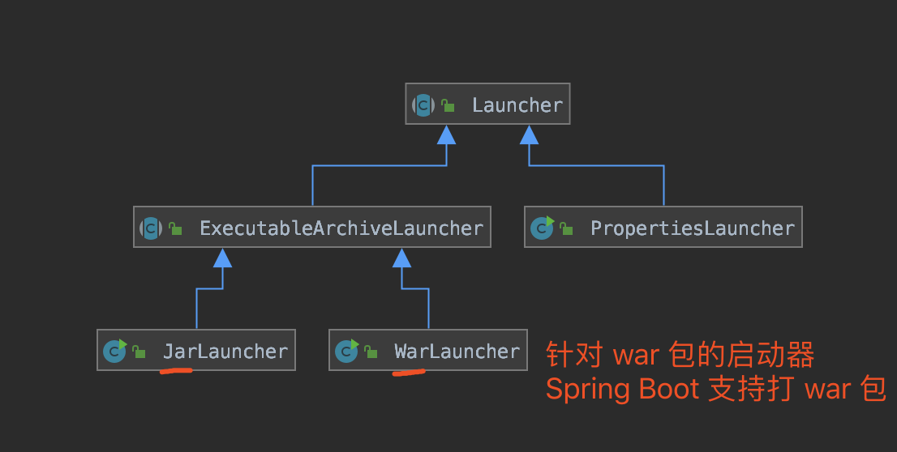
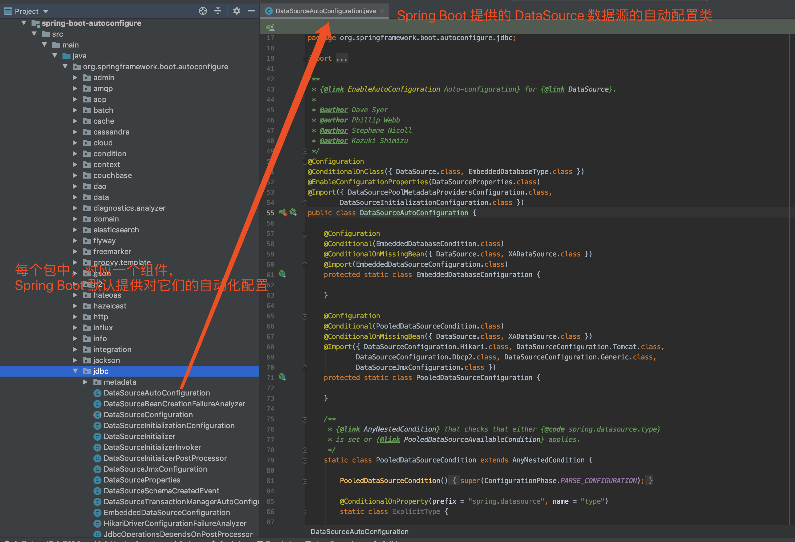
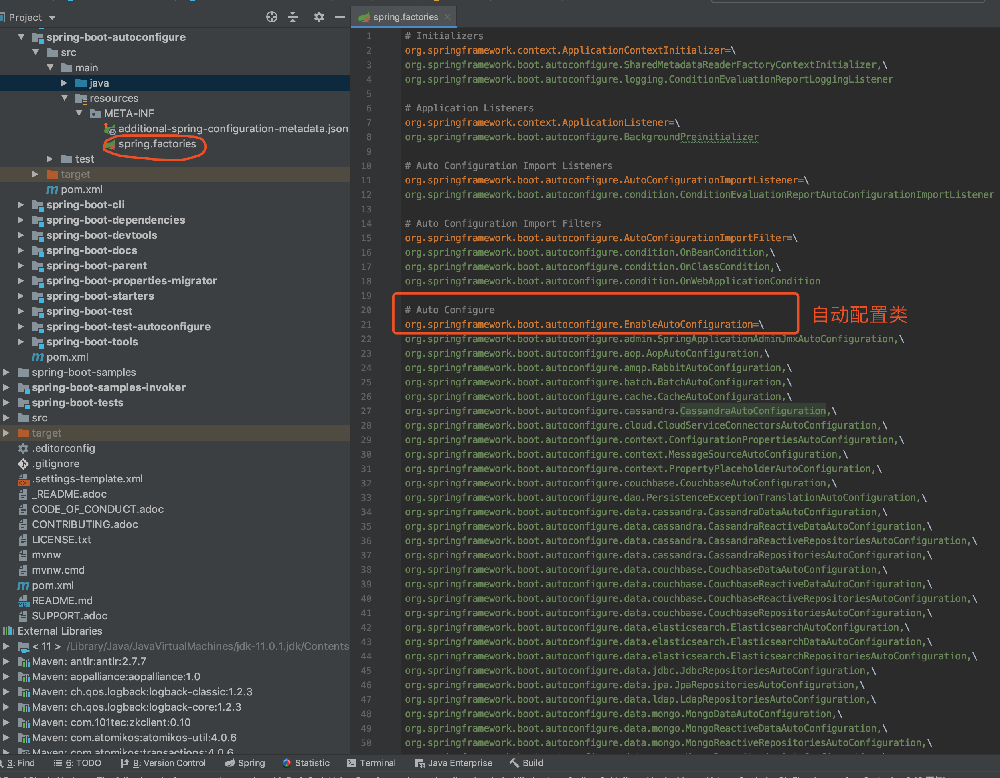
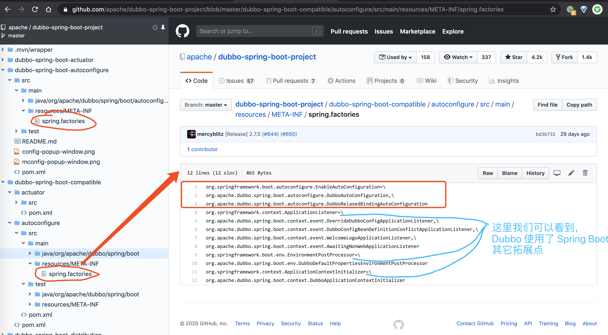
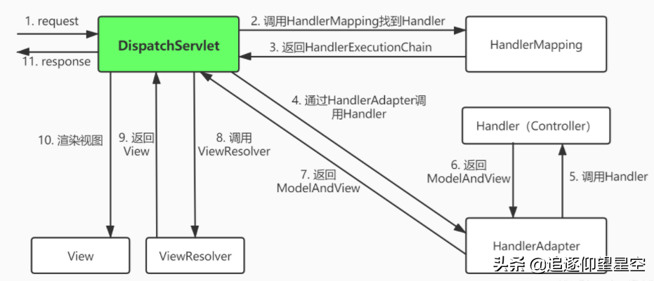

SpringBoot2.x核心技术


## 1、SpringBoot配置文件加载顺序及配置项优先级

SpringBoot的配置文件中配置项加载是在`org.springframework.boot.context.config.ConfigFileApplicationListener`收到`ApplicationEnvironmentPreparedEvent`事件后进行的。

SpringBoot的配置文件中配置项加载优先级逻辑是这样的：

1. **默认的配置文件加载顺序**：

   1. **`file:./config/`**：当前项目路径下的config目录下
   2. **`file:./config/*/`**：当前项目路径下的config目录下的任意子目录下
   3. **`file:./`**：当前项目路径下
   4. **`classpath:/config/`**：当前类路径下的config目录下
   5. **`classpath:/`**：当前类路径下

   > **举个例说明**：
   >
   > 1. `file:./config/application.properties`：`server.port=9999`
   > 2. `file:./config/*/application.properties`：`server.port=8888`
   > 3. `file:./application.properties`：`server.port=7777`
   > 4. `classpath:/config/application.properties`：`server.port=6666`
   > 5. `classpath:/application.properties`：`server.port=5555`
   >
   > 则`server.port`的值最终为**9999**

2. **如果配置了`spring.config.location`**，例如`spring.config.location=classpath:/custom-config/,file:./custom-config/`，那么1中默认的加载策略完全失效，以指定的`spring.config.location`值为准！其加载顺序如下：

   1. **`file:./custom-config/`**：当前项目路径下的custom-config目录下
   2. **`classpath:custom-config/`**：当前类路径下的custom-config目录下

3. **如果配置了`spring.config.additional-location`**，例如`spring.config.additional-location=classpath:/custom-config/,file:./custom-config/`，那么1中默认的加载策略将会继续生效，同时包括`spring.config.additional-location`中指定的配置文件！其加载顺序如下：

   1. **`file:./custom-config/`**：当前项目路径下的custom-config目录下
   2. **`classpath:custom-config/`**：当前类路径下的custom-config目录下
   3. **`file:./config/`**：当前项目路径下的config目录下
   4. **`file:./config/*/`**：当前项目路径下的config目录下的任意子目录下
   5. **`file:./`**：当前项目路径下
   6. **`classpath:/config/`**：当前类路径下的config目录下
   7. **`classpath:/`**：当前类路径下

4. **如果既配置了`spring.config.location`又配置了`spring.config.additional-location`**，那么两者同时生效，并且`spring.config.additional-location`的加载在前，`spring.config.location`的加载在后。

5. **如果同一目录下，遇到名字相同且后缀名分别为`.properties`和`.yaml`的情况，优先加载`properties`文件中的**。


**上面讲述了SpringBoot配置文件加载顺序，现在来说说SpringBoot的加载逻辑**：

- 首先从已有的`Environment`环境变量中搜索可能设置的`spring.profiles.include`和`spring.profiles.active`值。如果未设置，则按默认`Profile`名称(`default`)为开始搜索的起始`Profile`并将其加入`profiles`队列之中。后面每次搜索`Profile`的搜索路径`getSearchLocations()`方法都会从已有的`Environment`环境变量中搜索`spring.config.additional-location`和`spring.config.location`以确定**最终搜索路径**。

- 然后开始第一次搜索，此时队列中只有一个默认`Profile`名称(`default`)，开始从**最终搜索路径**中搜索`application.properties`或`application.yaml`，而且只找他们，其他配置文件先不管。找到`application.properties`或`application.yaml`之后通过`PropertySourceLoader`将配置文件内容加载出来并从内容中提取`spring.profiles.include`和`spring.profiles.active`的值加入`profiles`队列之中。由于循环搜索的驱动是调用`Queue#poll()`方法，所以当前`Profile`搜索完毕之后就删除了。

- 然后继续搜索`Profile`队列的后续`profile`（如果存在的话），最搜索出所有符合的配置文件并添加到`Environment`环境变量的`propertySources`中去。


## 2、spring.profiles.active和spring.profiles.include的区别

- `spring.profiles.active`：代表需要激活的配置文件列表(多个以逗号隔开，**且后面的优先级大于前面的**)，这里指的配置文件名形如这样的：application-${active}.properties|yaml

- `spring.profiles.include`：代表无条件被激活的配置文件列表(多个以逗号隔开，**且后面的优先级大于前面的**)，这里指的配置文件名形如这样的：application-${active}.properties|yaml

- `spring.profiles.active`指定的配置文件中的相同配置项的优先级要大于`spring.profiles.include`中的。同时两者的优先级都高于默认配置文件(application.properties|yaml)。加载优先级也即：

  **spring.profiles.active  >  spring.profiles.include  >  application.properties|yaml**

  举个例子：

  ```properties
  #application.properties
  
  account.id=111
  account.username=admin
  account.password=123456
  account.balance=0
  account.type=debit-card
  
  #application-dev.properties
  account.username=dev
  account.password=dev123
  
  #application-prd.properties
  account.id=222
  account.username=prd
  account.type=credit-card
  
  #application-foo.properties
  account.id=333
  account.balance=100
  
  #application-bar.properties
  account.balance=200
  ```

  1. 当`spring.profiles.active=dev`；`spring.profiles.include=foo,bar`时，结果是：

     ```properties
     account.id=333
     account.username=dev
     account.password=dev123
     account.balance=200
     account.type=debit-card
     ```

  2. 当`spring.profiles.active=dev`；`spring.profiles.include=bar,foo`时，结果是：

     注意include列表中foo与bar的顺序变了，导致结果也会不一样，注意观察

     ```properties
     account.id=333
     account.username=dev
     account.password=dev123
     account.balance=100
     account.type=debit-card
     ```

  3. 当`spring.profiles.active=dev,prd`；`spring.profiles.include=foo,bar`时，结果是：

     ```properties
     account.id=222
     account.username=prd
     account.password=dev123
     account.balance=200
     account.type=credit-card
     ```

  4. 当`spring.profiles.active=prd,dev`；`spring.profiles.include=foo,bar`时，结果是：

     注意active列表中dev与prd的顺序变了，导致结果也会不一样，注意观察

     ```properties
     account.id=222
     account.username=dev
     account.password=dev123
     account.balance=200
     account.type=credit-card
     ```


## 3、SpringBoot中针对某指定配置项(例如server.port)的顺序优先级

SpringBoot使用一个非常特殊的`PropertySource`顺序，该顺序设计用于允许合理地重写值。配置项的优先加载顺序如下所示依次由高到底：

1. 在启用devtools的情况下，如果在**~/.config/spring-boot/spring-boot-devtools.properties**中发现该配置项，则优先使用。
2. `@TestPropertySource` 注解中发现该配置项，则优先使用。
3. `@SpringBootTest`的`properties`属性中发现该配置项，则优先使用。
4. 命令行参数（例如--server.port=8090）中发现该配置项，则优先使用。
5. 在系统属性`System.getProperties()`或系统环境变量`System.getEnv()`中key为`SPRING_APPLICATION_JSON`的，或者由-Dspring.application.json参数指定的，JSON格式的属性集中发现该配置项，则优先使用。
6. `ServletConfig`的`init-param`中发现该配置项，则优先使用。
7. `ServletContext`的`init-param`中发现该配置项，则优先使用。
8. JNDI (`java:comp/env`)中发现该配置项，则优先使用。
9. 系统属性`System.getProperties()`中发现该配置项，则优先使用。
10. 系统环境变量`System.getEnv()`中发现该配置项，则优先使用。
11. `RandomValuePropertySource`的random.*属性中发现该配置项，则优先使用。
12. **`file:./config/application-{profile}.properties|yaml`**中发现该配置项，则优先使用。
13. **`file:./config/*/application-{profile}.properties|yaml`**中发现该配置项，则优先使用。
14. **`file:./application-{profile}.properties|yaml`**中发现该配置项，则优先使用。
15. **`classpath:/config/application-{profile}.properties|yaml`**中发现该配置项，则优先使用。
16. **`classpath:/application-{profile}.properties|yaml`**中发现该配置项，则优先使用。
17. `@Configuration`注解的class上出现的`@PropertySource`注解指定的properties中发现该配置项，则优先使用。
18. `SpringApplication.setDefaultProperties(..)`设置的默认配置中发现该配置项，则优先使用。


## 4、SpringBoot Jar包启动原理

- #### 概述

  Spring Boot 提供了 Maven 插件 [`spring-boot-maven-plugin`](https://docs.spring.io/spring-boot/docs/current/reference/html/build-tool-plugins.html#build-tool-plugins-maven-plugin)，可以方便的将 Spring Boot 项目打成 `jar` 包或者 `war` 包。

  考虑到部署的便利性，我们绝大多数 99.99% 的场景下，我们会选择打成 `jar` 包。这样，我们就无需在部署项目的服务器上，配置相应的 Tomcat、Jetty 等 Servlet 容器。

  那么，`jar` 包是如何运行，并启动 Spring Boot 项目的呢？这个就是本文的目的，一起弄懂 Spring Boot `jar` 包的**运行原理**。

  下面，我们来打开一个 Spring Boot `jar` 包，看看其里面的结构。如下图所示，一共分成四部分：

  

  - ① `META-INF` 目录：通过 `MANIFEST.MF` 文件提供 `jar` 包的**元数据**，声明了 `jar` 的启动类。

  - ② `org` 目录：为 Spring Boot 提供的 [`spring-boot-loader`](https://github.com/spring-projects/spring-boot/blob/master/spring-boot-project/spring-boot-tools/spring-boot-loader/) 项目，它是 `java -jar` 启动 Spring Boot 项目的秘密所在，也是稍后我们将深入了解的部分。

    > Spring Boot Loader provides the secret sauce that allows you to build a single jar file that can be launched using `java -jar`. Generally you will not need to use `spring-boot-loader` directly, but instead work with the [Gradle](https://github.com/spring-projects/spring-boot/blob/master/spring-boot-project/spring-boot-tools/spring-boot-gradle-plugin) or [Maven](https://github.com/spring-projects/spring-boot/blob/master/spring-boot-project/spring-boot-tools/spring-boot-maven-plugin) plugin.

  - ③ `BOOT-INF/lib` 目录：我们 Spring Boot 项目中引入的**依赖**的 `jar` 包们。`spring-boot-loader` 项目很大的一个作用，就是**解决 `jar` 包里嵌套 `jar` 的情况**，如何加载到其中的类。

  - ④ `BOOT-INF/classes` 目录：我们在 Spring Boot 项目中 Java 类所编译的 `.class`、配置文件等等。

  先简单剧透下，`spring-boot-loader` 项目需要解决两个问题：

  - 第一，如何引导执行我们创建的 Spring Boot 应用的启动类，例如上述图中的 Application 类。
  - 第二，如何加载 `BOOT-INF/class` 目录下的类，以及 `BOOT-INF/lib` 目录下内嵌的 `jar` 包中的类。

  下面，尾随艿艿，一起来抽丝剥茧！

- #### MANIFEST.MF

  我们来查看 `META-INF/MANIFEST.MF` 文件，里面的内容如下：

  ```shell
  Manifest-Version: 1.0
  Implementation-Title: lab-39-demo
  Implementation-Version: 2.2.2.RELEASE
  Start-Class: cn.iocoder.springboot.lab39.skywalkingdemo.Application
  Spring-Boot-Classes: BOOT-INF/classes/
  Spring-Boot-Lib: BOOT-INF/lib/
  Build-Jdk-Spec: 1.8
  Spring-Boot-Version: 2.2.2.RELEASE
  Created-By: Maven Archiver 3.4.0
  Main-Class: org.springframework.boot.loader.JarLauncher
  ```
  它实际是一个 **Properties** 配置文件，每一行都是一个配置项目。重点来看看两个配置项：

  - `Main-Class` 配置项：Java 规定的 `jar` 包的启动类，这里设置为 `spring-boot-loader` 项目的 [JarLauncher](https://github.com/spring-projects/spring-boot/blob/master/spring-boot-project/spring-boot-tools/spring-boot-loader/src/main/java/org/springframework/boot/loader/JarLauncher.java) 类，进行 Spring Boot 应用的启动。
  - `Start-Class` 配置项：Spring Boot 规定的**主**启动类，这里设置为我们定义的 Application 类。

  > 备注一下：`Main-Class` 配置项是Java Jar包体系的标准， `META-INF/MANIFEST.MF` 文件中还可以有`Class-Path`等参数。但是`Start-Class` 配置项并不是Java标准之内的，而是SpringBoot自定义的一项属性，例如上面的`Spring-Boot-Classes`、`Spring-Boot-Version`都是SpringBoot自定义的属性。

  可能有朋友会有疑惑，`Start-Class` 对应的 Application 类自带了 `#main(String[] args)` 方法，为什么我们不能直接运行会如何呢？我们来简单尝试一下哈，控制台执行如下：

  ```shell
  $ java -classpath lab-39-demo-2.2.2.RELEASE.jar cn.iocoder.springboot.lab39.skywalkingdemo.Application错误: 找不到或无法加载主类 cn.iocoder.springboot.lab39.skywalkingdemo.Application
  ```
  **直接找不到 Application 类，因为它在 `BOOT-INF/classes` 目录下，不符合 Java 默认的 `jar` 包的加载规则。因此，需要通过 JarLauncher 启动加载。**

  **当然实际还有一个更重要的原因，Java 规定可执行器的 `jar` 包禁止嵌套其它 `jar` 包。**但是我们可以看到 `BOOT-INF/lib` 目录下，实际有 Spring Boot 应用依赖的所有 `jar` 包。因此，`spring-boot-loader` 项目自定义实现了 ClassLoader 实现类 [LaunchedURLClassLoader](https://github.com/spring-projects/spring-boot/blob/master/spring-boot-project/spring-boot-tools/spring-boot-loader/src/main/java/org/springframework/boot/loader/LaunchedURLClassLoader.java)，支持加载 `BOOT-INF/classes` 目录下的 `.class` 文件，以及 `BOOT-INF/lib` 目录下的 `jar` 包。

- #### JarLauncher

  [JarLauncher](https://github.com/spring-projects/spring-boot/blob/master/spring-boot-project/spring-boot-tools/spring-boot-loader/src/main/java/org/springframework/boot/loader/JarLauncher.java) 类是针对 Spring Boot `jar` 包的启动类，整体类图如下所示：

  

  JarLauncher 的源码比较简单，如下图所示：

  ```java
  public class JarLauncher extends ExecutableArchiveLauncher {
  
  	static final String BOOT_INF_CLASSES = "BOOT-INF/classes/";
  
  	static final String BOOT_INF_LIB = "BOOT-INF/lib/";
  
  	public JarLauncher() {
  	}
  
  	protected JarLauncher(Archive archive) {
  		super(archive);
  	}
  
  	@Override
  	protected boolean isNestedArchive(Archive.Entry entry) {
  		if (entry.isDirectory()) {
  			return entry.getName().equals(BOOT_INF_CLASSES);
  		}
  		return entry.getName().startsWith(BOOT_INF_LIB);
  	}
  
  	public static void main(String[] args) throws Exception {
  		new JarLauncher().launch(args);
  	}
  
  }
  ```
  通过 `#main(String[] args)` 方法，创建 JarLauncher 对象，并调用其 `#launch(String[] args)` 方法进行启动。整体的启动逻辑，其实是由父类 [Launcher](https://github.com/spring-projects/spring-boot/blob/master/spring-boot-project/spring-boot-tools/spring-boot-loader/src/main/java/org/springframework/boot/loader/Launcher.java) 所提供，如下图所示：

  ```java
  // Launcher.java
  
  protected void launch(String[] args) throws Exception {
  	// <1> 注册 URL 协议的处理器
  	JarFile.registerUrlProtocolHandler();
  	// <2> 创建类加载器
  	ClassLoader classLoader = createClassLoader(getClassPathArchives());
  	// <3> 执行启动类的 main 方法
  	launch(args, getMainClass(), classLoader);
  }
  ```

  - `<1>` 处，调用 JarFile 的 `#registerUrlProtocolHandler()` 方法，注册 Spring Boot 自定义的 [URLStreamHandler](https://github.com/openjdk-mirror/jdk7u-jdk/blob/master/src/share/classes/java/net/URLStreamHandler.java) 实现类，用于 `jar` 包的加载读取。
  - `<2>` 处，调用自身的 `#createClassLoader(List<Archive> archives)` 方法，创建自定义的 [ClassLoader](https://github.com/openjdk-mirror/jdk7u-jdk/blob/master/src/share/classes/java/lang/ClassLoader.java) 实现类，用于从 `jar` 包中加载类。
  - `<3>` 处，执行我们声明的 Spring Boot 启动类，进行 Spring Boot 应用的启动。

  

  简单来说，可以分成以下几步：

  1. 首先需要创建自定义的类加载器`LaunchedURLClassLoader`，这个类加载器是继承`URLClassLoader`，因此需要`BOOT-INF/classes` 和`BOOT-INF/lib`中的jar包和类的URL 。

  2. `spring-boot-loader` 将`BOOT-INF/classes`看做是一个整体，即`BOOT-INF/classes/` 目录被归类为**一个** Archive 对象，而 `BOOT-INF/lib/` 目录下的**每个** `jar` 包都对应**一个** Archive 对象。这个`Archive` 称之为归档文件，是`spring-boot-loader` 自定义的接口，接口如下所示：

     ```java
     public interface Archive extends Iterable<Archive.Entry>, AutoCloseable {
     
     	//获取归档的URL
     	URL getUrl() throws MalformedURLException;
     
     	/**
     	 * Returns the manifest of the archive.
     	 */
     	Manifest getManifest() throws IOException;
     	
         //获取归档文件的嵌套归档文件，这里嵌套归档文件可能是一个Class类文件或者一个Jar包文件
     	default Iterator<Archive> getNestedArchives(EntryFilter searchFilter, EntryFilter includeFilter)
     			throws IOException {
     		EntryFilter combinedFilter = (entry) -> (searchFilter == null || searchFilter.matches(entry))
     				&& (includeFilter == null || includeFilter.matches(entry));
     		List<Archive> nestedArchives = getNestedArchives(combinedFilter);
     		return nestedArchives.iterator();
     	}
         
         //...
     }
     ```

     实际上`Launcher#createArchive()`方法就只创建了一个`Archive`，就是整个SpringBoot `Jar`作为一个`Archive`，实际就是`JarFileArchive`对象，通过其`getNestedArchives()` 方法递归获取 `BOOT-INF/lib` 目录下的`jar`和 `BOOT-INF/classes` 中的`Class`的URL列表并传给`LaunchedURLClassLoader`构造器。

     以下是：

     ```java
     import java.security.CodeSource;
     import java.security.ProtectionDomain;
     //...
     
     public abstract class Launcher {
         /**
          * 可以看出SpringBoot Jar中的其他文件(class和lib)都有一个共同的父路径，改父路径通过
          * java.security.CodeSource和java.security.ProtectionDomain得出来的，例如：
          * jar:file:/Users/yunai/Java/SpringBoot-Labs/lab-39/lab-39-demo/target/lab-39-demo-2.2.2.RELEASE.jar!/
          */
     	protected final Archive createArchive() throws Exception {
     		ProtectionDomain protectionDomain = getClass().getProtectionDomain();
     		CodeSource codeSource = protectionDomain.getCodeSource();
     		URI location = (codeSource != null) ? codeSource.getLocation().toURI() : null;
     		String path = (location != null) ? location.getSchemeSpecificPart() : null;
     		if (path == null) {
     			throw new IllegalStateException("Unable to determine code source archive");
     		}
     		File root = new File(path);
     		if (!root.exists()) {
     			throw new IllegalStateException("Unable to determine code source archive from " + root);
     		}
     		return (root.isDirectory() ? new ExplodedArchive(root) : new JarFileArchive(root));
     	}
         //...
     }
     ```

  3. 接下来就是最后一步：使用`LaunchedURLClassLoader`来加载 `META-INF/MANIFEST.MF`  中定义的`Start-Class`类，然后通过反射调用其`#main(String[] args)` ，也就是调用`cn.iocoder.springboot.lab39.skywalkingdemo.Application#main(String[] args)`，参数就是`JarLauncher#launch(String[] args)`方法传来的参数`args`，这样就把SpringBoot程序给启动起来了 。

     

- #### LaunchedURLClassLoader

  [LaunchedURLClassLoader](https://github.com/DarLiner/spring-boot/blob/master/spring-boot-project/spring-boot-tools/spring-boot-loader/src/main/java/org/springframework/boot/loader/LaunchedURLClassLoader.java) 是 `spring-boot-loader` 项目自定义的**类加载器**，实现对 `jar` 包中 `META-INF/classes` 目录下的**类**和 `META-INF/lib` 内嵌的 `jar` 包中的**类**的**加载**。

  ```java
  // LaunchedURLClassLoader.java
  
  public class LaunchedURLClassLoader extends URLClassLoader {
  
  	public LaunchedURLClassLoader(URL[] urls, ClassLoader parent) {
  		super(urls, parent);
  	}
  	
  }
  ```

  LaunchedURLClassLoader 的实现代码并不多，我们主要来看看它是如何从 `jar` 包中加载类的。核心如下图所示：

  

  - `<1>` 处，在通过**父类**的 `#getPackage(String name)` 方法获取不到指定类所在的包时，**会通过遍历 `urls` 数组，从 `jar` 包中加载类所在的包**。当找到包时，会调用 `#definePackage(String name, Manifest man, URL url)` 方法，设置包所在的 **Archive** 对应的 `Manifest`。为什么要设置**Archive** 对应的 `Manifest`？因为`spring-boot-loader` 的设计者是准备将 `BOOT-INF/classes` 作为一个整体`Jar`包交给URLClassLoader来读取，但是其缺少作为`Jar`包的组成元素`Manifest`，所以将**Archive** 所持的 `Manifest`设置上去。
  - `<2>` 处，调用**父类**的 `#loadClass(String name, boolean resolve)` 方法，加载对应的类。
  - 整个类的加载是严格遵守双亲委派机制的。

摘要: 原创出处 http://www.iocoder.cn/Spring-Boot/jar/


## 5、SpringBoot常用注解

- ##### @SpringBootApplication

  这个注解是SpringBoot应用程序启动入口的标识，该注解是个组合注解，其是以下几种注解的组合：

  1. `@EnableAutoConfiguration` ：启用自动配置机制
  2. `@ComponentScan` ：启用自动扫描@Configuration、@Component等注解标注的bean并注册到容器中
  3. `@SpringBootConfiguration` ：在应用程序上下文中注册额外的bean来支撑SpringBoot

  **使用示例**：

  ```java
  import org.springframework.boot.SpringApplication;
  import org.springframework.boot.autoconfigure.SpringBootApplication;
   
  @SpringBootApplication
  public class MySpringBootApplication {
   
      public static void main(String[] args) {
          SpringApplication.run(MySpringBootApplication.class, args);
      }
   
  }
  ```

  

- ##### @EnableAutoConfiguration

  这个注释支持Spring应用程序上下文的自动配置，试图根据classpath中预定义的类来猜测和配置我们可能需要注册的bean。

  该注释已经被包含在@SpringBootApplication中，所以在启动类中再次添加它也没有影响。还建议通过@SpringBootApplication只包含该注释一次。

  自动配置类也是常规的Spring配置bean，一般情况下`@Configuration`注解标记的类都是自动配置类。`@EnableAutoConfiguration`使用SpringFactoriesLoader机制(针对这个类设置键值)定位它们。通常自动配置bean是@Conditional bean(通常使用@ConditionalOnClass和@ConditionalOnMissingBean注释)。

  

- ##### @SpringBootConfiguration

  `@SpringBootConfiguration`指示一个类是一个SpringBoot应用程序的启动类。它用来替代Spring的标准@Configuration注释，以便能够快速自动找到配置。

  同样，该注释已经被包含在@SpringBootApplication中，应用程序应该只包含一个@SpringBootConfiguration，大多数惯用的Spring引导应用程序将从@SpringBootApplication继承它。

  两种注释的主要区别在于@SpringBootConfiguration允许自动定位配置。这对于单元测试或集成测试特别有用。

  

- ##### @ImportAutoConfiguration

  `@ImportAutoConfiguration`只导入指定的自动配置类。和@EnableAutoConfiguration的区别在于：@EnableAutoConfiguration会尝试配置扫描期间在类路径中找到的bean，而@ImportAutoConfiguration只运行我们在注释中提供的配置类。

  **使用示例**：

  ```java
  @ComponentScan("com.xxx")
  @ImportAutoConfiguration({WebMvcAutoConfiguration.class
      ,DispatcherServletAutoConfiguration.class
      ,EmbeddedServletContainerAutoConfiguration.class
      ,ServerPropertiesAutoConfiguration.class
      ,HttpMessageConvertersAutoConfiguration.class})
  public class MySpringBootApplication 
  {
      public static void main(String[] args) 
      {
          SpringApplication.run(MySpringBootApplication.class, args);
      }
  }
  ```

  

- ##### @AutoConfigureBefore, @AutoConfigureAfter, @AutoConfigureOrder

  如果我们的配置需要以特定的顺序(before或after)应用，我们可以使用@AutoConfigureAfter或@AutoConfigureBefore注释来指定各个自动配置类之间的加载顺序。如果我们想定制某些相互之间不应该有任何直接先后配置顺序的情况，我们也可以使用@AutoConfigureOrder。该注释与常规的@Order注释具有相同的语义，但为自动配置类提供的专用顺序。

  **使用示例**：

  ```java
  package com.xxx.separated.config
      
  @Configuration
  public class FooConfiguration {
  
      public FooConfiguration() {
          System.out.println(">>> new FooConfiguration()");
      }
  
  }
  
  package com.xxx.separated.config
      
  @Configuration
  @AutoConfigureAfter(FooConfiguration.class)
  public class BarConfiguration {
  
      public BarConfiguration() {
          System.out.println(">>> new BarConfiguration()");
      }
  
  }
  ```

  **这三大注解用起来有大坑(网上说其不生效的骂声一片)，正确的使用姿势是**：

  - 将上面的`FooConfiguration`和`BarConfiguration`放在`@ComponentScan`扫描不到的包内。

  - 同时在当前工程的resources目录下增加META-INF/spring.factories文件，文件中写入(前后顺序无影响)：

    ```shell
    org.springframework.boot.autoconfigure.EnableAutoConfiguration=com.xxx.separated.config.FooConfiguration,com.xxx.separated.config.BarConfiguration
    ```

  通过上述两步配置之后才能正确工作。

  **<u>SpringBoot的自动配置均是通过`spring.factories`来指定的，它的优先顺序最低（执行时机是最晚的）；通过扫描进来的一般都是你自己自定义的配置类，所以优先顺序是最高的，肯定在`spring.factories`指定的自动配置之前载入!</u>**

  

- ##### 基于@Conditional的注解

  所有自动配置类通常都有一个或多个@Conditional注释。它只允许在满足条件时注册bean。下面是一些有用的条件注释

  1. ##### @ConditionalOnBean 和 @ConditionalOnMissingBean

     用于判断指定类型、或名称的bean是否注册在容器中。例如：

     ```java
     @Bean
     @ConditionalOnMissingBean(type = "JpaTransactionManager")
     JpaTransactionManager transactionManager(EntityManagerFactory entityManagerFactory) 
     {
         JpaTransactionManager transactionManager = new JpaTransactionManager();
         transactionManager.setEntityManagerFactory(entityManagerFactory);
         return transactionManager;
     }
     ```

  2. ##### @ConditionalOnClass 和 @ConditionalOnMissingClass

     用于判断指定名称的Class类是否出现在classpath类路径中。例如：

     ```java
     @Configuration
     @ConditionalOnClass(EmbeddedAcmeService.class)
     static class EmbeddedConfiguration 
     {
      
         @Bean
         @ConditionalOnMissingBean
         public EmbeddedAcmeService embeddedAcmeService() { ... }
      
     }
     ```

  3. ##### @ConditionalOnNotWebApplication 和 @ConditionalOnWebApplication

     用于判断当前应用是否是个基于Servlet容器的web应用。

  4. ##### @ConditionalOnProperty

     用于判断当前Spring的Environment环境变量中是否存在指定的配置项，或者更进一步判断指定的配置项是否具有指定的值。

     ```java
     @Bean
     @ConditionalOnProperty(name="spring.datasource.master")
     DataSource masterDataSource() 
     {
       	// ...
     }
     
     @Bean
     @ConditionalOnProperty(name="spring.cache.type", havingValue="redis")
     Cache redisCache() 
     {
       	// ...
     }
     ```

  5. ##### @ConditionalOnExpression

     基于SpEL表达式计算值的真假来判断条件的，例如：

     ```java
     @Bean
     @ConditionalOnExpression("${env} && ${havingValue == 'local'}")
     DataSource dataSource() 
     {
         // ...
     }
     ```


## 6、SpringBoot自动配置原理

1. ##### 基于@Conditional注解的条件化注册Bean使得自动配置成为可能

   - `@Conditional`注解和`Condition`接口的**定义**

     `org.springframework.context.annotation.Conditional`是Spring4新提供的注解，它的作用是按照一定的条件进行判断，满足条件给容器注册bean。

     ```java
     @Target({ElementType.TYPE, ElementType.METHOD})
     @Retention(RetentionPolicy.RUNTIME)
     @Documented
     public @interface Conditional {
     
        /**
         * 返条件实现类的列表，逻辑是：只要有一个Condition实现返回false，那么当前bean就被取消注册到容器中
         */
        Class<? extends Condition>[] value();
     
     }
     
     @FunctionalInterface
     public interface Condition {
     
     	/**
     	 * 条件匹配方法
     	 */
     	boolean matches(ConditionContext context, AnnotatedTypeMetadata metadata);
     
     }
     ```

     从代码中可以看到，需要传入一个Class数组，并且需要继承`Condition`接口，需要实现`matches()`方法，返回`true`则注册bean，`false`则不注册。

     <u>**`Conditional#value()`语义是：返条件实现类的列表，逻辑是：只要有一个`Condition`实现返回`false`，那么当前bean就被取消注册到容器中!**</u>

   - SpringBoot对`Condition`接口的进行了通用化拓展，拓展出一个公共的`Condition`基类：`org.springframework.boot.autoconfigure.condition.SpringBootCondition`，该SpringBootCondition基类只抽象出一个方法供子类去实现，如下所示：

     ```java
     public abstract class SpringBootCondition implements Condition {
         //...
         
     	/**
     	 * 返回一个条件匹配的结果
     	 * @return the condition outcome
     	 */
     	public abstract ConditionOutcome getMatchOutcome(ConditionContext context, AnnotatedTypeMetadata metadata);
         
         //...
     }
     //这个结果ConditionOutcome中封装了条件是否匹配以及不匹配的原因是什么
     public class ConditionOutcome {
     
     	private final boolean match;
     
     	private final ConditionMessage message;
     
     	public ConditionOutcome(boolean match, String message) {
     		this(match, ConditionMessage.of(message));
     	}
     }
     ```
     其中这个条件结果(`ConditionOutcome`)中封装了条件是否匹配(`boolean match`)以及不匹配的原因(`ConditionMessage message`)是什么。

     显然，Spring4 提交的 `@Conditional` 注解非常不方便，需要我们自己去拓展。因此，Spring Boot 进一步增强，提供了常用的条件注解：

     - `@ConditionalOnBean`：当容器里有指定 Bean 的条件下
     - `@ConditionalOnMissingBean`：当容器里没有指定 Bean 的情况下
     - `@ConditionalOnSingleCandidate`：当指定 Bean 在容器中只有一个，或者虽然有多个但是指定首选 Bean
     - `@ConditionalOnClass`：当类路径下有指定类的条件下
     - `@ConditionalOnMissingClass`：当类路径下没有指定类的条件下
     - `@ConditionalOnProperty`：指定的属性是否有指定的值
     - `@ConditionalOnResource`：类路径是否有指定的值
     - `@ConditionalOnExpression`：基于 SpEL 表达式作为判断条件
     - `@ConditionalOnJava`：基于 Java 版本作为判断条件
     - `@ConditionalOnJndi`：在 JNDI 存在的条件下差在指定的位置
     - `@ConditionalOnNotWebApplication`：当前项目不是 Web 项目的条件下
     - `@ConditionalOnWebApplication`：当前项目是 Web项 目的条件下

   - `@Conditional`注解和`Condition`接口的**使用示例**

     ```java
     public class WindowsCondition implements Condition {
         @Override
         public boolean matches(ConditionContext context, AnnotatedTypeMetadata metadata) {
             //获取ioc使用的beanFactory
             ConfigurableListableBeanFactory beanFactory = context.getBeanFactory();
             //获取类加载器
             ClassLoader classLoader = context.getClassLoader();
             //获取当前环境信息
             Environment environment = context.getEnvironment();
             //获取bean定义的注册类
             BeanDefinitionRegistry registry = context.getRegistry();
     
             //获得当前系统名
             String property = environment.getProperty("os.name");
             //包含Windows则说明是windows系统，返回true
             if (property.contains("Windows")){
                 return true;
             }
             return false;
         }
     }
     
     @Configuration
     public class SpringConditionalExampleConfiguration {
     
         @Bean
         @Conditional(WindowsCondition.class)
         public WindowsOperatingSystem windowsOperatingSystem() {
             return new WindowsOperatingSystem();
         }
     
     }
     ```

   - **运行原理**

     其实到现在为止，笔者也不知道Spring内部谁来处理了这个`@Conditional`注解，猜测应该是某个XxxBeanPostProcessor处理了这个注解。为了弄清楚，我们这样办：在`WindowsCondition#matches()`内部打个断点，查看调用堆栈，即能找到我们要找的处理类，这也是学会学习和钻研的方法！

     通过debug调用堆栈，我们发现处理`@Conditional`注解的逻辑在`ConfigurationClassPostProcessor`这个实现了`BeanDefinitionRegistryPostProcessor`接口的PostProcessor中，跟我猜测的不错，笔者猜测也是在`ConfigurationClassPostProcessor`中进行处理的，但是没有找到相关代码，严格地说处理的源头是它，但是实际处理`@Conditional`的却是另有其人，且看调用堆栈：

     `org.springframework.context.annotation.ConfigurationClassPostProcessor#processConfigBeanDefinitions()` ->

     `org.springframework.context.annotation.ConfigurationClassBeanDefinitionReader#loadBeanDefinitions()` ->

     `org.springframework.context.annotation.ConfigurationClassBeanDefinitionReader#loadBeanDefinitionsForBeanMethod()` ->

     **`org.springframework.context.annotation.ConditionEvaluator#shouldSkip()`** ->

     `com.penglecode.xmodule.master4j.springboot.example.conditions.WindowsCondition#matches()`

     重点就在这个`ConditionEvaluator#shouldSkip()`方法中，我们看看这个方法：

     ```java
     //这个ConditionEvaluator类就是处理@Conditional注解的类
     class ConditionEvaluator {
     
        private final ConditionContextImpl context;
     
        public ConditionEvaluator(@Nullable BeanDefinitionRegistry registry,
              @Nullable Environment environment, @Nullable ResourceLoader resourceLoader) {
     
           this.context = new ConditionContextImpl(registry, environment, resourceLoader);
        }
     
     
        /**
         * 确定一个bean的注解定义元数据来判定它是否满足@Conditional注解的条件(如果存在@Conditional注解的话)
         */
        public boolean shouldSkip(AnnotatedTypeMetadata metadata) {
           return shouldSkip(metadata, null);
        }
     
        /**
         * 确定一个bean的定义元数据来判定它是否满足@Conditional注解的条件(如果存在@Conditional注解的话)
         */
        public boolean shouldSkip(@Nullable AnnotatedTypeMetadata metadata, @Nullable ConfigurationPhase phase) {
            //如果当前bean没有被@Conditional注解，则返回false（即不忽略该bean）
           if (metadata == null || !metadata.isAnnotated(Conditional.class.getName())) {
              return false;
           }
     
           if (phase == null) { //如果Condition的检测时机未指定
              //如果bean的定义元数据是基于注解的定义元数据，并且当前是个配置类，则再次调用当前方法(使用确定的phase)
              if (metadata instanceof AnnotationMetadata &&
                    ConfigurationClassUtils.isConfigurationCandidate((AnnotationMetadata) metadata)) {
                 return shouldSkip(metadata, ConfigurationPhase.PARSE_CONFIGURATION);
              }
              return shouldSkip(metadata, ConfigurationPhase.REGISTER_BEAN);
           }
     
           //走到这里，说明phase有值
           
           //收集bean定义元数据上存在的@Conditional注解中指定的Condition实现
           List<Condition> conditions = new ArrayList<>();
           for (String[] conditionClasses : getConditionClasses(metadata)) {
              for (String conditionClass : conditionClasses) {
                 Condition condition = getCondition(conditionClass, this.context.getClassLoader());
                 conditions.add(condition);
              }
           }
           //对收集的Condition实现进行Order排序
           AnnotationAwareOrderComparator.sort(conditions);
     
           //只要有一个Condition实现返回false，那么当前bean就被取消注册到容器中!
           for (Condition condition : conditions) {
              ConfigurationPhase requiredPhase = null;
              if (condition instanceof ConfigurationCondition) {
                 requiredPhase = ((ConfigurationCondition) condition).getConfigurationPhase();
              }
              //1、如果当前condition不是ConfigurationCondition，则执行其matches()方法，返回!matches()
              //2、如果当前condition是ConfigurationCondition，并且requiredPhase与shouldSkip()方法传进来的相同
              //则执行其matches()方法，返回!matches()
              if ((requiredPhase == null || requiredPhase == phase) && !condition.matches(this.context, metadata)) {
                 return true;
              }
           }
     
           return false;
        }
     
        //获取@Conditional注解上的value()列表
        @SuppressWarnings("unchecked")
        private List<String[]> getConditionClasses(AnnotatedTypeMetadata metadata) {
           MultiValueMap<String, Object> attributes = metadata.getAllAnnotationAttributes(Conditional.class.getName(), true);
           Object values = (attributes != null ? attributes.get("value") : null);
           return (List<String[]>) (values != null ? values : Collections.emptyList());
        }
        //实例化一个Condition实现类的实例
        private Condition getCondition(String conditionClassName, @Nullable ClassLoader classloader) {
           Class<?> conditionClass = ClassUtils.resolveClassName(conditionClassName, classloader);
           return (Condition) BeanUtils.instantiateClass(conditionClass);
        }
     }
     ```

   **概括一下就是：`ConfigurationClassPostProcessor`在读取自动配置类时，当遇到`@Conditional`注解注释的bean组件定义时将会委托`ConditionEvaluator`的`shouldSkip()`方法进行筛选，筛选的逻辑就是执行`@Conditional`注解中指定`Condition`实现，如果有一个`Condition`实现返回`false`，那么当前bean就被取消注册到容器中!**

   

2. ##### SpringBoot 的 [spring-boot-autoconfigure](https://github.com/spring-projects/spring-boot/tree/master/spring-boot-project/spring-boot-autoconfigure) 项目，提供了大量框架的自动配置类，解放了程序员，使自动配置实至名归

   

   在我们通过 [`SpringApplication#run(Class primarySource, String... args)`](https://github.com/spring-projects/spring-boot/blob/master/spring-boot-project/spring-boot/src/main/java/org/springframework/boot/SpringApplication.java#L1218-L1227) 方法，启动 Spring Boot 应用的时候，有个非常重要的组件 [SpringFactoriesLoader](https://github.com/spring-projects/spring-framework/blob/master/spring-core/src/main/java/org/springframework/core/io/support/SpringFactoriesLoader.java) 类，会读取 `META-INF` 目录下的 `spring.factories` 文件，获得**每个框架定义的需要自动配置的配置类**。

   我们以 [spring-boot-autoconfigure](https://github.com/spring-projects/spring-boot/tree/master/spring-boot-project/spring-boot-autoconfigure) 项目的 [Spring Boot `spring.factories`](https://github.com/spring-projects/spring-boot/blob/master/spring-boot-project/spring-boot-autoconfigure/src/main/resources/META-INF/spring.factories) 文件来举个例子，如下图所示：

   

   如此，原先 `@Configuration` 注解的配置类，就**升级**成类自动配置类。这样，Spring Boot 在获取到需要自动配置的配置类后，就可以自动创建相应的 Bean，完成自动配置的功能。

   > 旁白君：这里其实还有一个非常有意思的话题，作为拓展知识，胖友可以后续去看看。实际上，我们可以把 `spring.factories` 理解成 Spring Boot 自己的 SPI 机制。感兴趣的胖友，可以看看如下的文章：
   >
   > - [《Spring Boot 的 SPI 机制》](http://www.iocoder.cn/Fight/SPI-mechanism-in-Spring-Boot/?self)
   > - [《Java 的 SPI 机制》](http://www.iocoder.cn/Fight/xuma/spi/?self)
   > - [《Dubbo 的 SPI 机制》](http://dubbo.apache.org/zh-cn/docs/dev/SPI.html)
   >
   > 实际上，自动配置只是 Spring Boot 基于 `spring.factories` 的一个拓展点 EnableAutoConfiguration。我们从上图中，还可以看到如下的拓展点：
   >
   > - ApplicationContextInitializer
   > - ApplicationListener
   > - AutoConfigurationImportListener
   > - AutoConfigurationImportFilter
   > - FailureAnalyzer
   > - TemplateAvailabilityProvider

   因为 spring-boot-autoconfigure 项目提供的是它选择的主流框架的自动配置，所以其它框架需要自己实现。例如说，Dubbo 通过 [dubbo-spring-boot-project](https://github.com/apache/dubbo-spring-boot-project) 项目，提供 Dubbo 的自动配置。如下图所示：

   

   

3. SpringBoot 自己的SPI机制的实现者[SpringFactoriesLoader](https://github.com/spring-projects/spring-framework/blob/master/spring-core/src/main/java/org/springframework/core/io/support/SpringFactoriesLoader.java) 助力自动配置清单的发现与执行

   1. ##### SPI机制

      （1）SPI思想

      - SPI的全名为Service Provider Interface.这个是针对厂商或者插件的。
      - SPI的思想：系统里抽象的各个模块，往往有很多不同的实现方案，比如日志模块的方案，xml解析模块、jdbc模块的方案等。面向的对象的设计里，我们一般推荐模块之间基于接口编程，模块之间不对实现类进行硬编码。一旦代码里涉及具体的实现类，就违反了可拔插的原则，如果需要替换一种实现，就需要修改代码。为了实现在模块装配的时候能不在程序里动态指明，这就需要一种服务发现机制。**java spi就是提供这样的一个机制：为某个接口寻找服务实现的机制**

      （2）SPI约定

      - 当服务的提供者，提供了服务接口的一种实现之后，在jar包的`META-INF/services/`目录里同时创建一个以服务接口命名的文件。该文件里就是实现该服务接口的具体实现类。而当外部程序装配这个模块的时候，就能通过该jar包`META-INF/services/`里的配置文件找到具体的实现类名，并装载实例化，完成模块的注入。通过这个约定，就不需要把服务放在代码中了，通过模块被装配的时候就可以发现服务类了。

      （3）SPI实现

      - Java自带的ServiceLoader实现

        `ServiceLoader`实现了`Iterable`，采用迟延加载的策略，当应用程序首次调用静态方法`ServiceLoader#load(String name)`方法时将会生成一个新的`ServiceLoader`实例，当应用程序开始迭代`ServiceLoader`时才会懒加载读取 `META-INF/services/` 下的配置文档，从文档中读出接口的实现类并通过反射实例化一个实例并缓存在`ServiceLoader`的一个`LinkedHashMap`类型的成员变量`providers`中。至于如何加载`META-INF/services/`目录下的配置文件其实是通过ClassLoader#getResources(String name)方法来实现的，由此看出这也不是什么独门秘籍，因此像其他诸如Dubbo、Spring等框架都实现了自己的SPI机制，他们都是大同小异而已！

      - ServiceLoader的使用

        1. 定义一组接口 (这里是IPay接口)，并写出接口的一个或多个实现(例如这里的AliPay和WeiXinPay)。

        ```java
        public interface IPay {
            void pay(Map<String,Object> parameter);
        }
        
        public class AliPay implements IPay {
            @Override
            public void pay(Map<String, Object> parameter) {
                System.out.println("支付宝支付");
            }
        }
        
        public class WeiXinPay implements IPay {
            @Override
            public void pay(Map<String, Object> parameter) {
                System.out.println("微信支付");
            }
        }
        ```

        2. 在 `src/main/resources/` 下建立 `/META-INF/services` 目录， 新增一个以接口(IPay)的全类名命名的文件(这里是`com.penglecode.xmodule.master4j.java.spi.IPay`)，内容是要应用的实现类（这里是`com.penglecode.xmodule.master4j.java.util.spi.AliPay`和`com.penglecode.xmodule.master4j.java.util.spi.WeiXinPay`，每行一个类）

        3. 通过`ServiceLoader`来调用接口给定的实现类：

           ```java
           public class PaySPIExample {
           
               public static void main(String[] args) {
                   ServiceLoader<IPay> pays = ServiceLoader.load(IPay.class);
                   for (IPay pay : pays) {
                       pay.pay(new HashMap<>());
                   }
               }
           
           }
           ```

           输出：

           ```shell
           支付宝支付
           微信支付
           ```

           

      - ServiceLoader的优点

        使用 Java SPI 机制的优势是实现解耦，使得接口的定义与具体业务实现分离，而不是耦合在一起。应用程序可以根据实际业务情况启用或替换具体组件。

      - ServiceLoader的缺点

        - 不能按需加载。虽然 ServiceLoader 做了延迟载入，但是基本只能通过遍历全部获取，也就是接口的实现类得全部载入并实例化一遍。如果你并不想用某些实现类，或者某些类实例化很耗时，它也被载入并实例化了，这就造成了浪费。
        - 获取某个实现类的方式不够灵活，只能通过 Iterator 形式获取，不能根据某个参数来获取对应的实现类。
        - 多个并发多线程使用 ServiceLoader 类的实例是不安全的。
        - 加载不到实现类时抛出并不是真正原因的异常，错误很难定位。

   2. ##### SPI使用案例

      - common-logging apache最早提供的日志的门面接口。只有接口，没有实现。具体方案由各提供商实现， 发现日志提供商是通过扫描 META-INF/services/org.apache.commons.logging.LogFactory配置文件，通过读取该文件的内容找到日志提工商实现类。只要我们的日志实现里包含了这个文件，并在文件里制定 LogFactory工厂接口的实现类即可。

   3. ##### SpringBoot中的类SPI扩展机制

      在SpringBoot的自动装配过程中，最终会加载`META-INF/spring.factories`文件，而加载的过程是由`org.springframework.core.io.support.SpringFactoriesLoader`加载的。从`CLASSPATH`下的每个Jar包中搜寻所有`META-INF/spring.factories`配置文件，然后当做properties文件解析，找到指定名称的配置后返回。需要注意的是，其实这里不仅仅是会去`CLASSPATH`路径下查找，会扫描所有路径下的Jar包，只不过这个文件只会在`CLASSPATH`下的jar包中。下面是`SpringFactoriesLoader`中加载所有`META-INF/spring.factories`配置文件的一段代码，**跟Java的`ServiceLoader`一样，都是通过`ClassLoader#getResources()`来加载的**：

      ```java
      public static final String FACTORIES_RESOURCE_LOCATION = "META-INF/spring.factories";
      // spring.factories文件的格式为：key=value1,value2,value3
      // 从所有的jar包中找到META-INF/spring.factories文件
      // 然后从文件中解析出key=factoryClass类名称的所有value值
      public static List<String> loadFactoryNames(Class<?> factoryClass, ClassLoader classLoader) {
          String factoryClassName = factoryClass.getName();
          // 取得资源文件的URL （这句代码是不是很熟悉?在java.util.ServiceLoader中也有）
          Enumeration<URL> urls = (classLoader != null ? classLoader.getResources(FACTORIES_RESOURCE_LOCATION) : ClassLoader.getSystemResources(FACTORIES_RESOURCE_LOCATION));
          List<String> result = new ArrayList<String>();
          // 遍历所有的URL
          while (urls.hasMoreElements()) {
              URL url = urls.nextElement();
              // 根据资源文件URL解析properties文件，得到对应的一组@Configuration类
              Properties properties = PropertiesLoaderUtils.loadProperties(new UrlResource(url));
              String factoryClassNames = properties.getProperty(factoryClassName);
              // 组装数据，并返回
              result.addAll(Arrays.asList(StringUtils.commaDelimitedListToStringArray(factoryClassNames)));
          }
          return result;
      }
      ```

   

4. 一些引入好jar包依赖的Starter，省去了开发者自己引入所需依赖及依赖版本的烦恼

   例如SpringBoot内置的许多Starter：spring-boot-starter-logging，spring-boot-starter-web，spring-boot-starter-jdbc等等。引入它们之后也就是相关的类在classpath类路径上，例如引入spring-boot-starter-jdbc之后，默认引入的是HikariCP这个数据库连接池，那么[spring-boot-autoconfigure](https://github.com/spring-projects/spring-boot/tree/master/spring-boot-project/spring-boot-autoconfigure) 项目中的`org.springframework.boot.autoconfigure.jdbc.DataSourceAutoConfiguration`将会通过`@ConditionalOnClass`条件匹配到classpath中存在HikariDataSource这个类，那么基于HikariCP数据库连接池的数据源将会被注册到容器中，这就是自动配置的最终结果，全程不需要程序员写任何代码，仅仅引入一个Starter就完成了默认的配置。

摘要: 原创出处 http://www.iocoder.cn/Spring-Boot/autoconfigure/ 


## 7、SpringBoot应用程序启动流程

1. 首先应用程序的入口引导调用`SpringApplication`的静态方法`run(Class<?> mainClass)`方法启动程序。

2. 执行`new SpringApplication(..)`，在`SpringApplication`的构造器方法中主要做了以下几个事情：

   - 推断当前应用程序的`WebApplicationType`

     调用`WebApplicationType#deduceFromClasspath()`方法，根据当前classpath类路径中的所存在类情况来推断当前应用程序类型(`WebApplicationType`)；`WebApplicationType`分为`NONE|SERVLET|REACTIVE`三种类型。

   - 通过`SpringFactoriesLoader`来加载所有的`META-INF/spring.factories`配置文件配置的`ApplicationContextInitializer`配置(注意会按照Order排序)，并设置给`SpringApplication.initializers`成员变量。

   - 以和加载`ApplicationContextInitializer`配置同样的方式来加载`ApplicationListener`配置，并设置给`SpringApplication.listeners`成员变量。

   - 推断当前应用程序的`main()`方法所在的类

     通过手动`new RuntimeException()`得到异常堆栈，从异常堆栈的方法名中获取`main`方法的那个类即是。

3. 接着调用`SpringApplication`的实例方法`run(String[] args)`，正式开始启动SpringBoot应用程序。

4. 调用`SpringApplicationRunListener`接口的默认实现`EventPublishingRunListener#starting()`方法广播`ApplicationStartingEvent`。<u>顺便说一句：由于这个时候ApplicationContext还未启动，所以响应`ApplicationStartingEvent`事件的只能是配在`META-INF/spring.factories`配置文件中的那些`ApplicationListener`。</u>

5. 准备应用上下文的`Environment`环境，并广播`ApplicationEnvironmentPreparedEvent`事件

   调用`prepareEnvironment()`方法，根据之前推断的`WebApplicationType`创建合适的Spring`Environment`环境(其实际类型是`StandardEnvironment`、`StandardServletEnvironment`、`StandardReactiveWebEnvironment`中的一种)，并且将当前应用程序的所传参数`args`覆盖到当前`Environment`环境中去，调用`SpringApplicationRunListener`接口的默认实现`EventPublishingRunListener#environmentPrepared()`方法广播`ApplicationEnvironmentPreparedEvent`事件，`org.springframework.boot.context.config.ConfigFileApplicationListener`收到`ApplicationEnvironmentPreparedEvent`事件执行程序中application.properties|yaml配置文件的查找及加载工作。

6. 根据`webApplicationType`的类型创建应用上下文ApplicationContext实例

   - 如果`webApplicationType`为Servlet应用的话，创建`AnnotationConfigServletWebServerApplicationContext`（此为SpringBoot扩展的`ApplicationContext`）
   - 如果`webApplicationType`为Reactive应用的话，创建`AnnotationConfigReactiveWebServerApplicationContext`（此为SpringBoot扩展的`ApplicationContext`）
   - 否则创建`AnnotationConfigApplicationContext`（此为Spring自带的`ApplicationContext`）

7. 准备应用上下文`SpringApplication#prepareContext()`，包括如下准备事项：

   - 设置之前准备好的`Environment`环境
   - 设置与后置处理(`Post-Processing`)相关的（如设置`ResourceLoader`、`ClassLoader`、`ConversionService`等）
   - 应用已设置的应用上下文初始化程序`ApplicationContextInitializer`（包括`META-INF/spring.factories`配置文件中配置的那些`ApplicationContextInitializer`和通过`context.initializer.classes`中配置的`ApplicationContextInitializer`）
   - 广播`ApplicationContextInitializedEvent`事件
   - 向BeanFactory中加载所有bean的定义（包括XML配置和JAVA注解配置两种方式的bean定义）
   - 广播`ApplicationPreparedEvent`事件

8. 刷新应用上下文`SpringApplication#refreshContext()`，这个刷新动作实际上也就是调用`AbstractApplicationContext#refresh()`方法。不过这个`refresh()`方法及其派生的声明周期钩子函数`onRefresh()`，`ServletWebServerApplicationContext`和`ReactiveWebServerApplicationContext`两个分支都对其进行了重写，都在`AbstractApplicationContext#onRefresh()`中加入了`createWebServer()`的逻辑，createWebServer()方法如下所示：

   ```java
   //org.springframework.boot.web.servlet.context.ServletWebServerApplicationContext#createWebServer()
   
   private void createWebServer() {
      WebServer webServer = this.webServer;
      ServletContext servletContext = getServletContext();
      if (webServer == null && servletContext == null) { //首次启动时调用refresh()方法会进入这个if分支
         ServletWebServerFactory factory = getWebServerFactory();
         //在WebServer启动的时候回设servletContext给当前ServletWebServerApplicationContext
         this.webServer = factory.getWebServer(getSelfInitializer());
         getBeanFactory().registerSingleton("webServerGracefulShutdown",
               new WebServerGracefulShutdownLifecycle(this.webServer));
         //WebServerStartStopLifecycle中调用了WebServer#start()方法启动Web服务器
         getBeanFactory().registerSingleton("webServerStartStop",
               new WebServerStartStopLifecycle(this, this.webServer));
      }
      else if (servletContext != null) { //后续应用程序运行过程中如果调用了refresh()方法则进入这个elseif分支
         try {
            getSelfInitializer().onStartup(servletContext);
         }
         catch (ServletException ex) {
            throw new ApplicationContextException("Cannot initialize servlet context", ex);
         }
      }
      initPropertySources();
   }
   ```

9. 至此应用上下文的刷新已经完毕，`ContextRefreshedEvent`事件将会被广播出去。

10. 最后依次广播`ApplicationStartedEvent`、`ApplicationReadyEvent`事件。


## 8、SpringBoot事件有哪些？

对于一个最简单的Web应用来说，从`SpringApplication.run(XxxApplication.class)`开始，到服务完全启动好，SpringBoot**依次**会广播以下事件给相关监听者(`ApplicationListener`)：

- `ApplicationStartingEvent`：在`SpringApplication`的实例方法`run(String[] args)`开始运行是触发。
- `ApplicationEnvironmentPreparedEvent`：应用程序上下文的`Environment`环境准备好时触发。
- `ApplicationContextInitializedEvent`：应用程序上下文初始化之后触发。
- `ApplicationPreparedEvent`：应用程序上下文准备好之后触发。

<u>以上四种事件由于广播事件的时机在AbstractApplicationContext#registerListeners()方法(该方法会被AbstractApplicationContext#refresh()方法调用)之前，所以**只能**将以上四种事件的ApplicationListener的配置放到`META-INF/spring.factories`才能生效，除此SpringBoot无能为力；**而以下几个事件的ApplicationListener却可以以Bean的形式注册到容器中生效**！！！</u>

- `WebServerInitializedEvent`（`ServletWebServerInitializedEvent`|`ReactiveWebServerInitializedEvent`）：WebServer（ServletWebServer|ReactiveWebServer）启动时触发。
- `ContextRefreshedEvent`：应用上下文刷新完毕时调用，即AbstractApplicationContext#refresh()调用完成时。
- `ApplicationStartedEvent`：整个SpringBoot应用启动完毕时触发。
- `ApplicationReadyEvent`：整个SpringBoot应用开始对外提供服务时触发。其实其触发时机跟`ApplicationStartedEvent`紧挨着无限接近。


## 9、SpringMVC的请求处理过程




1. HTTP请求到达`HttpServlet#service(request, response)`方法，最终流转至`DispatchServlet#doDispatch(request, response)`方法中。

2. 调用`DispatcherServlet#getHandler(request)`方法。

3. 在该方法中从一系列注册到容器中的`HandlerMapping`实现列表中挨个查找给定`request`请求的`HandlerExecutionChain`，一旦找到则立即返回。由于我们是基于`@RequestMapping`注解开发`handler`的，所以毫无疑问，肯定是`RequestMappingHandlerMapping`实现帮我们找到了对应的`handler`。

4. 调用`DispatcherServlet#getHandlerAdapter(handler)`方法，一般情况下返回的是`RequestMappingHandlerAdapter`。

   由于不同的`HandlerMapping`映射出来的`handler`对象可能不一样，例如`AbstractUrlHandlerMapping` 映射器映射出来的是 `handler` 是 `Controller` 对象，`AbstractHandlerMethodMapping` 映射器映射出来的 `handler` 是 `HandlerMethod` 对象。由此肯定需要应用适配器模式来解决这种差异，即由不同的适配器来负责解析具体的`handler`得到我们最终希望得到的`ModelAndView`。

5. 调用`handler`，一般是个`HandlerMethod`，也即调用某个`Controller`的某个方法。在调用`Controller`的方法前，需要通过一系列的`HandlerMethodArgumentResolver`来解析诸如`@RequestParam`、`@RequestBody`等handler方法参数注解并配合HttpMessageConverter来读取包含早请求中的参数。

6. 通过`HandlerMethodReturnValueHandler#handleReturnValue`来处理`Controller`方法的调用结果，并组装一个`ModelAndView`返回。

   **注意这一步是个重要的分水岭：**

   - 如果是一个同步的页面请求，那么这个`HandlerMethodReturnValueHandler`应该是`ViewNameMethodReturnValueHandler`，经过它处理method返回值后那么一定会返回一个非`null`的`ModelAndView`。
   - 如果是一个异步的Ajax请求，那么这个`HandlerMethodReturnValueHandler`应该是`RequestResponseBodyMethodProcessor`，其处理method返回值时会直接通过合适的HttpMessageConverter直接将结果write给客户端了，且返回一个`null`的`ModelAndView`用来指示后续的ViewResolver也不用去查找视图并渲染视图了，此处已经提前代做了。

7. `HandlerAdapter#handle(..)`调用结束返回`ModelAndView`给`DispatchServlet#render(mav)`方法进一步处理。

8. `DispatchServlet`委托一系列`ViewResolver`实现去根据视图名称`viewName`查找视图`View`。

9. `ViewResolver`查找到视图`View`之后立刻返回。

10. 接着`DispatchServlet`调用View#render(..)方法渲染视图

11. 视图内容被write到客户端(浏览器端)，整个流程结束。


